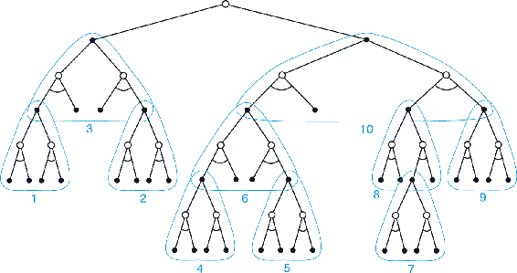

# 8.9  Heuristic Search

The classical state-space planning methods in artificial intelligence are decision-time planning methods collectively known as *heuristic search*. In heuristic search, for each state encountered, a large tree of possible continuations is considered. The approximate value function is applied to the leaf nodes and then backed up toward the current state at the root. The backing up within the search tree is just the same as in the expected updates with maxes (those for *v*\* and *q*\*) discussed throughout this book. The backing up stops at the state–action nodes for the current state. Once the backed-up values of these nodes are computed, the best of them is chosen as the current action, and then all backed-up values are discarded.

In conventional heuristic search no effort is made to save the backed-up values by changing the approximate value function. In fact, the value function is generally designed by people and never changed as a result of search. However, it is natural to consider allowing the value function to be improved over time, using either the backed-up values computed during heuristic search or any of the other methods presented throughout this book. In a sense we have taken this approach all along. Our greedy, *ε*-greedy, and UCB (Section 2.7) action-selection methods are not unlike heuristic search, albeit on a smaller scale. For example, to compute the greedy action given a model and a state-value function, we must look ahead from each possible action to each possible next state, take into account the rewards and estimated values, and then pick the best action. Just as in conventional heuristic search, this process computes backed-up values of the possible actions, but does not attempt to save them. Thus, heuristic search can be viewed as an extension of the idea of a greedy policy beyond a single step.

The point of searching deeper than one step is to obtain better action selections. If one has a perfect model and an imperfect action-value function, then in fact deeper search will usually yield better policies.[2](part0016_split_015.html#fn2x11) Certainly, if the search is all the way to the end of the episode, then the effect of the imperfect value function is eliminated, and the action determined in this way must be optimal. If the search is of sufficient depth *k* such that *γ**k* is very small, then the actions will be correspondingly near optimal. On the other hand, the deeper the search, the more computation is required, usually resulting in a slower response time. A good example is provided by Tesauro’s grandmaster-level backgammon player, TD-Gammon (Section 16.1). This system used TD learning to learn an afterstate value function through many games of self-play, using a form of heuristic search to make its moves. As a model, TD-Gammon used a priori knowledge of the probabilities of dice rolls and the assumption that the opponent always selected the actions that TD-Gammon rated as best for it. Tesauro found that the deeper the heuristic search, the better the moves made by TD-Gammon, but the longer it took to make each move. Backgammon has a large branching factor, yet moves must be made within a few seconds. It was only feasible to search ahead selectively a few steps, but even so the search resulted in significantly better action selections.

We should not overlook the most obvious way in which heuristic search focuses updates: on the current state. Much of the effectiveness of heuristic search is due to its search tree being tightly focused on the states and actions that might immediately follow the current state. You may spend more of your life playing chess than checkers, but when you play checkers, it pays to think about checkers and about your particular checkers position, your likely next moves, and successor positions. No matter how you select actions, it is these states and actions that are of highest priority for updates and where you most urgently want your approximate value function to be accurate. Not only should your computation be preferentially devoted to imminent events, but so should your limited memory resources. In chess, for example, there are far too many possible positions to store distinct value estimates for each of them, but chess programs based on heuristic search can easily store distinct estimates for the millions of positions they encounter looking ahead from a single position. This great focusing of memory and computational resources on the current decision is presumably the reason why heuristic search can be so effective.

The distribution of updates can be altered in similar ways to focus on the current state and its likely successors. As a limiting case we might use exactly the methods of heuristic search to construct a search tree, and then perform the individual, one-step updates from bottom up, as suggested by [Figure 8.9](part0016_split_009.html#fig8-9). If the updates are ordered in this way and a tabular representation is used, then exactly the same overall update would be achieved as in depth-first heuristic search. Any state-space search can be viewed in this way as the piecing together of a large number of individual one-step updates. Thus, the performance improvement observed with deeper searches is not due to the use of multistep updates as such. Instead, it is due to the focus and concentration of updates on states and actions immediately downstream from the current state. By devoting a large amount of computation specifically relevant to the candidate actions, decision-time planning can produce better decisions than can be produced by relying on unfocused updates.

[Figure 8.9](part0016_split_009.html#C_fig8-9): Heuristic search can be implemented as a sequence of one-step updates (shown here outlined in blue) backing up values from the leaf nodes toward the root. The ordering shown here is for a selective depth-first search.
