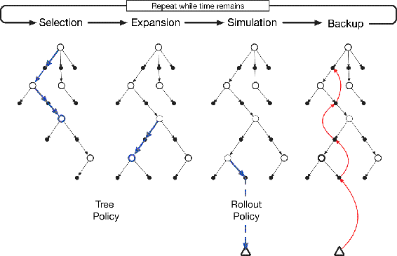

# 8.11  Monte Carlo Tree Search

*Monte Carlo Tree Search* (MCTS) is a recent and strikingly successful example of decision-time planning. At its base, MCTS is a rollout algorithm as described above, but enhanced by the addition of a means for accumulating value estimates obtained from the Monte Carlo simulations in order to successively direct simulations toward more highly-rewarding trajectories. MCTS is largely responsible for the improvement in computer Go from a weak amateur level in 2005 to a grandmaster level (6 dan or more) in 2015. Many variations of the basic algorithm have been developed, including a variant that we discuss in Section 16.6 that was critical for the stunning 2016 victories of the program AlphaGo over an 18-time world champion Go player. MCTS has proved to be effective in a wide variety of competitive settings, including general game playing (e.g., see Finnsson and Björnsson, 2008; Genesereth and Thielscher, 2014), but it is not limited to games; it can be effective for single-agent sequential decision problems if there is an environment model simple enough for fast multistep simulation.

MCTS is executed after encountering each new state to select the agent’s action for that state; it is executed again to select the action for the next state, and so on. As in a rollout algorithm, each execution is an iterative process that simulates many trajectories starting from the current state and running to a terminal state (or until discounting makes any further reward negligible as a contribution to the return). The core idea of MCTS is to successively focus multiple simulations starting at the current state by extending the initial portions of trajectories that have received high evaluations from earlier simulations. MCTS does not have to retain approximate value functions or policies from one action selection to the next, though in many implementations it retains selected action values likely to be useful for its next execution.

For the most part, the actions in the simulated trajectories are generated using a simple policy, usually called a rollout policy as it is for simpler rollout algorithms. When both the rollout policy and the model do not require a lot of computation, many simulated trajectories can be generated in a short period of time. As in any tabular Monte Carlo method, the value of a state–action pair is estimated as the average of the (simulated) returns from that pair. Monte Carlo value estimates are maintained only for the subset of state–action pairs that are most likely to be reached in a few steps, which form a tree rooted at the current state, as illustrated in [Figure 8.10](part0016_split_011.html#fig8-10). MCTS incrementally extends the tree by adding nodes representing states that look promising based on the results of the simulated trajectories. Any simulated trajectory will pass through the tree and then exit it at some leaf node. Outside the tree and at the leaf nodes the rollout policy is used for action selections, but at the states inside the tree something better is possible. For these states we have value estimates for of at least some of the actions, so we can pick among them using an informed policy, called the *tree policy*, that balances exploration and exploitation. For example, the tree policy could select actions using an *ε*-greedy or UCB selection rule (Chapter 2).

[Figure 8.10](part0016_split_011.html#C_fig8-10): Monte Carlo Tree Search. When the environment changes to a new state, MCTS executes as many iterations as possible before an action needs to be selected, incrementally building a tree whose root node represents the current state. Each iteration consists of the four operations **Selection**, **Expansion** (though possibly skipped on some iterations), **Simulation**, and **Backup**, as explained in the text and illustrated by the bold arrows in the trees. Adapted from Chaslot, Bakkes, Szita, and Spronck (2008).

In more detail, each iteration of a basic version of MCTS consists of the following four steps as illustrated in [Figure 8.10](part0016_split_011.html#fig8-10):

* **Selection.** Starting at the root node, a *tree policy* based on the action values attached to the edges of the tree traverses the tree to select a leaf node.
* **Expansion.** On some iterations (depending on details of the application), the tree is expanded from the selected leaf node by adding one or more child nodes reached from the selected node via unexplored actions.
* **Simulation.** From the selected node, or from one of its newly-added child nodes (if any), simulation of a complete episode is run with actions selected by the rollout policy. The result is a Monte Carlo trial with actions selected first by the tree policy and beyond the tree by the rollout policy.
* **Backup.** The return generated by the simulated episode is backed up to update, or to initialize, the action values attached to the edges of the tree traversed by the tree policy in this iteration of MCTS. No values are saved for the states and actions visited by the rollout policy beyond the tree. [Figure 8.10](part0016_split_011.html#fig8-10) illustrates this by showing a backup from the terminal state of the simulated trajectory directly to the state–action node in the tree where the rollout policy began (though in general, the entire return over the simulated trajectory is backed up to this state–action node).

MCTS continues executing these four steps, starting each time at the tree’s root node, until no more time is left, or some other computational resource is exhausted. Then, finally, an action from the root node (which still represents the current state of the environment) is selected according to some mechanism that depends on the accumulated statistics in the tree; for example, it may be an action having the largest action value of all the actions available from the root state, or perhaps the action with the largest visit count to avoid selecting outliers. This is the action MCTS actually selects. After the environment transitions to a new state, MCTS is run again, sometimes starting with a tree of a single root node representing the new state, but often starting with a tree containing any descendants of this node left over from the tree constructed by the previous execution of MCTS; all the remaining nodes are discarded, along with the action values associated with them.

MCTS was first proposed to select moves in programs playing two-person competitive games, such as Go. For game playing, each simulated episode is one complete play of the game in which both players select actions by the tree and rollout policies. Section 16.6 describes an extension of MCTS used in the AlphaGo program that combines the Monte Carlo evaluations of MCTS with action values learned by a deep artificial neural network via self-play reinforcement learning.

Relating MCTS to the reinforcement learning principles we describe in this book provides some insight into how it achieves such impressive results. At its base, MCTS is a decision-time planning algorithm based on Monte Carlo control applied to simulations that start from the root state; that is, it is a kind of rollout algorithm as described in the previous section. It therefore benefits from online, incremental, sample-based value estimation and policy improvement. Beyond this, it saves action-value estimates attached to the tree edges and updates them using reinforcement learning’s sample updates. This has the effect of focusing the Monte Carlo trials on trajectories whose initial segments are common to high-return trajectories previously simulated. Further, by incrementally expanding the tree, MCTS effectively grows a lookup table to store a partial action-value function, with memory allocated to the estimated values of state–action pairs visited in the initial segments of high-yielding sample trajectories. MCTS thus avoids the problem of globally approximating an action-value function while it retains the benefit of using past experience to guide exploration.

The striking success of decision-time planning by MCTS has deeply influenced artificial intelligence, and many researchers are studying modifications and extensions of the basic procedure for use in both games and single-agent applications.
