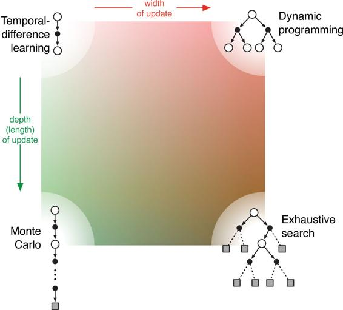

# 8.13  Summary of Part I: Dimensions

This chapter concludes Part I of this book. In it we have tried to present reinforcement learning not as a collection of individual methods, but as a coherent set of ideas cutting across methods. Each idea can be viewed as a dimension along which methods vary. The set of such dimensions spans a large space of possible methods. By exploring this space at the level of dimensions we hope to obtain the broadest and most lasting understanding. In this section we use the concept of dimensions in method space to recapitulate the view of reinforcement learning developed so far in this book.

All of the methods we have explored so far in this book have three key ideas in common: first, they all seek to estimate value functions; second, they all operate by backing up values along actual or possible state trajectories; and third, they all follow the general strategy of generalized policy iteration (GPI), meaning that they maintain an approximate value function and an approximate policy, and they continually try to improve each on the basis of the other. These three ideas are central to the subjects covered in this book. We suggest that value functions, backing up value updates, and GPI are powerful organizing principles potentially relevant to any model of intelligence, whether artificial or natural.

Two of the most important dimensions along which the methods vary are shown in [Figure 8.11](part0016_split_013.html#fig8-11). These dimensions have to do with the kind of update used to improve the value function. The horizontal dimension is whether they are sample updates (based on a sample trajectory) or expected updates (based on a distribution of possible trajectories). Expected updates require a distribution model, whereas sample updates need only a sample model, or can be done from actual experience with no model at all (another dimension of variation). The vertical dimension of [Figure 8.11](part0016_split_013.html#fig8-11) corresponds to the depth of updates, that is, to the degree of bootstrapping. At three of the four corners of the space are the three primary methods for estimating values: dynamic programming, TD, and Monte Carlo. Along the left edge of the space are the sample-update methods, ranging from one-step TD updates to full-return Monte Carlo updates. Between these is a spectrum including methods based on *n*-step updates (and in Chapter 12 we will extend this to mixtures of *n*-step updates such as the *λ*-updates implemented by eligibility traces).

[Figure 8.11](part0016_split_013.html#C_fig8-11): A slice through the space of reinforcement learning methods, highlighting the two of the most important dimensions explored in Part I of this book: the depth and width of the updates.

Dynamic programming methods are shown in the extreme upper-right corner of the space because they involve one-step expected updates. The lower-right corner is the extreme case of expected updates so deep that they run all the way to terminal states (or, in a continuing task, until discounting has reduced the contribution of any further rewards to a negligible level). This is the case of exhaustive search. Intermediate methods along this dimension include heuristic search and related methods that search and update up to a limited depth, perhaps selectively. There are also methods that are intermediate along the horizontal dimension. These include methods that mix expected and sample updates, as well as the possibility of methods that mix samples and distributions within a single update. The interior of the square is filled in to represent the space of all such intermediate methods.

A third dimension that we have emphasized in this book is the binary distinction between on-policy and off-policy methods. In the former case, the agent learns the value function for the policy it is currently following, whereas in the latter case it learns the value function for the policy for a different policy, often the one that the agent currently thinks is best. The policy generating behavior is typically different from what is currently thought best because of the need to explore. This third dimension might be visualized as perpendicular to the plane of the page in [Figure 8.11](part0016_split_013.html#fig8-11).

In addition to the three dimensions just discussed, we have identified a number of others throughout the book:

> **Definition of return** Is the task episodic or continuing, discounted or undiscounted?
>
> **Action values vs. state values vs. afterstate values** What kind of values should be estimated? If only state values are estimated, then either a model or a separate policy (as in actor–critic methods) is required for action selection.
>
> **Action selection/exploration** How are actions selected to ensure a suitable trade-off between exploration and exploitation? We have considered only the simplest ways to do this: *ε*-greedy, optimistic initialization of values, soft-max, and upper confidence bound.
>
> **Synchronous vs. asynchronous** Are the updates for all states performed simultaneously or one by one in some order?
>
> **Real vs. simulated** Should one update based on real experience or simulated experience? If both, how much of each?
>
> **Location of updates** What states or state–action pairs should be updated? Model-free methods can choose only among the states and state–action pairs actually encountered, but model-based methods can choose arbitrarily. There are many possibilities here.
>
> **Timing of updates** Should updates be done as part of selecting actions, or only afterward?
>
> **Memory for updates** How long should updated values be retained? Should they be retained permanently, or only while computing an action selection, as in heuristic search?

Of course, these dimensions are neither exhaustive nor mutually exclusive. Individual algorithms differ in many other ways as well, and many algorithms lie in several places along several dimensions. For example, Dyna methods use both real and simulated experience to affect the same value function. It is also perfectly sensible to maintain multiple value functions computed in different ways or over different state and action representations. These dimensions do, however, constitute a coherent set of ideas for describing and exploring a wide space of possible methods.

The most important dimension not mentioned here, and not covered in Part I of this book, is that of function approximation. Function approximation can be viewed as an orthogonal spectrum of possibilities ranging from tabular methods at one extreme through state aggregation, a variety of linear methods, and then a diverse set of nonlinear methods. This dimension is explored in Part II.
