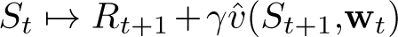
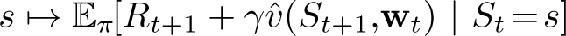

# 9.1  Value-function Approximation

All of the prediction methods covered in this book have been described as updates to an estimated value function that shift its value at particular states toward a “backed-up value,” or *update target*, for that state. Let us refer to an individual update by the notation *s* ⟼ *u*, where *s* is the state updated and *u* is the update target that *s*’s estimated value is shifted toward. For example, the Monte Carlo update for value prediction is *S**t* ⟼ G*t*, the TD(0) update is , and the *n*-step TD update is *S**t* ⟼ G*t*:*t*+*n*. In the DP (dynamic programming) policy-evaluation update, , an arbitrary state *s* is updated, whereas in the other cases the state encountered in actual experience, *S**t*, is updated.

It is natural to interpret each update as specifying an example of the desired input–output behavior of the value function. In a sense, the update *s* ⟼ *u* means that the estimated value for state *s* should be more like the update target *u*. Up to now, the actual update has been trivial: the table entry for *s*’s estimated value has simply been shifted a fraction of the way toward *u*, and the estimated values of all other states were left unchanged. Now we permit arbitrarily complex and sophisticated methods to implement the update, and updating at *s* generalizes so that the estimated values of many other states are changed as well. Machine learning methods that learn to mimic input–output examples in this way are called *supervised learning* methods, and when the outputs are numbers, like *u*, the process is often called *function approximation*. Function approximation methods expect to receive examples of the desired input–output behavior of the function they are trying to approximate. We use these methods for value prediction simply by passing to them the *s*↦*g* of each update as a training example. We then interpret the approximate function they produce as an estimated value function.

Viewing each update as a conventional training example in this way enables us to use any of a wide range of existing function approximation methods for value prediction. In principle, we can use any method for supervised learning from examples, including artificial neural networks, decision trees, and various kinds of multivariate regression. However, not all function approximation methods are equally well suited for use in reinforcement learning. The most sophisticated artificial neural network and statistical methods all assume a static training set over which multiple passes are made. In reinforcement learning, however, it is important that learning be able to occur online, while the agent interacts with its environment or with a model of its environment. To do this requires methods that are able to learn efficiently from incrementally acquired data. In addition, reinforcement learning generally requires function approximation methods able to handle nonstationary target functions (target functions that change over time). For example, in control methods based on GPI (generalized policy iteration) we often seek to learn *qπ* while *π* changes. Even if the policy remains the same, the target values of training examples are nonstationary if they are generated by bootstrapping methods (DP and TD learning). Methods that cannot easily handle such nonstationarity are less suitable for reinforcement learning.
