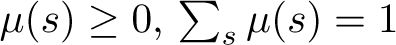
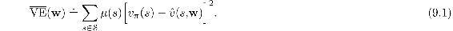
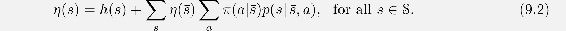
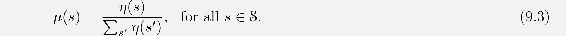

# 9.2  The Prediction Objective (VE)

Up to now we have not specified an explicit objective for prediction. In the tabular case a continuous measure of prediction quality was not necessary because the learned value function could come to equal the true value function exactly. Moreover, the learned values at each state were decoupled—an update at one state affected no other. But with genuine approximation, an update at one state affects many others, and it is not possible to get the values of all states exactly correct. By assumption we have far more states than weights, so making one state’s estimate more accurate invariably means making others’ less accurate. We are obligated then to say which states we care most about. We must specify a state distribution , representing how much we care about the error in each state *s*. By the error in a state *s* we mean the square of the difference between the approximate value  (*s,* **w**) and the true value *vπ*(*s*). Weighting this over the state space by *μ*, we obtain a natural objective function, the *Mean Squared Value Error*, denoted VE:

The square root of this measure, the root VE, gives a rough measure of how much the approximate values differ from the true values and is often used in plots. Often *μ*(*s*) is chosen to be the fraction of time spent in *s*. Under on-policy training this is called the *on-policy distribution*; we focus entirely on this case in this chapter. In continuing tasks, the on-policy distribution is the stationary distribution under *π*.

**The on-policy distribution in episodic tasks**

In an episodic task, the on-policy distribution is a little different in that it depends on how the initial states of episodes are chosen. Let *h*(*s*) denote the probability that an episode begins in each state *s*, and let *η*(*s*) denote the number of time steps spent, on average, in state *s* in a single episode. Time is spent in a state *s* if episodes start in *s*, or if transitions are made into *s* from a preceding state *s* in which time is spent:

This system of equations can be solved for the expected number of visits *η*(*s*). The on-policy distribution is then the fraction of time spent in each state normalized to sum to one:

This is the natural choice without discounting. If there is discounting (*γ <* 1) it should be treated as a form of termination, which can be done simply by including a factor of *γ* in the second term of ([9.2](part0018_split_002.html#x1-97002r2)).

The two cases, continuing and episodic, behave similarly, but with approximation they must be treated separately in formal analyses, as we will see repeatedly in this part of the book. This completes the specification of the learning objective.

But it is not completely clear that the VE is the right performance objective for reinforcement learning. Remember that our ultimate purpose—the reason we are learning a value function—is to find a better policy. The best value function for this purpose is not necessarily the best for minimizing VE. Nevertheless, it is not yet clear what a more useful alternative goal for value prediction might be. For now, we will focus on VE.

An ideal goal in terms of VE would be to find a *global optimum*, a weight vector **w**\* for which VE(**w**\*) ≤ VE(**w**) for all possible **w**. Reaching this goal is sometimes possible for simple function approximators such as linear ones, but is rarely possible for complex function approximators such as artificial neural networks and decision trees. Short of this, complex function approximators may seek to converge instead to a *local optimum*, a weight vector **w**\* for which VE(**w**\*) ≤ VE(**w**) for all **w** in some neighborhood of **w**\*. Although this guarantee is only slightly reassuring, it is typically the best that can be said for nonlinear function approximators, and often it is enough. Still, for many cases of interest in reinforcement learning there is no guarantee of convergence to an optimum, or even to within a bounded distance of an optimum. Some methods may in fact diverge, with their VE approaching infinity in the limit.

In the last two sections we outlined a framework for combining a wide range of reinforcement learning methods for value prediction with a wide range of function approximation methods, using the updates of the former to generate training examples for the latter. We also described a VE performance measure which these methods may aspire to minimize. The range of possible function approximation methods is far too large to cover all, and anyway too little is known about most of them to make a reliable evaluation or recommendation. Of necessity, we consider only a few possibilities. In the rest of this chapter we focus on function approximation methods based on gradient principles, and on linear gradient-descent methods in particular. We focus on these methods in part because we consider them to be particularly promising and because they reveal key theoretical issues, but also because they are simple and our space is limited.
