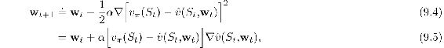
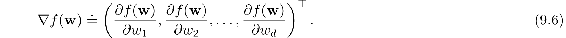
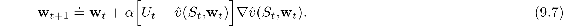
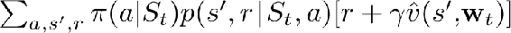
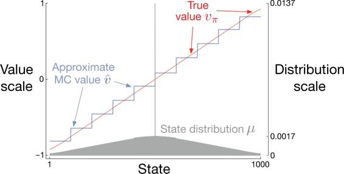

# 9.3  Stochastic-gradient and Semi-gradient Methods

We now develop in detail one class of learning methods for function approximation in value prediction, those based on stochastic gradient descent (SGD). SGD methods are among the most widely used of all function approximation methods and are particularly well suited to online reinforcement learning.

In gradient-descent methods, the weight vector is a column vector with a fixed number of real valued components, **w** ≐ (*w*1*, w*2*, …, w**d*)⊤,[1](part0018_split_019.html#fn1x12) and the approximate value function  (*s,* **w**) is a differentiable function of **w** for all *s* ∈𝒮. We will be updating **w** at each of a series of discrete time steps, *t* = 0, 1, 2, 3*, …*, so we will need a notation **w***t* for the weight vector at each step. For now, let us assume that, on each step, we observe a new example *S**t* ↦ *vπ*(*S**t*) consisting of a (possibly randomly selected) state *S**t* and its true value under the policy. These states might be successive states from an interaction with the environment, but for now we do not assume so. Even though we are given the exact, correct values, *vπ*(*S**t*) for each *S**t*, there is still a difficult problem because our function approximator has limited resources and thus limited resolution. In particular, there is generally no **w** that gets all the states, or even all the examples, exactly correct. In addition, we must generalize to all the other states that have not appeared in examples.

We assume that states appear in examples with the same distribution, *μ*, over which we are trying to minimize the VE as given by ([9.1](part0018_split_002.html#x1-97001r1)). A good strategy in this case is to try to minimize error on the observed examples. *Stochastic gradient-descent* (SGD) methods do this by adjusting the weight vector after each example by a small amount in the direction that would most reduce the error on that example:

where *α* is a positive step-size parameter, and ∇*f*(**w**), for any scalar expression *f*(**w**) that is a function of a vector (here **w**), denotes the column vector of partial derivatives of the expression with respect to the components of the vector:

This derivative vector is the *gradient* of *f* with respect to **w**. SGD methods are “gradient descent” methods because the overall step in **w***t* is proportional to the negative gradient of the example’s squared error ([9.4](part0018_split_003.html#x1-98002r4)). This is the direction in which the error falls most rapidly. Gradient descent methods are called “stochastic” when the update is done, as here, on only a single example, which might have been selected stochastically. Over many examples, making small steps, the overall effect is to minimize an average performance measure such as the VE.

It may not be immediately apparent why SGD takes only a small step in the direction of the gradient. Could we not move all the way in this direction and completely eliminate the error on the example? In many cases this could be done, but usually it is not desirable. Remember that we do not seek or expect to find a value function that has zero error for all states, but only an approximation that balances the errors in different states. If we completely corrected each example in one step, then we would not find such a balance. In fact, the convergence results for SGD methods assume that *α* decreases over time. If it decreases in such a way as to satisfy the standard stochastic approximation conditions ([2.7](part0010_split_005.html#x1-20003r7)), then the SGD method ([9.5](part0018_split_003.html#x1-98003r5)) is guaranteed to converge to a local optimum.

We turn now to the case in which the target output, here denoted *U**t* ∈ ℝ, of the *t*th training example, *S**t* ⟼ *U**t*, is not the true value, *vπ*(*S**t*), but some, possibly random, approximation to it. For example, *U**t* might be a noise-corrupted version of *vπ*(*S**t*), or it might be one of the bootstrapping targets using  mentioned in the previous section. In these cases we cannot perform the exact update ([9.5](part0018_split_003.html#x1-98003r5)) because *vπ*(*S**t*) is unknown, but we can approximate it by substituting *U**t* in place of *vπ*(*S**t*). This yields the following general SGD method for state-value prediction:

If *U**t* is an *unbiased* estimate, that is, if 𝔼[*U**t*|*S**t* = *s*] = *vπ*(*S**t*), for each *t*, then **w***t* is guaranteed to converge to a local optimum under the usual stochastic approximation conditions ([2.7](part0010_split_005.html#x1-20003r7)) for decreasing *α*.

For example, suppose the states in the examples are the states generated by interaction (or simulated interaction) with the environment using policy *π*. Because the true value of a state is the expected value of the return following it, the Monte Carlo target *U**t* ≐ G*t* is by definition an unbiased estimate of *vπ*(*S**t*). With this choice, the general SGD method ([9.7](part0018_split_003.html#x1-98005r7)) converges to a locally optimal approximation to *vπ*(*S**t*). Thus, the gradient-descent version of Monte Carlo state-value prediction is guaranteed to find a locally optimal solution. Pseudocode for a complete algorithm is shown in the box below.

**Gradient Monte Carlo Algorithm for Estimating  ≈ *vπ***

Input: the policy *π* to be evaluated

Input: a differentiable function  : 𝒮 × ℝ*d* *→* ℝ

Algorithm parameter: step size *α >* 0

Initialize value-function weights **w** ∈ ℝ*d* arbitrarily (e.g., **w** = **0**)

Loop forever (for each episode):

Generate an episode *S*0*, A*0*, R*1*, S*1*, A*1*, …, R**T**, S**T* using *π*

Loop for each step of episode, *t* = 0, 1*, …, T* − 1:

**w** ← **w** + *α*[G*t* −  (*S**t*, **w**)]∇ (*S**t*, **w**)

One does not obtain the same guarantees if a bootstrapping estimate of *vπ*(*S**t*) is used as the target *U**t* in ([9.7](part0018_split_003.html#x1-98005r7)). Bootstrapping targets such as *n*-step returns G*t*:*t*+*n* or the DP target  all depend on the current value of the weight vector **w***t*, which implies that they will be biased and that they will not produce a true gradient-descent method. One way to look at this is that the key step from ([9.4](part0018_split_003.html#x1-98002r4)) to ([9.5](part0018_split_003.html#x1-98003r5)) relies on the target being independent of **w***t*. This step would not be valid if a bootstrapping estimate were used in place of *vπ*(*S**t*). Bootstrapping methods are not in fact instances of true gradient descent (Barnard, 1993). They take into account the effect of changing the weight vector **w***t* on the estimate, but ignore its effect on the target. They include only a part of the gradient and, accordingly, we call them *semi-gradient methods*.

Although semi-gradient (bootstrapping) methods do not converge as robustly as gradient methods, they do converge reliably in important cases such as the linear case discussed in the next section. Moreover, they offer important advantages that make them often clearly preferred. One reason for this is that they typically enable significantly faster learning, as we have seen in Chapters 6 and 7. Another is that they enable learning to be continual and online, without waiting for the end of an episode. This enables them to be used on continuing problems and provides computational advantages. A prototypical semi-gradient method is semi-gradient TD(0), which uses *U**t* ≐ *R**t*+1 + *γ*  (*S**t*+1, **w**) as its target. Complete pseudocode for this method is given in the box below.

**Semi-gradient TD(0) for estimating  ≈ *vπ***

Input: the policy *π* to be evaluated

Input: a differentiable function  : 𝒮+ × ℝ*d* *→* ℝ such that  (terminal, ·) = 0

Algorithm parameter: step size *α >* 0

Initialize value-function weights **w** ∈ ℝ*d* arbitrarily (e.g., **w** = **0**)

Loop for each episode:

Initialize *S*

Loop for each step of episode:

Choose *A ∼ π*(·|*S*)

Take action *A*, observe *R, S*′

**w** ← **w** + *α*[*R* + *γ*  (*S*′, **w**) −  (*S,* **w**)]∇ (*S,* **w**)

*S* ← *S*′

until *S* is terminal

*State aggregation* is a simple form of generalizing function approximation in which states are grouped together, with one estimated value (one component of the weight vector **w**) for each group. The value of a state is estimated as its group’s component, and when the state is updated, that component alone is updated. State aggregation is a special case of SGD ([9.7](part0018_split_003.html#x1-98005r7)) in which the gradient, ∇ (*S**t*, **w***t*), is 1 for *S**t*’s group’s component and 0 for the other components.

**Example 9.1: State Aggregation on the 1000-state Random Walk** Consider a 1000-state version of the random walk task (Examples [6.2](part0014_split_002.html#sec1-45) and [7.1](part0015_split_001.html#sec1-53) on pages 125 and 144). The states are numbered from 1 to 1000, left to right, and all episodes begin near the center, in state 500. State transitions are from the current state to one of the 100 neighboring states to its left, or to one of the 100 neighboring states to its right, all with equal probability. Of course, if the current state is near an edge, then there may be fewer than 100 neighbors on that side of it. In this case, all the probability that would have gone into those missing neighbors goes into the probability of terminating on that side (thus, state 1 has a 0.5 chance of terminating on the left, and state 950 has a 0.25 chance of terminating on the right). As usual, termination on the left produces a reward of −1, and termination on the right produces a reward of +1. All other transitions have a reward of zero. We use this task as a running example throughout this section.

[Figure 9.1](part0018_split_003.html#fig9-1) shows the true value function *vπ* for this task. It is nearly a straight line, but curving slightly toward the horizontal for the last 100 states at each end. Also shown is the final approximate value function learned by the gradient Monte-Carlo algorithm with state aggregation after 100,000 episodes with a step size of *α* = 2 × 10−5. For the state aggregation, the 1000 states were partitioned into 10 groups of 100 states each (i.e., states 1–100 were one group, states 101–200 were another, and so on). The staircase effect shown in the figure is typical of state aggregation; within each group, the approximate value is constant, and it changes abruptly from one group to the next. These approximate values are close to the global minimum of the VE ([9.1](part0018_split_002.html#x1-97001r1)).

[Figure 9.1](part0018_split_003.html#C_fig9-1): Function approximation by state aggregation on the 1000-state random walk task, using the gradient Monte Carlo algorithm (page 202).

Some of the details of the approximate values are best appreciated by reference to the state distribution *μ* for this task, shown in the lower portion of the figure with a right-side scale. State 500, in the center, is the first state of every episode, but is rarely visited again. On average, about 1.37% of the time steps are spent in the start state. The states reachable in one step from the start state are the second most visited, with about 0.17% of the time steps being spent in each of them. From there *μ* falls off almost linearly, reaching about 0.0147% at the extreme states 1 and 1000. The most visible effect of the distribution is on the leftmost groups, whose values are clearly shifted higher than the unweighted average of the true values of states within the group, and on the rightmost groups, whose values are clearly shifted lower. This is due to the states in these areas having the greatest asymmetry in their weightings by *μ*. For example, in the leftmost group, state 100 is weighted more than 3 times more strongly than state 1. Thus the estimate for the group is biased toward the true value of state 100, which is higher than the true value of state 1.

■
