# 9.4  Linear Methods

One of the most important special cases of function approximation is that in which the approximate function, 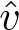 (·, **w**), is a linear function of the weight vector, **w**. Corresponding to every state *s*, there is a real-valued vector **x**(*s*) ≐ (*x*1(*s*)*, x*2(*s*)*, …, x**d*(*s*))⊤, with the same number of components as **w**. Linear methods approximate state-value function by the inner product between **w** and **x**(*s*):

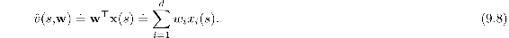

In this case the approximate value function is said to be *linear in the weights*, or simply *linear*.

The vector **x**(*s*) is called a *feature vector* representing state *s*. Each component *x**i*(*s*) of **x**(*s*) is the value of a function *x**i* : 𝒮 *→* ℝ. We think of a *feature* as the entirety of one of these functions, and we call its value for a state *s* a *feature of s*. For linear methods, features are *basis functions* because they form a linear basis for the set of approximate functions. Constructing *d*-dimensional feature vectors to represent states is the same as selecting a set of *d* basis functions. Features may be defined in many different ways; we cover a few possibilities in the next sections.

It is natural to use SGD updates with linear function approx. The gradient of the approximate value function with respect to **w** in this case is

Thus, in the linear case the general SGD update ([9.7](part0018_split_003.html#x1-98005r7)) reduces to a particularly simple form:

Because it is so simple, the linear SGD case is one of the most favorable for mathematical analysis. Almost all useful convergence results for learning systems of all kinds are for linear (or simpler) function approximation methods.

In particular, in the linear case there is only one optimum (or, in degenerate cases, one set of equally good optima), and thus any method that is guaranteed to converge to or near a local optimum is automatically guaranteed to converge to or near the global optimum. For example, the gradient Monte Carlo algorithm presented in the previous section converges to the global optimum of the VE under linear function approx. if *α* is reduced over time according to the usual conditions.

The semi-gradient TD(0) algorithm presented in the previous section also converges under linear function approx., but this does not follow from general results on SGD; a separate theorem is necessary. The weight vector converged to is also not the global optimum, but rather a point near the local optimum. It is useful to consider this important case in more detail, specifically for the continuing case. The update at each time *t* is

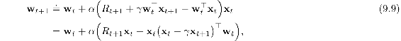

where here we have used the notational shorthand **x***t* = **x**(*S**t*). Once the system has reached steady state, for any given **w***t*, the expected next weight vector can be written

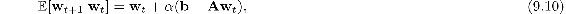

where

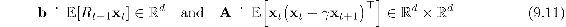

From ([9.10](part0018_split_004.html#x1-99004r10)) it is clear that, if the system converges, it must converge to the weight vector **w**TD at which

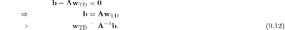

This quantity is called the *TD fixed point*. In fact linear semi-gradient TD(0) converges to this point. Some of the theory proving its convergence, and the existence of the inverse above, is given in the box.

**Proof of Convergence of Linear TD(0)**

What properties assure convergence of the linear TD(0) algorithm ([9.9](part0018_split_004.html#x1-99003r9))? Some insight can be gained by rewriting ([9.10](part0018_split_004.html#x1-99004r10)) as

Note that the matrix **A** multiplies the weight vector **w***t* and not **b**; only **A** is important to convergence. To develop intuition, consider the special case in which **A** is a diagonal matrix. If any of the diagonal elements are negative, then the corresponding diagonal element of **I** − α**A** will be greater than one, and the corresponding component of **w***t* will be amplified, which will lead to divergence if continued. On the other hand, if the diagonal elements of **A** are all positive, then **α** can be chosen smaller than one over the largest of them, such that **I** − α**A** is diagonal with all diagonal elements between 0 and 1. In this case the first term of the update tends to shrink **w***t*, and stability is assured. In general, **w***t* will be reduced toward zero whenever **A** is *positive definite*, meaning *y*⊤**A***y >* 0 for any real vector *y* ≠ 0. Positive definiteness also ensures that the inverse **A**−1 exists.

For linear TD(0), in the continuing case with *γ <* 1, the **A** matrix ([9.11](part0018_split_004.html#x1-99005r11)) can be written

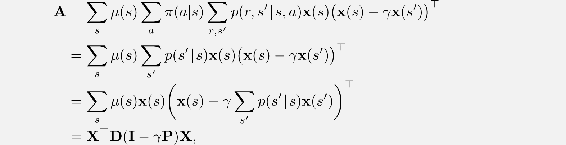

where *μ*(*s*) is the stationary distribution under *π*, *p*(*s*′ | *s*) is the probability of transition from *s* to *s*′ under policy *π*, **P** is the |𝒮|×|𝒮| matrix of these probabilities, **D** is the |𝒮|×|𝒮| diagonal matrix with the *μ*(*s*) on its diagonal, and **X** is the |𝒮|× *d* matrix with **x**(*s*) as its rows. From here it is clear that the inner matrix **D**(**I** − *γ***P**) is key to determining the positive definiteness of **A**.

For a key matrix of this form, positive definiteness is assured if all of its columns sum to a nonnegative number. This was shown by Sutton (1988, p. 27) based on two previously established theorems. One theorem says that any matrix **M** is positive definite if and only if the symmetric matrix **S** = **M** + **M**⊤ is positive definite (Sutton 1988, appendix). The second theorem says that any symmetric real matrix **S** is positive definite if all of its diagonal entries are positive and greater than the sum of the absolute values of the corresponding off-diagonal entries (Varga 1962, p. 23). For our key matrix, **D**(**I** − *γ***P**), the diagonal entries are positive and the off-diagonal entries are negative, so all we have to show is that each row sum plus the corresponding column sum is positive. The row sums are all positive because **P** is a stochastic matrix and *γ <* 1. Thus it only remains to show that the column sums are nonnegative. Note that the row vector of the column sums of any matrix **M** can be written as **1**⊤**M**, where **1** is the column vector with all components equal to 1. Let ***μ*** denote the |𝒮|-vector of the *μ*(*s*), where ***μ*** = **P**⊤***μ*** by virtue of *μ* being the stationary distribution. The column sums of our key matrix, then, are:

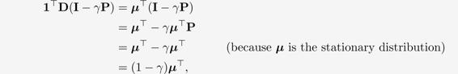

all components of which are positive. Thus, the key matrix and its **A** matrix are positive definite, and on-policy TD(0) is stable. (Additional conditions and a schedule for reducing *α* over time are needed to prove convergence with probability one.)

At the TD fixed point, it has also been proven (in the continuing case) that the VE is within a bounded expansion of the lowest possible error:

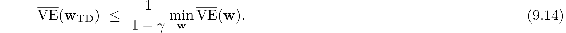

That is, the asymptotic error of the TD method is no more than 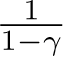 times the smallest possible error, that attained in the limit by the Monte Carlo method. Because *γ* is often near one, this expansion factor can be quite large, so there is substantial potential loss in asymptotic performance with the TD method. On the other hand, recall that the TD methods are often of vastly reduced variance compared to Monte Carlo methods, and thus faster, as we saw in Chapters 6 and 7. Which method will be best depends on the nature of the approximation and problem, and on how long learning continues.

A bound analogous to ([9.14](part0018_split_004.html#x1-99010r14)) applies to other on-policy bootstrapping methods as well. For example, linear semi-gradient DP ([Eq. 9.7](part0018_split_003.html#x1-98005r7) with 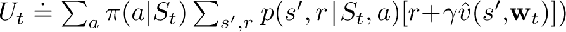 with updates according to the on-policy distribution will also converge to the TD fixed point. One-step semi-gradient *action-value* methods, such as semi-gradient Sarsa(0) covered in the next chapter converge to an analogous fixed point and an analogous bound. For episodic tasks, there is a slightly different but related bound (see Bertsekas and Tsitsiklis, 1996). There are also a few technical conditions on the rewards, features, and decrease in the step-size parameter, which we have omitted here. The full details can be found in the original paper (Tsitsiklis and Van Roy, 1997).

Critical to the these convergence results is that states are updated according to the on-policy distribution. For other update distributions, bootstrapping methods using function approximation may actually diverge to infinity. Examples of this and a discussion of possible solution methods are given in Chapter 11.

**Example 9.2: Bootstrapping on the 1000-state Random Walk** State aggregation is a special case of linear function approx., so let’s return to the 1000-state random walk to illustrate some of the observations made in this chapter. The left panel of [Figure 9.2](part0018_split_004.html#fig9-2) shows the final value function learned by the semi-gradient TD(0) algorithm (page 203) using the same state aggregation as in [Example 9.1](part0018_split_003.html#sec1-75) . We see that the near-asymptotic TD approximation is indeed farther from the true values than the Monte Carlo approximation shown in [Figure 9.1](part0018_split_003.html#fig9-1).

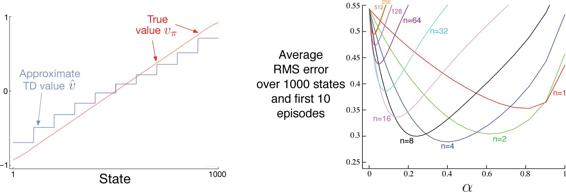

[Figure 9.2](part0018_split_004.html#C_fig9-2): Bootstrapping with state aggregation on the 1000-state random walk task. *Left*: Asymptotic values of semi-gradient TD are worse than the asymptotic Monte Carlo values in [Figure 9.1](part0018_split_003.html#fig9-1). *Right*: Performance of *n*-step methods with state-aggregation are strikingly similar to those with tabular representations (cf. [Figure 7.2](part0015_split_001.html#fig7-2)). These data are averages over 100 runs.

Nevertheless, TD methods retain large potential advantages in learning rate, and generalize Monte Carlo methods, as we investigated fully with *n*-step TD methods in Chapter 7. The right panel of [Figure 9.2](part0018_split_004.html#fig9-2) shows results with an *n*-step semi-gradient TD method using state aggregation on the 1000-state random walk that are strikingly similar to those we obtained earlier with tabular methods and the 19-state random walk ([Figure 7.2](part0015_split_001.html#fig7-2)). To obtain such quantitatively similar results we switched the state aggregation to 20 groups of 50 states each. The 20 groups were then quantitatively close to the 19 states of the tabular problem. In particular, recall that state transitions were up to 100 states to the left or right. A typical transition would then be of 50 states to the right or left, which is quantitatively analogous to the single-state state transitions of the 19-state tabular system. To complete the match, we use here the same performance measure—an unweighted average of the RMS error over all states and over the first 10 episodes—rather than a VE objective as is otherwise more appropriate when using function approximation.

■

The semi-gradient *n*-step TD algorithm used in the example above is the natural extension of the tabular *n*-step TD algorithm presented in Chapter 7 to semi-gradient function approximation. Pseudocode is given in the box below.

***n*-step semi-gradient TD for estimating 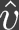 ≈ *vπ***

Input: the policy *π* to be evaluated

Input: a differentiable function 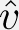 : 𝒮+ × ℝ*d* *→* ℝ such that  (terminal, ·) = 0

Algorithm parameters: step size *α >* 0, a positive integer *n*

Initialize value-function weights **w** arbitrarily (e.g., **w** = **0**)

All store and access operations (*S**t* and *R**t*) can take their index mod *n* + 1

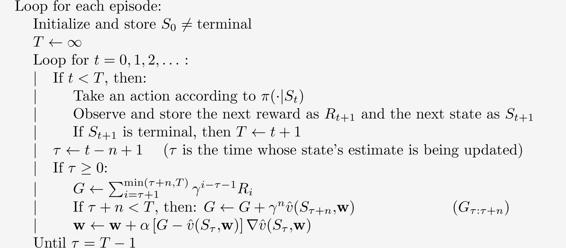

The key equation of this algorithm, analogous to ([7.2](part0015_split_001.html#x1-71003r2)), is

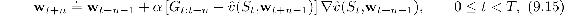

where the *n*-step return is generalized from ([7.1](part0015_split_001.html#x1-71002r1)) to

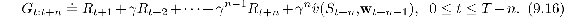

*Exercise 9.1* Show that tabular methods such as presented in Part I of this book are a special case of linear function approx. What would the feature vectors be?

□
