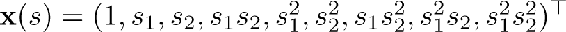
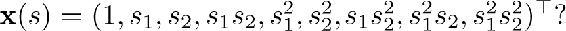

## 9.5.1  Polynomials

The states of many problems are initially expressed as numbers, such as positions and velocities in the pole-balancing task ([Example 3.4](part0011_split_003.html#sec1-20)), the number of cars in each lot in the Jack’s car rental problem ([Example 4.1](part0012_split_003.html#sec1-28)), or the gambler’s capital in the gambler problem ([Example 4.2](part0012_split_004.html#sec1-29)). In these types of problems, function approximation for reinforcement learning has much in common with the familiar tasks of interpolation and regression. Various families of features commonly used for interpolation and regression can also be used in reinforcement learning. Polynomials make up one of the simplest families of features used for interpolation and regression. While the basic polynomial features we discuss here do not work as well as other types of features in reinforcement learning, they serve as a good introduction because they are simple and familiar.

As an example, suppose a reinforcement learning problem has states with two numerical dimensions. For a single representative state *s*, let its two numbers be *s*1 ∈ ℝ and *s*2 ∈ ℝ. You might choose to represent *s* simply by its two state dimensions, so that **x**(*s*) = (*s*1*, s*2)⊤, but then you would not be able to take into account any interactions between these dimensions. In addition, if both *s*1 and *s*2 were zero, then the approximate value would have to also be zero. Both limitations can be overcome by instead representing *s* by the four-dimensional feature vector **x**(*s*) = (1*, s*1*, s*2*, s*1*s*2)⊤. The initial 1 feature allows the representation of affine functions in the original state numbers, and the final product feature, *s*1*s*2, enables interactions to be taken into account. Or you might choose to use higher-dimensional feature vectors like  to take more complex interactions into account. Such feature vectors enable approximations as arbitrary quadratic functions of the state numbers—even though the approximation is still linear in the weights that have to be learned. Generalizing this example from two to *k* numbers, we can represent highly-complex interactions among a problem’s state dimensions:

Suppose each state *s* corresponds to *k* numbers, *s*1, *s*2,…, *s**k*, with each *s**i* ∈ ℝ. For this *k*-dimensional state space, each order-*n* polynomial-basis feature *x**i* can be written as

where each *c**i, j* is an integer in the set {0, 1,…, *n*} for an integer *n* ≥ 0. These features make up the order-*n* polynomial basis for dimension *k*, which contains (*n* + 1)*k* different features.

Higher-order polynomial bases allow for more accurate approximations of more complicated functions. But because the number of features in an order-*n* polynomial basis grows exponentially with the dimension *k* of the natural state space (if *n >* 0), it is generally necessary to select a subset of them for function approximation. This can be done using prior beliefs about the nature of the function to be approximated, and some automated selection methods developed for polynomial regression can be adapted to deal with the incremental and nonstationary nature of reinforcement learning.

*Exercise 9.2* Why does ([9.17](part0018_split_006.html#x1-101001r17)) define (*n* + 1)*k* distinct features for dimension *k*?

□

*Exercise 9.3* What *n* and *c**i, j* produce the feature vectors 

□
