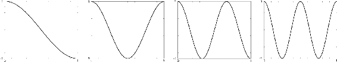
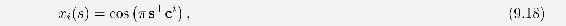
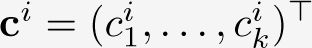
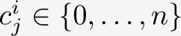
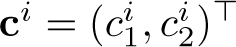
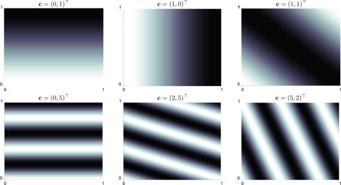
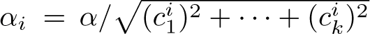
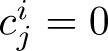
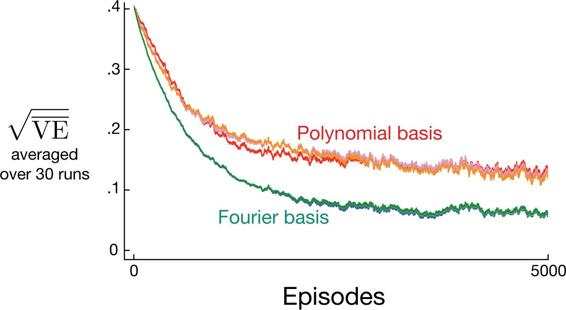

## 9.5.2  Fourier Basis

Another linear function approx. method is based on the time-honored Fourier series, which expresses periodic functions as weighted sums of sine and cosine basis functions (features) of different frequencies. (A function *f* is periodic if *f*(*x*) = *f*(*x* + *τ*) for all *x* and some period *τ*.) The Fourier series and the more general Fourier transform are widely used in applied sciences in part because if a function to be approximated is known, then the basis function weights are given by simple formulae and, further, with enough basis functions essentially any function can be approximated as accurately as desired. In reinforcement learning, where the functions to be approximated are unknown, Fourier basis functions are of interest because they are easy to use and can perform well in a range of reinforcement learning problems.

First consider the one-dimensional case. The usual Fourier series representation of a function of one dimension having period *τ* represents the function as a linear combination of sine and cosine functions that are each periodic with periods that evenly divide *τ* (in other words, whose frequencies are integer multiples of a fundamental frequency 1*/τ*). But if you are interested in approximating an aperiodic function defined over a bounded interval, then you can use these Fourier basis features with *τ* set to the length the interval. The function of interest is then just one period of the periodic linear combination of the sine and cosine features.

Furthermore, if you set *τ* to twice the length of the interval of interest and restrict attention to the approximation over the half interval [0*, τ/*2], then you can use just the cosine features. This is possible because you can represent any *even* function, that is, any function that is symmetric about the origin, with just the cosine basis. So any function over the half-period [0*, τ/*2] can be approximated as closely as desired with enough cosine features. (Saying “any function” is not exactly correct because the function has to be mathematically well-behaved, but we skip this technicality here.) Alternatively, it is possible to use just sine features, linear combinations of which are always *odd* functions, that is functions that are anti-symmetric about the origin. But it is generally better to keep just the cosine features because “half-even” functions tend to be easier to approximate than “half-odd” functions because the latter are often discontinuous at the origin. Of course, this does not rule out using both sine and cosine features to approximate over the interval [0*, τ/*2], which might be advantageous in some circumstances.

Following this logic and letting *τ* = 2 so that the features are defined over the half-*τ* interval [0, 1], the one-dimensional order-*n* Fourier cosine basis consists of the *n* + 1 features

for *i* = 0,…, *n*. [Figure 9.3](part0018_split_007.html#fig9-3) shows one-dimensional Fourier cosine features *x**i*, for *i* = 1, 2, 3, 4; *x*0 is a constant function.

[Figure 9.3](part0018_split_007.html#C_fig9-3): One-dimensional Fourier cosine-basis features *x**i*, *i* = 1, 2, 3, 4, for approximating functions over the interval [0, 1]. After Konidaris et al. (2011).

This same reasoning applies to the Fourier cosine series approximation in the multi-dimensional case as described in the box below.

Suppose each state *s* corresponds to a vector of *k* numbers, **s** = (*s*1*, s*2*,…, s**k*)⊤, with each *s**i* ∈ [0, 1]. The *i*th feature in the order-*n* Fourier cosine basis can then be written

where , with  for *j* = 1,…, *k* and *i* = 0,…, (*n*+1)*k*. This defines a feature for each of the (*n* + 1)*k* possible integer vectors **c***i*. The inner product **s**⊤**c***i* has the effect of assigning an integer in {0,…, *n*} to each dimension of **s**. As in the one-dimensional case, this integer determines the feature’s frequency along that dimension. The features can of course be shifted and scaled to suit the bounded state space of a particular application.

As an example, consider the *k* = 2 case in which **s** = (*s*1*, s*2)⊤, where each . [Figure 9.4](part0018_split_007.html#fig9-4) shows a selection of six Fourier cosine features, each labeled by the vector **c***i* that defines it (*s*1 is the horizontal axis and **c***i* is shown as a row vector with the index *i* omitted). Any zero in **c** means the feature is constant along that state dimension. So if **c** = (0, 0)⊤, the feature is constant over both dimensions; if **c** = (*c*1, 0)⊤ the feature is constant over the second dimension and varies over the first with frequency depending on *c*1; and similarly, for **c** = (0*, c*2)⊤. When **c** = (*c*1*, c*2)⊤ with neither *c**j* = 0, the feature varies along both dimensions and represents an interaction between the two state variables. The values of *c*1 and *c*2 determine the frequency along each dimension, and their ratio gives the direction of the interaction.

[Figure 9.4](part0018_split_007.html#C_fig9-4): A selection of six two-dimensional Fourier cosine features, each labeled by the vector **c***i* that defines it (*s*1 is the horizontal axis, and **c***i* is shown with the index *i* omitted). After Konidaris et al. (2011).

When using Fourier cosine features with a learning algorithm such as ([9.7](part0018_split_003.html#x1-98005r7)), semi-gradient TD(0), or semi-gradient Sarsa, it may be helpful to use a different step-size parameter for each feature. If *α* is the basic step-size parameter, then Konidaris, Osentoski, and Thomas (2011) suggest setting the step-size parameter for feature *x**i* to  (except when each , in which case *α**i* = *α*).

Fourier cosine features with Sarsa can produce good performance compared to several other collections of basis functions, including polynomial and radial basis functions. Not surprisingly, however, Fourier features have trouble with discontinuities because it is difficult to avoid “ringing” around points of discontinuity unless very high frequency basis functions are included.

The number of features in the order-*n* Fourier basis grows exponentially with the dimension of the state space, but if that dimension is small enough (e.g., *k* ≤ 5), then one can select *n* so that all of the order-*n* Fourier features can be used. This makes the selection of features more-or-less automatic. For high dimension state spaces, however, it is necessary to select a subset of these features. This can be done using prior beliefs about the nature of the function to be approximated, and some automated selection methods can be adapted to deal with the incremental and nonstationary nature of reinforcement learning. An advantage of Fourier basis features in this regard is that it is easy to select features by setting the **c***i* vectors to account for suspected interactions among the state variables and by limiting the values in the **c***j* vectors so that the approximation can filter out high frequency components considered to be noise. On the other hand, because Fourier features are non-zero over the entire state space (with the few zeros excepted), they represent global properties of states, which can make it difficult to find good ways to represent local properties.

[Figure 9.5](part0018_split_007.html#fig9-5) shows learning curves comparing the Fourier and polynomial bases on the 1000-state random walk example. In general, we do not recommend using polynomials for online learning.[2](part0018_split_019.html#fn2x12)

[Figure 9.5](part0018_split_007.html#C_fig9-5): Fourier basis vs polynomials on the 1000-state random walk. Shown are learning curves for the gradient Monte Carlo method with Fourier and polynomial bases of order 5, 10, and 20. The step-size parameters were roughly optimized for each case: *α* = 0.0001 for the polynomial basis and *α* = 0.00005 for the Fourier basis. The performance measure (y-axis) is the root mean squared value error ([9.1](part0018_split_002.html#x1-97001r1)).
