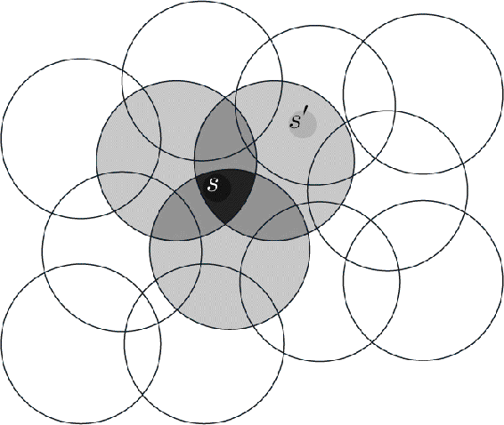
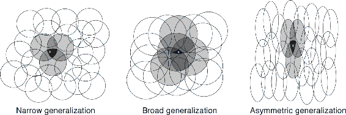
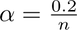
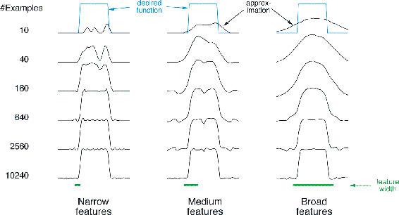

## 9.5.3  Coarse Coding

Consider a task in which the natural representation of the state set is a continuous two-dimensional space. One kind of representation for this case is made up of features corresponding to *circles* in state space, as shown to the right. If the state is inside a circle, then the corresponding feature has the value 1 and is said to be *present*; otherwise the feature is 0 and is said to be *absent*. This kind of 1–0-valued feature is called a *binary feature*. Given a state, which binary features are present indicate within which circles the state lies, and thus coarsely code for its location. Representing a state with features that overlap in this way (although they need not be circles or binary) is known as *coarse coding*.

Assuming linear gradient-descent function approximation, consider the effect of the size and density of the circles. Corresponding to each circle is a single weight (a component of **w**) that is affected by learning. If we train at one state, a point in the space, then the weights of all circles intersecting that state will be affected. Thus, by ([9.8](part0018_split_004.html#x1-99001r8)), the approximate value function will be affected at all states within the union of the circles, with a greater effect the more circles a point has “in common” with the state, as shown in [Figure 9.6](part0018_split_008.html#fig9-6). If the circles are small, then the generalization will be over a short distance, as in [Figure 9.7](part0018_split_008.html#fig9-7) (left), whereas if they are large, it will be over a large distance, as in [Figure 9.7](part0018_split_008.html#fig9-7) (middle). Moreover, the shape of the features will determine the nature of the generalization. For example, if they are not strictly circular, but are elongated in one direction, then generalization will be similarly affected, as in [Figure 9.7](part0018_split_008.html#fig9-7) (right).

[Figure 9.6](part0018_split_008.html#C_fig9-6): Coarse coding. Generalization from state *s* to state *s*′ depends on the number of their features whose receptive fields (in this case, circles) overlap. These states have one feature in common, so there will be slight generalization between them.

[Figure 9.7](part0018_split_008.html#C_fig9-7): Generalization in linear function approx. methods is determined by the sizes and shapes of the features’ receptive fields. All three of these cases have roughly the same number and density of features.

Features with large receptive fields give broad generalization, but might also seem to limit the learned function to a coarse approximation, unable to make discriminations much finer than the width of the receptive fields. Happily, this is not the case. Initial generalization from one point to another is indeed controlled by the size and shape of the receptive fields, but acuity, the finest discrimination ultimately possible, is controlled more by the total number of features.

**Example 9.3: Coarseness of Coarse Coding** This example illustrates the effect on learning of the size of the receptive fields in coarse coding. Linear function approx. based on coarse coding and ([9.7](part0018_split_003.html#x1-98005r7)) was used to learn a one-dimensional square-wave function (shown at the top of [Figure 9.8](part0018_split_008.html#fig9-8)). The values of this function were used as the targets, *U**t*. With just one dimension, the receptive fields were intervals rather than circles. Learning was repeated with three different sizes of the intervals: narrow, medium, and broad, as shown at the bottom of the figure. All three cases had the same density of features, about 50 over the extent of the function being learned. Training examples were generated uniformly at random over this extent. The step-size parameter was , where *n* is the number of features that were present at one time. [Figure 9.8](part0018_split_008.html#fig9-8) shows the functions learned in all three cases over the course of learning. Note that the width of the features had a strong effect early in learning. With broad features, the generalization tended to be broad; with narrow features, only the close neighbors of each trained point were changed, causing the function learned to be more bumpy. However, the final function learned was affected only slightly by the width of the features. Receptive field shape tends to have a strong effect on generalization but little effect on asymptotic solution quality.

[Figure 9.8](part0018_split_008.html#C_fig9-8): Example of feature width’s strong effect on initial generalization (first row) and weak effect on asymptotic accuracy (last row).

■
