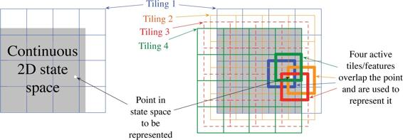
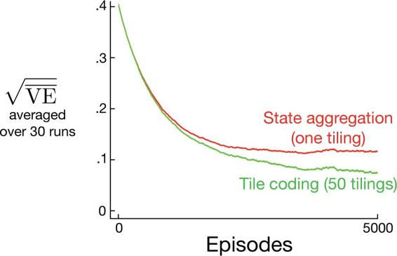
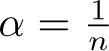
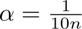
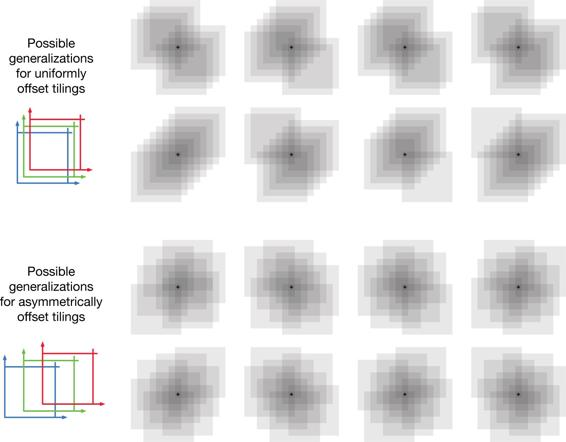
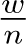
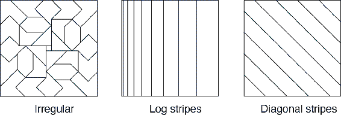
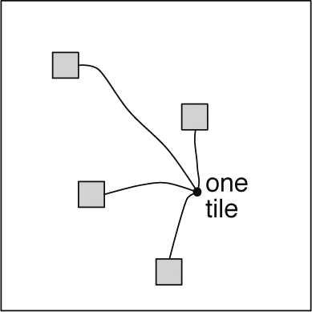

## 9.5.4  Tile Coding

Tile coding is a form of coarse coding for multi-dimensional continuous spaces that is flexible and computationally efficient. It may be the most practical feature representation for modern sequential digital computers.

In tile coding the receptive fields of the features are grouped into partitions of the state space. Each such partition is called a *tiling*, and each element of the partition is called a *tile*. For example, the simplest tiling of a two-dimensional state space is a uniform grid such as that shown on the left side of [Figure 9.9](part0018_split_009.html#fig9-9). The tiles or receptive field here are squares rather than the circles in [Figure 9.6](part0018_split_008.html#fig9-6). If just this single tiling were used, then the state indicated by the white spot would be represented by the single feature whose tile it falls within; generalization would be complete to all states within the same tile and nonexistent to states outside it. With just one tiling, we would not have coarse coding but just a case of state aggregation.

[Figure 9.9](part0018_split_009.html#C_fig9-9): Multiple, overlapping grid-tilings on a limited two-dimensional space. These tilings are offset from one another by a uniform amount in each dimension.

To get the strengths of coarse coding requires overlapping receptive fields, and by definition the tiles of a partition do not overlap. To get true coarse coding with tile coding, multiple tilings are used, each offset by a fraction of a tile width. A simple case with four tilings is shown on the right side of [Figure 9.9](part0018_split_009.html#fig9-9). Every state, such as that indicated by the white spot, falls in exactly one tile in each of the four tilings. These four tiles correspond to four features that become active when the state occurs. Specifically, the feature vector **x**(*s*) has one component for each tile in each tiling. In this example there are 4 × 4 × 4 = 64 components, all of which will be 0 except for the four corresponding to the tiles that *s* falls within. [Figure 9.10](part0018_split_009.html#fig9-10) shows the advantage of multiple offset tilings (coarse coding) over a single tiling on the 1000-state random walk example.

[Figure 9.10](part0018_split_009.html#C_fig9-10): Why we use coarse coding. Shown are learning curves on the 1000-state random walk example for the gradient Monte Carlo algorithm with a single tiling and with multiple tilings. The space of 1000 states was treated as a single continuous dimension, covered with tiles each 200 states wide. The multiple tilings were offset from each other by 4 states. The step-size parameter was set so that the initial learning rate in the two cases was the same, *α* = 0.0001 for the single tiling and *α* = 0.0001/50 for the 50 tilings.

An immediate practical advantage of tile coding is that, because it works with partitions, the overall number of features that are active at one time is the same for any state. Exactly one feature is present in each tiling, so the total number of features present is always the same as the number of tilings. This allows the step-size parameter, *α*, to be set in an easy, intuitive way. For example, choosing , where *n* is the number of tilings, results in exact one-trial learning. If the example *s* ⟼ *v* is trained on, then whatever the prior estimate,  (*s,* **w***t*), the new estimate will be  (*s,* **w***t*+1) = *v*. Usually one wishes to change more slowly than this, to allow for generalization and stochastic variation in target outputs. For example, one might choose , in which case the estimate for the trained state would move one-tenth of the way to the target in one update, and neighboring states will be moved less, proportional to the number of tiles they have in common.

Tile coding also gains computational advantages from its use of binary feature vectors. Because each component is either 0 or 1, the weighted sum making up the approximate value function ([9.8](part0018_split_004.html#x1-99001r8)) is almost trivial to compute. Rather than performing *d* multiplications and additions, one simply computes the indices of the *n* ≪ *d* active features and then adds up the *n* corresponding components of the weight vector.

Generalization occurs to states other than the one trained if those states fall within any of the same tiles, proportional to the number of tiles in common. Even the choice of how to offset the tilings from each other affects generalization. If they are offset uniformly in each dimension, as they were in [Figure 9.9](part0018_split_009.html#fig9-9), then different states can generalize in qualitatively different ways, as shown in the upper half of [Figure 9.11](part0018_split_009.html#fig9-11). Each of the eight subfigures show the pattern of generalization from a trained state to nearby points. In this example there are eight tilings, thus 64 subregions within a tile that generalize distinctly, but all according to one of these eight patterns. Note how uniform offsets result in a strong effect along the diagonal in many patterns. These artifacts can be avoided if the tilings are offset asymmetrically, as shown in the lower half of the figure. These lower generalization patterns are better because they are all well centered on the trained state with no obvious asymmetries.

[Figure 9.11](part0018_split_009.html#C_fig9-11): Why tile asymmetrical offsets are preferred in tile coding. Shown is the strength of generalization from a trained state, indicated by the small black plus, to nearby states, for the case of eight tilings. If the tilings are uniformly offset (above), then there are diagonal artifacts and substantial variations in the generalization, whereas with asymmetrically offset tilings the generalization is more spherical and homogeneous.

Tilings in all cases are offset from each other by a fraction of a tile width in each dimension. If *w* denotes the tile width and *n* the number of tilings, then  is a fundamental unit. Within small squares  on a side, all states activate the same tiles, have the same feature representation, and the same approximated value. If a state is moved by  in any cartesian direction, the feature representation changes by one component/tile. Uniformly offset tilings are offset from each other by exactly this unit distance. For a two-dimensional space, we say that each tiling is offset by the displacement vector (1, 1), meaning that it is offset from the previous tiling by  times this vector. In these terms, the asymmetrically offset tilings shown in the lower part of [Figure 9.11](part0018_split_009.html#fig9-11) are offset by a displacement vector of (1, 3).

Extensive studies have been made of the effect of different displacement vectors on the generalization of tile coding (Parks and Militzer, 1991; An, 1991; An, Miller and Parks, 1991; Miller, An, Glanz and Carter, 1990), assessing their homegeneity and tendency toward diagonal artifacts like those seen for the (1, 1) displacement vectors. Based on this work, Miller and Glanz (1996) recommend using displacement vectors consisting of the first odd integers. In particular, for a continuous space of dimension *k*, a good choice is to use the first odd integers (1, 3, 5, 7*, …*, 2*k* − 1), with *n* (the number of tilings) set to an integer power of 2 greater than or equal to 4*k*. This is what we have done to produce the tilings in the lower half of [Figure 9.11](part0018_split_009.html#fig9-11), in which *k* = 2, *n* = 23 ≥ 4*k*, and the displacement vector is (1, 3). In a three-dimensional case, the first four tilings would be offset in total from a base position by (0, 0, 0), (1, 3, 5), (2, 6, 10), and (3, 9, 15). Open-source software that can efficiently make tilings like this for any *k* is readily available.

In choosing a tiling strategy, one has to pick the number of the tilings and the shape of the tiles. The number of tilings, along with the size of the tiles, determines the resolution or fineness of the asymptotic approximation, as in general coarse coding and illustrated in [Figure 9.8](part0018_split_008.html#fig9-8). The shape of the tiles will determine the nature of generalization as in [Figure 9.7](part0018_split_008.html#fig9-7). Square tiles will generalize roughly equally in each dimension as indicated in [Figure 9.11](part0018_split_009.html#fig9-11) (lower). Tiles that are elongated along one dimension, such as the stripe tilings in [Figure 9.12](part0018_split_009.html#fig9-12) (middle), will promote generalization along that dimension. The tilings in [Figure 9.12](part0018_split_009.html#fig9-12) (middle) are also denser and thinner on the left, promoting discrimination along the horizonal dimension at lower values along that dimension. The diagonal stripe tiling in [Figure 9.12](part0018_split_009.html#fig9-12) (right) will promote generalization along one diagonal. In higher dimensions, axis-aligned stripes correspond to ignoring some of the dimensions in some of the tilings, that is, to hyperplanar slices. Irregular tilings such as shown in [Figure 9.12](part0018_split_009.html#fig9-12) (left) are also possible, though rare in practice and beyond the standard software.

[Figure 9.12](part0018_split_009.html#C_fig9-12): Tilings need not be grids. They can be arbitrarily shaped and non-uniform, while still in many cases being computationally efficient to compute.

In practice, it is often desirable to use different shaped tiles in different tilings. For example, one might use some vertical stripe tilings and some horizontal stripe tilings. This would encourage generalization along either dimension. However, with stripe tilings alone it is not possible to learn that a particular conjunction of horizontal and vertical coordinates has a distinctive value (whatever is learned for it will bleed into states with the same horizontal and vertical coordinates). For this one needs the conjunctive rectangular tiles such as originally shown in [Figure 9.9](part0018_split_009.html#fig9-9). With multiple tilings—some horizontal, some vertical, and some conjunctive—one can get everything: a preference for generalizing along each dimension, yet the ability to learn specific values for conjunctions (see Sutton, 1996 for examples). The choice of tilings determines generalization, and until this choice can be effectively automated, it is important that tile coding enables the choice to be made flexibly and in a way that makes sense to people.

Another useful trick for reducing memory requirements is *hashing*—a consistent pseudo-random collapsing of a large tiling into a much smaller set of tiles. Hashing produces tiles consisting of noncontiguous, disjoint regions randomly spread throughout the state space, but that still form an exhaustive partition. For example, one tile might consist of the four subtiles shown to the right. Through hashing, memory requirements are often reduced by large factors with little loss of performance. This is possible because high resolution is needed in only a small fraction of the state space. Hashing frees us from the curse of dimensionality in the sense that memory requirements need not be exponential in the number of dimensions, but need merely match the real demands of the task. Open-source implementations of tile coding commonly include efficient hashing.

*Exercise 9.4* Suppose we believe that one of two state dimensions is more likely to have an effect on the value function than is the other, that generalization should be primarily across this dimension rather than along it. What kind of tilings could be used to take advantage of this prior knowledge?

□
