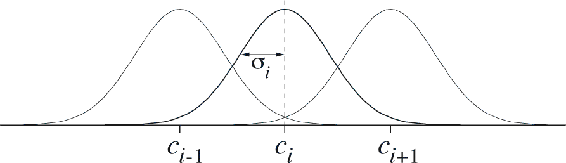

## 9.5.5  Radial Basis Functions

Radial basis functions (RBFs) are the natural generalization of coarse coding to continuous-valued features. Rather than each feature being either 0 or 1, it can be anything in the interval [0, 1], reflecting various *degrees* to which the feature is present. A typical RBF feature, *x**i*, has a Gaussian (bell-shaped) response *x**i*(*s*) dependent only on the distance between the state, *s*, and the feature’s prototypical or center state, *c**i*, and relative to the feature’s width, *σ**i*:

The norm or distance metric of course can be chosen in whatever way seems most appropriate to the states and task at hand. The figure below shows a one-dimensional example with a Euclidean distance metric.

Figure 9.13: One-dimensional radial basis functions.

The primary advantage of RBFs over binary features is that they produce approximate functions that vary smoothly and are differentiable. Although this is appealing, in most cases it has no practical significance. Nevertheless, extensive studies have been made of graded response functions such as RBFs in the context of tile coding (An, 1991; Miller et al., 1991; An et al., 1991; Lane, Handelman and Gelfand, 1992). All of these methods require substantial additional computational complexity (over tile coding) and often reduce performance when there are more than two state dimensions. In high dimensions the edges of tiles are much more important, and it has proven difficult to obtain well controlled graded tile activations near the edges.

An *RBF network* is a linear function approximator using RBFs for its features. Learning is defined by equations ([9.7](part0018_split_003.html#x1-98005r7)) and ([9.8](part0018_split_004.html#x1-99001r8)), exactly as in other linear function approximators. In addition, some learning methods for RBF networks change the centers and widths of the features as well, bringing them into the realm of nonlinear function approximators. Nonlinear methods may be able to fit target functions much more precisely. The downside to RBF networks, and to nonlinear RBF networks especially, is greater computational complexity and, often, more manual tuning before learning is robust and efficient.
