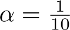
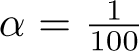
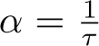
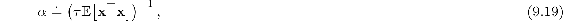
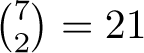

# 9.6  Selecting Step-Size Parameters Manually

Most SGD methods require the designer to select an appropriate step-size parameter *α*. Ideally this selection would be automated, and in some cases it has been, but for most cases it is still common practice to set it manually. To do this, and to better understand the algorithms, it is useful to develop some intuitive sense of the role of the step-size parameter. Can we say in general how it should be set?

Theoretical considerations are unfortunately of little help. The theory of stochastic approximation gives us conditions ([2.7](part0010_split_005.html#x1-20003r7)) on a slowly decreasing step-size sequence that are sufficient to guarantee convergence, but these tend to result in learning that is too slow. The classical choice *α**t* = 1*/t*, which produces sample averages in tabular MC methods, is not appropriate for TD methods, for nonstationary problems, or for any method using function approximation. For linear methods, there are recursive least-squares methods that set an optimal *matrix* step size, and these methods can be extended to temporal-difference learning as in the LSTD method described in Section 9.8, but these require *O*(*d*2) step-size parameters, or *d* times more parameters than we are learning. For this reason we rule them out for use on large problems where function approximation is most needed.

To get some intuitive feel for how to set the step-size parameter manually, it is best to go back momentarily to the tabular case. There we can understand that a step size of *α* = 1 will result in a complete elimination of the sample error after one target (see ([2.4](part0010_split_004.html#x1-19002r4)) with a step size of one). As discussed on page 201, we usually want to learn slower than this. In the tabular case, a step size of  would take about 10 experiences to converge approximately to their mean target, and if we wanted to learn in 100 experiences we would use . In general, if , then the tabular estimate for a state will approach the mean of its targets, with the most recent targets having the greatest effect, after about *τ* experiences with the state.

With general function approximation there is not such a clear notion of *number* of experiences with a state, as each state may be similar to and dissimilar from all the others to various degrees. However, there is a similar rule that gives similar behavior in the case of linear function approx. Suppose you wanted to learn in about *τ* experiences with substantially the same feature vector. A good rule of thumb for setting the step-size parameter of linear SGD methods is then

where **x** is a random feature vector chosen from the same distribution as input vectors will be in the SGD. This method works best if the feature vectors do not vary greatly in length; ideally **x**⊤**x** is a constant.

*Exercise 9.5* Suppose you are using tile coding to transform a seven-dimensional continuous state space into binary feature vectors to estimate a state value function  (*s,* **w**) ≈ *vπ*(*s*). You believe that the dimensions do not interact strongly, so you decide to use eight tilings of each dimension separately (stripe tilings), for 7 × 8 = 56 tilings. In addition, in case there are some pairwise interactions between the dimensions, you also take all  pairs of dimensions and tile each pair conjunctively with rectangular tiles. You make two tilings for each pair of dimensions, making a grand total of 21 × 2 + 56 = 98 tilings. Given these feature vectors, you suspect that you still have to average out some noise, so you decide that you want learning to be gradual, taking about 10 presentations with the same feature vector before learning nears its asymptote. What step-size parameter *α* should you use? Why?

□
