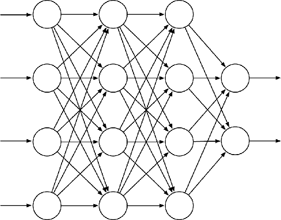
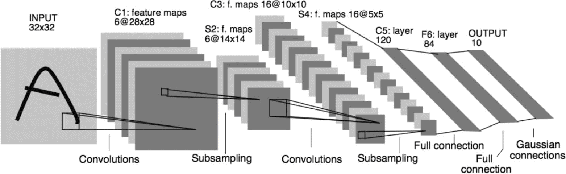

# 9.7  Nonlinear Function Approximation: Artificial Neural Networks

Artificial neural networks (ANNs) are widely used for nonlinear function approximation. An ANN is a network of interconnected units that have some of the properties of neurons, the main components of nervous systems. ANNs have a long history, with the latest advances in training deeply-layered ANNs (deep learning) being responsible for some of the most impressive abilities of machine learning systems, including reinforcement learning systems. In Chapter 16 we describe several impressive examples of reinforcement learning systems that use ANN function approximation.

[Figure 9.14](part0018_split_012.html#fig9-14) shows a generic feedforward ANN, meaning that there are no loops in the network, that is, there are no paths within the network by which a unit’s output can influence its input. The network in the figure has an output layer consisting of two output units, an input layer with four input units, and two “hidden layers”: layers that are neither input nor output layers. A real-valued weight is associated with each link. A weight roughly corresponds to the efficacy of a synaptic connection in a real neural network (see Section 15.1). If an ANN has at least one loop in its connections, it is a recurrent rather than a feedforward ANN. Although both feedforward and recurrent ANNs have been used in reinforcement learning, here we look only at the simpler feedforward case.

[Figure 9.14](part0018_split_012.html#C_fig9-14): A generic feedforward ANN with four input units, two output units, and two hidden layers.

The units (the circles in [Figure 9.14](part0018_split_012.html#fig9-14)) are typically semi-linear units, meaning that they compute a weighted sum of their input signals and then apply to the result a nonlinear function, called the *activation function*, to produce the unit’s output, or activation. Different activation functions are used, but they are typically S-shaped, or sigmoid, functions such as the logistic function *f*(*x*) = 1/(1 + *e*−*x*), though sometimes the rectifier nonlinearity *f*(*x*) = max(0*, x*) is used. A step function like *f*(*x*) = 1 if *x* ≥ *θ*, and 0 otherwise, results in a binary unit with threshold *θ*. The units in a network’s input layer are somewhat different in having their activations set to externally-supplied values that are the inputs to the function the network is approximating.

The activation of each output unit of a feedforward ANN is a nonlinear function of the activation patterns over the network’s input units. The functions are parameterized by the network’s connection weights. An ANN with no hidden layers can represent only a very small fraction of the possible input-output functions. However an ANN with a single hidden layer containing a large enough finite number of sigmoid units can approximate any continuous function on a compact region of the network’s input space to any degree of accuracy (Cybenko, 1989). This is also true for other nonlinear activation functions that satisfy mild conditions, but nonlinearity is essential: if all the units in a multi-layer feedforward ANN have linear activation functions, the entire network is equivalent to a network with no hidden layers (because linear functions of linear functions are themselves linear).

Despite this “universal approximation” property of one-hidden-layer ANNs, both experience and theory show that approximating the complex functions needed for many artificial intelligence tasks is made easier—indeed may require—abstractions that are hierarchical compositions of many layers of lower-level abstractions, that is, abstractions produced by deep architectures such as ANNs with many hidden layers. (See Bengio, 2009, for a thorough review.) The successive layers of a deep ANN compute increasingly abstract representations of the network’s “raw” input, with each unit providing a feature contributing to a hierarchical representation of the overall input-output function of the network.

Training the hidden layers of an ANN is therefore a way to automatically create features appropriate for a given problem so that hierarchical representations can be produced without relying exclusively on hand-crafted features. This has been an enduring challenge for artificial intelligence and explains why learning algorithms for ANNs with hidden layers have received so much attention over the years. ANNs typically learn by a stochastic gradient method (Section 9.3). Each weight is adjusted in a direction aimed at improving the network’s overall performance as measured by an objective function to be either minimized or maximized. In the most common supervised learning case, the objective function is the expected error, or loss, over a set of labeled training examples. In reinforcement learning, ANNs can use TD errors to learn value functions, or they can aim to maximize expected reward as in a gradient bandit (Section 2.8) or a policy-gradient algorithm (Chapter 13). In all of these cases it is necessary to estimate how a change in each connection weight would influence the network’s overall performance, in other words, to estimate the partial derivative of an objective function with respect to each weight, given the current values of all the network’s weights. The gradient is the vector of these partial derivatives.

The most successful way to do this for ANNs with hidden layers (provided the units have differentiable activation functions) is the backpropagation algorithm, which consists of alternating forward and backward passes through the network. Each forward pass computes the activation of each unit given the current activations of the network’s input units. After each forward pass, a backward pass efficiently computes a partial derivative for each weight. (As in other stochastic gradient learning algorithms, the vector of these partial derivatives is an estimate of the true gradient.) In Section 15.10 we discuss methods for training ANNs with hidden layers that use reinforcement learning principles instead of backpropagation. These methods are less efficient than the backpropagation algorithm, but they may be closer to how real neural networks learn.

The backpropagation algorithm can produce good results for shallow networks having 1 or 2 hidden layers, but it may not work well for deeper ANNs. In fact, training a network with *k* + 1 hidden layers can actually result in poorer performance than training a network with *k* hidden layers, even though the deeper network can represent all the functions that the shallower network can (Bengio, 2009). Explaining results like these is not easy, but several factors are important. First, the large number of weights in a typical deep ANN makes it difficult to avoid the problem of overfitting, that is, the problem of failing to generalize correctly to cases on which the network has not been trained. Second, backpropagation does not work well for deep ANNs because the partial derivatives computed by its backward passes either decay rapidly toward the input side of the network, making learning by deep layers extremely slow, or the partial derivatives grow rapidly toward the input side of the network, making learning unstable. Methods for dealing with these problems are largely responsible for many impressive recent results achieved by systems that use deep ANNs.

Overfitting is a problem for any function approximation method that adjusts functions with many degrees of freedom on the basis of limited training data. It is less of a problem for online reinforcement learning that does not rely on limited training sets, but generalizing effectively is still an important issue. Overfitting is a problem for ANNs in general, but especially so for deep ANNs because they tend to have very large numbers of weights. Many methods have been developed for reducing overfitting. These include stopping training when performance begins to decrease on validation data different from the training data (cross validation), modifying the objective function to discourage complexity of the approximation (regularization), and introducing dependencies among the weights to reduce the number of degrees of freedom (e.g., weight sharing).

A particularly effective method for reducing overfitting by deep ANNs is the dropout method introduced by Srivastava, Hinton, Krizhevsky, Sutskever, and Salakhutdinov (2014). During training, units are randomly removed from the network (dropped out) along with their connections. This can be thought of as training a large number of “thinned” networks. Combining the results of these thinned networks at test time is a way to improve generalization performance. The dropout method efficiently approximates this combination by multiplying each outgoing weight of a unit by the probability that that unit was retained during training. Srivastava et al. found that this method significantly improves generalization performance. It encourages individual hidden units to learn features that work well with random collections of other features. This increases the versatility of the features formed by the hidden units so that the network does not overly specialize to rarely-occurring cases.

Hinton, Osindero, and Teh (2006) took a major step toward solving the problem of training the deep layers of a deep ANN in their work with deep belief networks, layered networks closely related to the deep ANNs discussed here. In their method, the deepest layers are trained one at a time using an unsupervised learning algorithm. Without relying on the overall objective function, unsupervised learning can extract features that capture statistical regularities of the input stream. The deepest layer is trained first, then with input provided by this trained layer, the next deepest layer is trained, and so on, until the weights in all, or many, of the network’s layers are set to values that now act as initial values for supervised learning. The network is then fine-tuned by backpropagation with respect to the overall objective function. Studies show that this approach generally works much better than backpropagation with weights initialized with random values. The better performance of networks trained with weights initialized this way could be due to many factors, but one idea is that this method places the network in a region of weight space from which a gradient-based algorithm can make good progress.

*Batch normalization* (Ioffe and Szegedy, 2015) is another technique that makes it easier to train deep ANNs. It has long been known that ANN learning is easier if the network input is normalized, for example, by adjusting each input variable to have zero mean and unit variance. Batch normalization for training deep ANNs normalizes the output of deep layers before they feed into the following layer. Ioffe and Szegedy (2015) used statistics from subsets, or “mini-batches,” of training examples to normalize these between-layer signals to improve the learning rate of deep ANNs.

Another technique useful for training deep ANNs is *deep residual learning* (He, Zhang, Ren, and Sun, 2016). Sometimes it is easier to learn how a function differs from the identity function than to learn the function itself. Then adding this difference, or residual function, to the input produces the desired function. In deep ANNs, a block of layers can be made to learn a residual function simply by adding shortcut, or skip, connections around the block. These connections add the input to the block to its output, and no additional weights are needed. He et al. (2016) evaluated this method using deep convolutional networks with skip connections around every pair of adjacent layers, finding substantial improvement over networks without the skip connections on benchmark image classification tasks. Both batch normalization and deep residual learning were used in the reinforcement learning application to the game of Go that we describe in Chapter 16.

A type of deep ANN that has proven to be very successful in applications, including impressive reinforcement learning applications (Chapter 16), is the *deep convolutional network*. This type of network is specialized for processing high-dimensional data arranged in spatial arrays, such as images. It was inspired by how early visual processing works in the brain (LeCun, Bottou, Bengio and Haffner, 1998). Because of its special architecture, a deep convolutional network can be trained by backpropagation without resorting to methods like those described above to train the deep layers.

[Figure 9.15](part0018_split_012.html#fig9-15) illustrates the architecture of a deep convolutional network. This instance, from LeCun et al. (1998), was designed to recognize hand-written characters. It consists of alternating convolutional and subsampling layers, followed by several fully connected final layers. Each convolutional layer produces a number of feature maps. A feature map is a pattern of activity over an array of units, where each unit performs the same operation on data in its receptive field, which is the part of the data it “sees” from the preceding layer (or from the external input in the case of the first convolutional layer). The units of a feature map are identical to one another except that their receptive fields, which are all the same size and shape, are shifted to different locations on the arrays of incoming data. Units in the same feature map share the same weights. This means that a feature map detects the same feature no matter where it is located in the input array. In the network in [Figure 9.15](part0018_split_012.html#fig9-15), for example, the first convolutional layer produces 6 feature maps, each consisting of 28 × 28 units. Each unit in each feature map has a 5 × 5 receptive field, and these receptive fields overlap (in this case by four columns and four rows). Consequently, each of the 6 feature maps is specified by just 25 adjustable weights.

[Figure 9.15](part0018_split_012.html#C_fig9-15): Deep Convolutional Network. Republished with permission of Proceedings of the IEEE, from Gradient-based learning applied to document recognition, LeCun, Bottou, Bengio, and Haffner, volume 86, 1998; permission conveyed through Copyright Clearance Center, Inc.

The subsampling layers of a deep convolutional network reduce the spatial resolution of the feature maps. Each feature map in a subsampling layer consists of units that average over a receptive field of units in the feature maps of the preceding convolutional layer. For example, each unit in each of the 6 feature maps in the first subsampling layer of the network of [Figure 9.15](part0018_split_012.html#fig9-15) averages over a 2 × 2 non-overlapping receptive field over one of the feature maps produced by the first convolutional layer, resulting in six 14 × 14 feature maps. Subsampling layers reduce the network’s sensitivity to the spatial locations of the features detected, that is, they help make the network’s responses spatially invariant. This is useful because a feature detected at one place in an image is likely to be useful at other places as well.

Advances in the design and training of ANNs—of which we have only mentioned a few—all contribute to reinforcement learning. Although current reinforcement learning theory is mostly limited to methods using tabular or linear function approx. methods, the impressive performances of notable reinforcement learning applications owe much of their success to nonlinear function approximation by multi-layer ANNs. We discuss several of these applications in Chapter 16.
