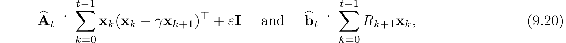
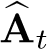
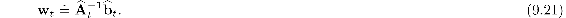
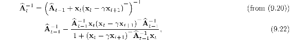
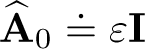
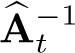
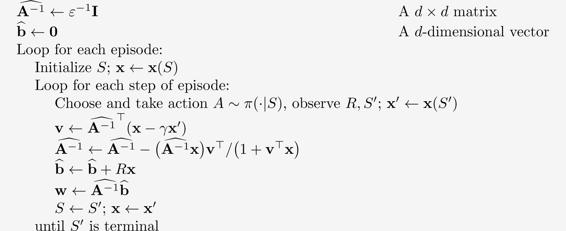

# 9.8  Least-Squares TD

All the methods we have discussed so far in this chapter have required computation per time step proportional to the number of parameters. With more computation, however, one can do better. In this section we present a method for linear function approx. that is arguably the best that can be done for this case.

As we established in Section 9.4 TD(0) with linear function approx. converges asymptotically (for appropriately decreasing step sizes) to the TD fixed point:

where

Why, one might ask, must we compute this solution iteratively? This is wasteful of data! Could one not do better by computing estimates of **A** and **b**, and then directly computing the TD fixed point? The *Least-Squares TD* algorithm, commonly known as *LSTD*, does exactly this. It forms the natural estimates

where **I** is the identity matrix, and *ε***I**, for some small *ε >* 0, ensures that  is always invertible. It might seem that these estimates should both be divided by *t*, and indeed they should; as defined here, these are really estimates of *t times* **A** and *t times* **b**. However, the extra *t* factors cancel out when LSTD uses these estimates to estimate the TD fixed point as

This algorithm is the most data efficient form of linear TD(0), but it is also more expensive computationally. Recall that semi-gradient TD(0) requires memory and per-step computation that is only *O*(*d*).

How complex is LSTD? As it is written above the complexity seems to increase with *t*, but the two approximations in ([9.20](part0018_split_013.html#x1-108001r20)) could be implemented incrementally using the techniques we have covered earlier (e.g., in Chapter 2) so that they can be done in constant time per step. Even so, the update for  would involve an outer product (a column vector times a row vector) and thus would be a matrix update; its computational complexity would be *O*(*d*2), and of course the memory required to hold the  matrix would be *O*(*d*2).

A potentially greater problem is that our final computation ([9.21](part0018_split_013.html#x1-108002r21)) uses the inverse of , and the computational complexity of a general inverse computation is *O*(*d*3). Fortunately, an inverse of a matrix of our special form—a sum of outer products—can also be updated incrementally with only *O*(*d*2) computations, as

for *t >* 0, with . Although the identity ([9.22](part0018_split_013.html#x1-108005r22)), known as *the Sherman-Morrison formula*, is superficially complicated, it involves only vector-matrix and vector-vector multiplications and thus is only *O*(*d*2). Thus we can store the inverse matrix , maintain it with ([9.22](part0018_split_013.html#x1-108005r22)), and then use it in ([9.21](part0018_split_013.html#x1-108002r21)), all with only *O*(*d*2) memory and per-step computation. The complete algorithm is given in the box on the next page.

Of course, *O*(*d*2) is still significantly more expensive than the *O*(*d*) of semi-gradient TD. Whether the greater data efficiency of LSTD is worth this computational expense depends on how large *d* is, how important it is to learn quickly, and the expense of other parts of the system. The fact that LSTD requires no step-size parameter is sometimes also touted, but the advantage of this is probably overstated. LSTD does not require a step size, but it does requires *ε*; if *ε* is chosen too small the sequence of inverses can vary wildly, and if *ε* is chosen too large then learning is slowed. In addition, LSTD’s lack of a step-size parameter means that it never forgets. This is sometimes desirable, but it is problematic if the target policy *π* changes as it does in reinforcement learning and GPI. In control applications, LSTD typically has to be combined with some other mechanism to induce forgeting, mooting any initial advantage of not requiring a step-size parameter.

**LSTD for estimating  = **w**⊤**x**(·) ≈ *vπ* (*O*(*d*2) version)**

Input: feature representation **x** : 𝒮+ *→* ℝ*d* such that **x**(*terminal*) = **0**

Algorithm parameter: small *ε >* 0

