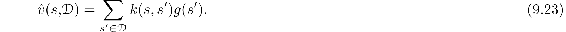
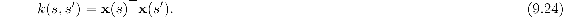

# 9.10  Kernel-based Function Approximation

Memory-based methods such as the weighted average and locally weighted regression methods described above depend on assigning weights to examples *s*′ ⟼ *g* in the database depending on the distance between *s*′ and a query states *s*. The function that assigns these weights is called a *kernel function*, or simply a *kernel*. In the weighted average and locally weighted regressions methods, for example, a kernel function *k* : ℝ *→* ℝ assigns weights to distances between states. More generally, weights do not have to depend on distances; they can depend on some other measure of similarity between states. In this case, *k* : 𝒮×𝒮 *→* ℝ, so that *k*(*s, s*′) is the weight given to data about *s*′ in its influence on answering queries about *s*.

Viewed slightly differently, *k*(*s, s*′) is a measure of the strength of generalization from *s*′ to *s*. Kernel functions numerically express how *relevant* knowledge about any state is to any other state. As an example, the strengths of generalization for tile coding shown in [Figure 9.11](part0018_split_009.html#fig9-11) correspond to different kernel functions resulting from uniform and asymmetrical tile offsets. Although tile coding does not explicitly use a kernel function in its operation, it generalizes according to one. In fact, as we discuss more below, the strength of generalization resulting from linear parametric function approximation can always be described by a kernel function.

*Kernel regression* is the memory-based method that computes a kernel weighted average of the targets of *all* examples stored in memory, assigning the result to the query state. If 𝒟 is the set of stored examples, and *g*(*s*′) denotes the target for state *s*′ in a stored example, then kernel regression approximates the target function, in this case a value function depending on 𝒟, as

The weighted average method described above is a special case in which *k*(*s, s*′) is non-zero only when *s* and *s*′ are close to one another so that the sum need not be computed over all of 𝒟.

A common kernel is the Gaussian radial basis function (RBF) used in RBF function approximation as described in Section 9.5.5. In the method described there, RBFs are features whose centers and widths are either fixed from the start, with centers presumably concentrated in areas where many examples are expected to fall, or are adjusted in some way during learning. Barring methods that adjust centers and widths, this is a linear parametric method whose parameters are the weights of each RBF, which are typically learned by stochastic gradient, or semi-gradient, descent. The form of the approximation is a linear combination of the pre-determined RBFs. Kernel regression with an RBF kernel differs from this in two ways. First, it is memory-based: the RBFs are centered on the states of the stored examples. Second, it is nonparametric: there are no parameters to learn; the response to a query is given by ([9.23](part0018_split_015.html#x1-110001r23)).

Of course, many issues have to be addressed for practical implementation of kernel regression, issues that are beyond the scope of our brief discussion. However, it turns out that any linear parametric regression method like those we described in Section 9.4, with states represented by feature vectors **x**(*s*) = (*x*1(*s*)*, x*2(*s*)*, …, x**d*(*s*))⊤, can be recast as kernel regression where *k*(*s, s*′) is the inner product of the feature vector representations of *s* and *s*′; that is

Kernel regression with this kernel function produces the same approximation that a linear parametric method would if it used these feature vectors and learned with the same training data.

We skip the mathematical justification for this, which can be found in any modern machine learning text, such as Bishop (2006), and simply point out an important implication. Instead of constructing features for linear parametric function approximators, one can instead construct kernel functions directly without referring at all to feature vectors. Not all kernel functions can be expressed as inner products of feature vectors as in ([9.24](part0018_split_015.html#x1-110002r24)), but a kernel function that can be expressed like this can offer significant advantages over the equivalent parametric method. For many sets of feature vectors, ([9.24](part0018_split_015.html#x1-110002r24)) has a compact functional form that can be evaluated without any computation taking place in the *d*-dimensional feature space. In these cases, kernel regression is much less complex than directly using a linear parametric method with states represented by these feature vectors. This is the so-called “kernel trick” that allows effectively working in the high-dimension of an expansive feature space while actually working only with the set of stored training examples. The kernel trick is the basis of many machine learning methods, and researchers have shown how it can sometimes benefit reinforcement learning.
