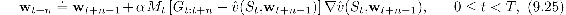
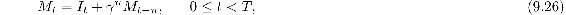
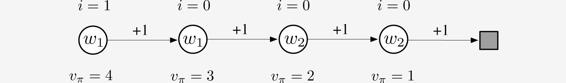

# 9.11  Looking Deeper at On-policy Learning: Interest and Emphasis

The algorithms we have considered so far in this chapter have treated all the states encountered equally, as if they were all equally important. In some cases, however, we are more interested in some states than others. In discounted episodic problems, for example, we may be more interested in accurately valuing early states in the episode than in later states where discounting may have made the rewards much less important to the value of the start state. Or, if an action-value function is being learned, it may be less important to accurately value poor actions whose value is much less than the greedy action. Function approximation resources are always limited, and if they were used in a more targeted way, then performance could be improved.

One reason we have treated all states encountered equally is that then we are updating according to the on-policy distribution, for which stronger theoretical results are available for semi-gradient methods. Recall that the on-policy distribution was defined as the distribution of states encountered in an MDP while following the target policy. Now we will generalize this concept significantly. Rather than having one on-policy distribution for the MDP, we will have many. All of them will have in common that they are a distribution of states encountered in trajectories while following the target policy, but they will vary in how the trajectories are, in a sense, initiated.

We now introduce some new concepts. First we introduce a non-negative scalar measure, a random variable *I**t* called *interest*, indicating the degree to which we are interested in accurately valuing the state (or state–action pair) at time *t*. If we don’t care at all about the state, then the interest should be zero; if we fully care, it might be one, though it is formally allowed to take any non-negative value. The interest can be set in any causal way; for example, it may depend on the trajectory up to time *t* or the learned parameters at time *t*. The distribution *μ* in the VE ([9.1](part0018_split_002.html#x1-97001r1)) is then defined as the distribution of states encountered while following the target policy, weighted by the interest. Second, we introduce another non-negative scalar random variable, the *emphasis M**t*. This scalar multiplies the learning update and thus emphasizes or de-emphasizes the learning done at time *t*. The general *n*-step learning rule, replacing ([9.15](part0018_split_004.html#x1-99012r15)), is

with the *n*-step return given by ([9.16](part0018_split_004.html#x1-99013r16)) and the emphasis determined recursively from the interest by:

with *M**t* ≐ 0, for all *t <* 0. These equations are taken to include the Monte Carlo case, for which G*t*:*t*+*n* = G*t*, all the updates are made at end of the episode, *n* = *T* −*t*, and *M**t* = *I**t*.

[Example 9.5](part0018_split_016.html#sec1-83)  illustrates how interest and emphasis can result in more accurate value estimates.

**Example 9.5: Interest and Emphasis**

To see the potential benefits of using interest and emphasis, consider the four-state Markov reward process shown below:

Episodes start in the leftmost state, then transition one state to the right, with a reward of + 1, on each step until the terminal state is reached. The true value of the first state is thus 4, of the second state 3, and so on as shown below each state. These are the true values; the estimated values can only approximate these because they are constrained by the parameterization. There are two components to the parameter vector **w** = (*w*1*, w*2)⊤, and the parameterization is as written inside each state. The estimated values of the first two states are given by *w*1 alone and thus must be the same even though their true values are different. Similarly, the estimated values of the third and fourth states are given by *w*2 alone and must be the same even though their true values are different. Suppose that we are interested in accurately valuing only the leftmost state; we assign it an interest of 1 while all the other states are assigned an interest of 0, as indicated above the states.

First consider applying gradient Monte Carlo algorithms to this problem. The algorithms presented earlier in this chapter that do not take into account interest and emphasis (in ([9.7](part0018_split_003.html#x1-98005r7)) and the box on [page 202](part0018_split_003.html#pg202)) will converge (for decreasing step sizes) to the parameter vector **w**∞ = (3.5, 1.5), which gives the first state—the only one we are interested in—a value of 3.5 (i.e., intermediate between the true values of the first and second states). The methods presented in this section that do use interest and emphasis, on the other hand, will learn the value of the first state exactly correctly; *w*1 will converge to 4 while *w*2 will never be updated because the emphasis is zero in all states save the leftmost.

Now consider applying two-step semi-gradient TD methods. The methods from earlier in this chapter without interest and emphasis (in ([9.15](part0018_split_004.html#x1-99012r15)) and ([9.16](part0018_split_004.html#x1-99013r16)) and the box on [page 209](part0018_split_004.html#pg209)) will again converge to **w**∞ = (3.5, 1.5), while the methods with interest and emphasis converge to **w**∞ = (4, 2). The latter produces the exactly correct values for the first state and for the third state (which the first state bootstraps from) while never making any updates corresponding to the second or fourth states.
