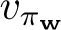

# 9.12  Summary

Reinforcement learning systems must be capable of *generalization* if they are to be applicable to artificial intelligence or to large engineering applications. To achieve this, any of a broad range of existing methods for *supervised-learning function approximation* can be used simply by treating each update as a training example.

Perhaps the most suitable supervised learning methods are those using *parameterized function approximation*, in which the policy is parameterized by a weight vector **w**. Although the weight vector has many components, the state space is much larger still, and we must settle for an approximate solution. We defined the *mean squared value error*, VE(**w**), as a measure of the error in the values (*s*) for a weight vector **w** under the *on-policy distribution*, *μ*. The VE gives us a clear way to rank different value-function approximations in the on-policy case.

To find a good weight vector, the most popular methods are variations of *stochastic gradient descent* (SGD). In this chapter we have focused on the *on-policy* case with a *fixed policy*, also known as policy evaluation or prediction; a natural learning algorithm for this case is *n-step semi-gradient TD*, which includes gradient Monte Carlo and semi-gradient TD(0) algorithms as the special cases when *n* = ∞ and *n* = 1 respectively. Semi-gradient TD methods are not true gradient methods. In such bootstrapping methods (including DP), the weight vector appears in the update target, yet this is not taken into account in computing the gradient—thus they are *semi*-gradient methods. As such, they cannot rely on classical SGD results.

Nevertheless, good results can be obtained for semi-gradient methods in the special case of *linear* function approx., in which the value estimates are sums of features times corresponding weights. The linear case is the most well understood theoretically and works well in practice when provided with appropriate features. Choosing the features is one of the most important ways of adding prior domain knowledge to reinforcement learning systems. They can be chosen as polynomials, but this case generalizes poorly in the online learning setting typically considered in reinforcement learning. Better is to choose features according the Fourier basis, or according to some form of coarse coding with sparse overlapping receptive fields. Tile coding is a form of coarse coding that is particularly computationally efficient and flexible. Radial basis functions are useful for one- or two-dimensional tasks in which a smoothly varying response is important. LSTD is the most data-efficient linear TD prediction method, but requires computation proportional to the square of the number of weights, whereas all the other methods are of complexity linear in the number of weights. Nonlinear methods include artificial neural networks trained by backpropagation and variations of SGD; these methods have become very popular in recent years under the name *deep reinforcement learning*.

Linear semi-gradient *n*-step TD is guaranteed to converge under standard conditions, for all *n*, to a VE that is within a bound of the optimal error (achieved asymptotically by Monte Carlo methods). This bound is always tighter for higher *n* and approaches zero as *n →* ∞. However, in practice very high *n* results in very slow learning, and some degree of bootstrapping (*n <* ∞) is usually preferrable, just as we saw in comparisons of tabular *n*-step methods in Chapter 7 and in comparisons of tabular TD and Monte Carlo methods in Chapter 6.
