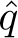

# Chapter 10

# On-policy Control with Approximation

In this chapter we return to the control problem, now with parametric approximation of the action-value function  (*s, a,* **w**) ≈ *q*\*(*s, a*), where **w** ∈ ℝ*d* is a finite-dimensional weight vector. We continue to restrict attention to the on-policy case, leaving off-policy methods to Chapter 11. The present chapter features the semi-gradient Sarsa algorithm, the natural extension of semi-gradient TD(0) (last chapter) to action values and to on-policy control. In the episodic case, the extension is straightforward, but in the continuing case we have to take a few steps backward and re-examine how we have used discounting to define an optimal policy. Surprisingly, once we have genuine function approximation we have to give up discounting and switch to a new “average-reward” formulation of the control problem, with new “differential” value functions.

Starting first in the episodic case, we extend the function approximation ideas presented in the last chapter from state values to action values. Then we extend them to control following the general pattern of on-policy GPI, using *ε*-greedy for action selection. We show results for *n*-step linear Sarsa on the Mountain Car problem. Then we turn to the continuing case and repeat the development of these ideas for the average-reward case with differential values.
