# 10.1  Episodic Semi-gradient Control

The extension of the semi-gradient prediction methods of Chapter 9 to action values is straightforward. In this case it is the approximate action-value function, 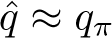, that is represented as a parameterized functional form with weight vector **w**. Whereas before we considered random training examples of the form *S**t* ⟼ *U**t*, now we consider examples of the form *S**t**, A**t* ⟼ *U**t*. The update target *U**t* can be any approximation of *qπ*(*S**t**, A**t*), including the usual backed-up values such as the full Monte Carlo return (G*t*) or any of the *n*-step Sarsa returns ([7.4](part0015_split_002.html#x1-72002r4)). The general gradient-descent update for action-value prediction is

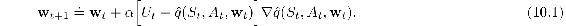

For example, the update for the one-step Sarsa method is

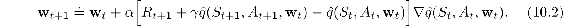

We call this method *episodic semi-gradient one-step Sarsa*. For a constant policy, this method converges in the same way that TD(0) does, with the same kind of error bound ([9.14](part0018_split_004.html#x1-99010r14)).

To form control methods, we need to couple such action-value prediction methods with techniques for policy improvement and action selection. Suitable techniques applicable to continuous actions, or to actions from large discrete sets, are a topic of ongoing research with as yet no clear resolution. On the other hand, if the action set is discrete and not too large, then we can use the techniques already developed in previous chapters. That is, for each possible action *a* available in the current state *S**t*, we can compute  (*S**t**, a,* **w***t*) and then find the greedy action 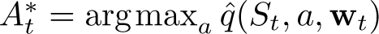. Policy improvement is then done (in the on-policy case treated in this chapter) by changing the estimation policy to a soft approximation of the greedy policy such as the *ε*-greedy policy. Actions are selected according to this same policy. Pseudocode for the complete algorithm is given in the box.

**Episodic Semi-gradient Sarsa for Estimating  ≈ *q*\***

Input: a differentiable action-value function parameterization  : 𝒮×𝒜× ℝ*d* *→* ℝ

Algorithm parameters: step size *α >* 0, small *ε >* 0

Initialize value-function weights **w** ∈ ℝ*d* arbitrarily (e.g., **w** = **0**)

Loop for each episode:

*S, A* ← initial state and action of episode (e.g., *ε*-greedy)

Loop for each step of episode:

Take action *A*, observe *R, S*′

If *S*′ is terminal:

**w** ← **w** + *α*[*R* −  (*S, A,* **w**)]∇ (*S, A,* **w**)

Go to next episode

Choose *A*′ as a function of  (*S*′, ·, **w**) (e.g., *ε*-greedy)

**w** ← **w** + *α*[*R* + *γ*  (*S*′*, A*′, **w**) −  (*S, A,* **w**)]∇ (*S, A,* **w**)

*S* ← *S*′

*A* ← *A*′

**Example 10.1: Mountain Car Task** Consider the task of driving an underpowered car up a steep mountain road, as suggested by the diagram in the upper left of [Figure 10.1](part0019_split_001.html#fig10-1). The difficulty is that gravity is stronger than the car’s engine, and even at full throttle the car cannot accelerate up the steep slope. The only solution is to first move away from the goal and up the opposite slope on the left. Then, by applying full throttle the car can build up enough inertia to carry it up the steep slope even though it is slowing down the whole way. This is a simple example of a continuous control task where things have to get worse in a sense (farther from the goal) before they can get better. Many control methodologies have great difficulties with tasks of this kind unless explicitly aided by a human designer.

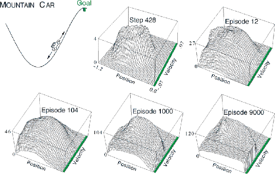

[Figure 10.1](part0019_split_001.html#C_fig10-1): The Mountain Car task (upper left panel) and the cost-to-go function (− max*a*  (*s, a,* **w**)) learned during one run.

The reward in this problem is −1 on all time steps until the car moves past its goal position at the top of the mountain, which ends the episode. There are three possible actions: full throttle forward (+1), full throttle reverse (−1), and zero throttle (0). The car moves according to a simplified physics. Its position, *x**t*, and velocity, 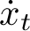, are updated by

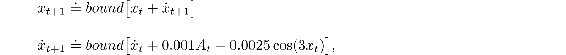

where the *bound* operation enforces − 1.2 ≤ *x**t*+1 ≤ 0.5 and 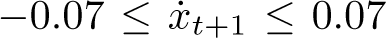. In addition, when *x**t*+1 reached the left bound, 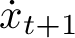 was reset to zero. When it reached the right bound, the goal was reached and the episode was terminated. Each episode started from a random position *x**t* ∈ [−0.6, − 0.4) and zero velocity. To convert the two continuous state variables to binary features, we used grid-tilings as in [Figure 9.9](part0018_split_009.html#fig9-9). We used 8 tilings, with each tile covering 1/8th of the bounded distance in each dimension, and asymmetrical offsets as described in Section 9.5.4.[1](part0019_split_008.html#fn1x13) The feature vectors **x**(*s, a*) created by tile coding were then combined linearly with the parameter vector to approximate the action-value function:

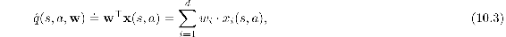

for each pair of state, *s*, and action, *a*.

[Figure 10.1](part0019_split_001.html#fig10-1) shows what typically happens while learning to solve this task with this form of function approximation.[2](part0019_split_008.html#fn2x13) Shown is the negative of the value function (the *cost-to-go* function) learned on a single run. The initial action values were all zero, which was optimistic (all true values are negative in this task), causing extensive exploration to occur even though the exploration parameter, *ε*, was 0. This can be seen in the middle-top panel of the figure, labeled “Step 428”. At this time not even one episode had been completed, but the car has oscillated back and forth in the valley, following circular trajectories in state space. All the states visited frequently are valued worse than unexplored states, because the actual rewards have been worse than what was (unrealistically) expected. This continually drives the agent away from wherever it has been, to explore new states, until a solution is found.

[Figure 10.2](part0019_split_001.html#fig10-2) shows several learning curves for semi-gradient Sarsa on this problem, with various step sizes.

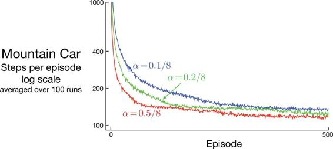

[Figure 10.2](part0019_split_001.html#C_fig10-2): Mountain Car learning curves for the semi-gradient Sarsa method with tile-coding function approximation and *ε*-greedy action selection.

■
