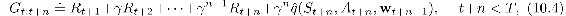
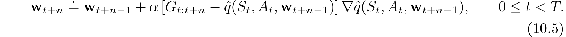
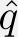
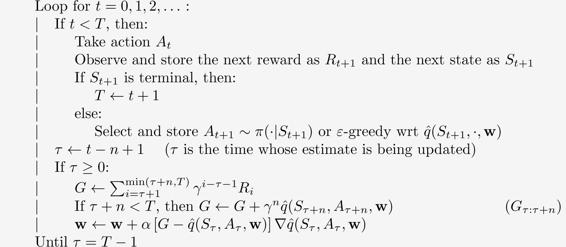
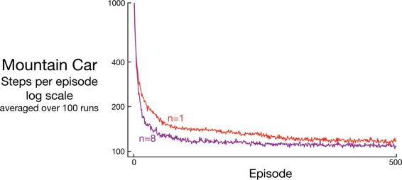
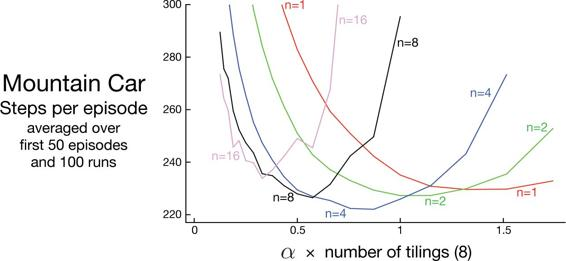

# 10.2  Semi-gradient *n*-step Sarsa

We can obtain an *n*-step version of episodic semi-gradient Sarsa by using an *n*-step return as the update target in the semi-gradient Sarsa update equation ([10.1](part0019_split_001.html#x1-115001r1)). The *n*-step return immediately generalizes from its tabular form ([7.4](part0015_split_002.html#x1-72002r4)) to a function approximation form:

with G*t*:*t*+*n* ≐ G*t* if *t* + *n* ≥ *T*, as usual. The *n*-step update equation is

Complete pseudocode is given in the box below.

**Episodic semi-gradient *n*-step Sarsa for estimating  ≈ *q*\* or *qπ***

Input: a differentiable action-value function parameterization  : 𝒮×𝒜× ℝ*d* *→* ℝ

Input: a policy *π* (if estimating *qπ*)

Algorithm parameters: step size *α >* 0, small *ε >* 0, a positive integer *n*

Initialize value-function weights **w** ∈ ℝ*d* arbitrarily (e.g., **w** = **0**)

All store and access operations (*S**t*, *A**t*, and *R**t*) can take their index mod *n* +1

Loop for each episode:

Initialize and store *S*0 ≠ terminal

Select and store an action *A*0 *∼ π*(·|*S*0) or *ε*-greedy wrt  (*S*0, ·, **w**)

*T* ← ∞

As we have seen before, performance is best if an intermediate level of bootstrapping is used, corresponding to an *n* larger than 1. [Figure 10.3](part0019_split_002.html#fig10-3) shows how this algorithm tends to learn faster and obtain a better asymptotic performance at *n* = 8 than at *n* = 1 on the Mountain Car task. [Figure 10.4](part0019_split_002.html#fig10-4) shows the results of a more detailed study of the effect of the parameters *α* and *n* on the rate of learning on this task.

[Figure 10.3](part0019_split_002.html#C_fig10-3): Performance of one-step vs 8-step semi-gradient Sarsa on the Mountain Car task. Good step sizes were used: *α* = 0.5/8 for *n* = 1 and *α* = 0.3/8 for *n* = 8.

[Figure 10.4](part0019_split_002.html#C_fig10-4): Effect of the *α* and *n* on early performance of *n*-step semi-gradient Sarsa and tile-coding function approximation on the Mountain Car task. As usual, an intermediate level of bootstrapping (*n* = 4) performed best. These results are for selected *α* values, on a log scale, and then connected by straight lines. The standard errors ranged from 0.5 (less than the line width) for *n* = 1 to about 4 for *n* = 16, so the main effects are all statistically significant.

*Exercise 10.1* We have not explicitly considered or given pseudocode for any Monte Carlo methods or in this chapter. What would they be like? Why is it reasonable not to give pseudocode for them? How would they perform on the Mountain Car task?

□

*Exercise 10.2* Give pseudocode for semi-gradient one-step *Expected* Sarsa for control.

□

*Exercise 10.3* Why do the results shown in [Figure 10.4](part0019_split_002.html#fig10-4) have higher standard errors at large *n* than at small *n*?

□
