# 10.3  Average Reward: A New Problem Setting for Continuing Tasks

We now introduce a third classical setting—alongside the episodic and discounted settings—for formulating the goal in Markov decision problems (MDPs). Like the discounted setting, the *average reward* setting applies to continuing problems, problems for which the interaction between agent and environment goes on and on forever without termination or start states. Unlike that setting, however, there is no discounting—the agent cares just as much about delayed rewards as it does about immediate reward. The average-reward setting is one of the major settings commonly considered in the classical theory of dynamic programming and less-commonly in reinforcement learning. As we discuss in the next section, the discounted setting is problematic with function approximation, and thus the average-reward setting is needed to replace it.

In the average-reward setting, the quality of a policy *π* is defined as the average rate of reward, or simply *average reward*, while following that policy, which we denote as *r*(*π*):

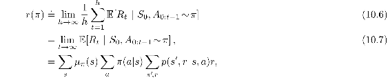

where the expectations are conditioned on the initial state, *S*0, and on the subsequent actions, *A*0*, A*1*, …, A**t*−1, being taken according to *π*. *μπ* is the steady-state distribution, *μπ*(*s*) ≐ lim*t*⟶∞ Pr{*St* = *s* |A0:*t*−1∼π}, which is assumed to exist for any *π* and to be independent of *S*0. This assumption about the MDP is known as *ergodicity*. It means that where the MDP starts or any early decision made by the agent can have only a temporary effect; in the long run the expectation of being in a state depends only on the policy and the MDP transition probabilities. Ergodicity is sufficient to guarantee the existence of the limits in the equations above.

There are subtle distinctions that can be drawn between different kinds of optimality in the undiscounted continuing case. Nevertheless, for most practical purposes it may be adequate simply to order policies according to their average reward per time step, in other words, according to their *r*(*π*). This quantity is essentially the average reward under *π*, as suggested by ([10.7](part0019_split_003.html#x1-117002r7)). In particular, we consider all policies that attain the maximal value of *r*(*π*) to be optimal.

Note that the steady state distribution is the special distribution under which, if you select actions according to *π*, you remain in the same distribution. That is, for which

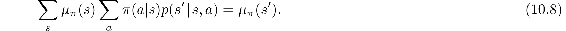

In the average-reward setting, returns are defined in terms of differences between rewards and the average reward:

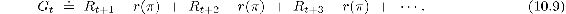

This is known as the *differential* return, and the corresponding value functions are known as *differential* value functions. They are defined in the same way and we will use the same notation for them as we have all along: *vπ*(*s*) ≐ 𝔼*π* [*Gt|St* = *s*] and *qπ*(*s, a*) ≐ 𝔼*π* [*Gt|St* = *s*, *At* = *a*] (similarly for *v*\* and *q*\*). Differential value functions also have Bellman equations, just slightly different from those we have seen earlier. We simply remove all *γ*s and replace all rewards by the difference between the reward and the true average reward:

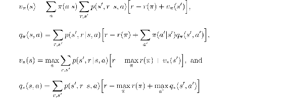

(cf. ([3.14](part0011_split_005.html#x1-32005r14)), Exercise 3.17, ([3.19](part0011_split_006.html#x1-33007r19)), and (3.20)).

There is also a differential form of the two TD errors:

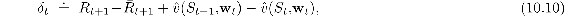

and

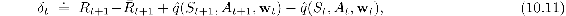

where *R**t* is an estimate at time *t* of the average reward *r*(*π*). With these alternate definitions, most of our algorithms and many theoretical results carry through to the average-reward setting without change.

For example, the average reward version of semi-gradient Sarsa is defined just as in ([10.2](part0019_split_001.html#x1-115002r2)) except with the differential version of the TD error. That is, by

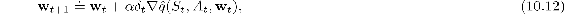

with *δ**t* given by ([10.11](part0019_split_003.html#x1-117006r11)). The pseudocode for the complete algorithm is given in the box on the next page.

*Exercise 10.4* Give pseudocode for a differential version of semi-gradient Q-learning.

□

*Exercise 10.5* What equations are needed (beyond [10.10](part0019_split_003.html#x1-117005r10)) to specify the differential version of TD(0)?

□

**Differential semi-gradient Sarsa for estimating  ≈ *q*\***

Input: a differentiable action-value function parameterization  : 𝒮×𝒜× ℝ*d* *→* ℝ

Algorithm parameters: step sizes *α, β >* 0

Initialize value-function weights **w** ∈ ℝ*d* arbitrarily (e.g., **w** = **0**)

Initialize average reward estimate *R* ∈ ℝ arbitrarily (e.g., *R* = 0)

Initialize state *S*, and action *A*

Loop for each step:

Take action *A*, observe *R, S*′

Choose *A*′ as a function of  (*S*′, ·, **w**) (e.g., *ε*-greedy)

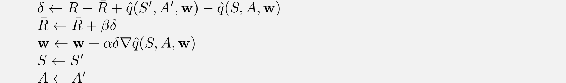

*Exercise 10.6* Consider a Markov reward process consisting of a ring of three states `A`, `B`, and `C`, with state transitions going deterministically around the ring. A reward of +1 is received upon arrival in `A` and otherwise the reward is 0. What are the differential values of the three states?

□

**Example 10.2: An Access-Control Queuing Task** This is a decision task involving access control to a set of 10 servers. Customers of four different priorities arrive at a single queue. If given access to a server, the customers pay a reward of 1, 2, 4, or 8 to the server, depending on their priority, with higher priority customers paying more. In each time step, the customer at the head of the queue is either accepted (assigned to one of the servers) or rejected (removed from the queue, with a reward of zero). In either case, on the next time step the next customer in the queue is considered. The queue never empties, and the priorities of the customers in the queue are equally randomly distributed. Of course a customer cannot be served if there is no free server; the customer is always rejected in this case. Each busy server becomes free with probability *p* = 0.06 on each time step. Although we have just described them for definiteness, let us assume the statistics of arrivals and departures are unknown. The task is to decide on each step whether to accept or reject the next customer, on the basis of his priority and the number of free servers, so as to maximize long-term reward without discounting.

In this example we consider a tabular solution to this problem. Although there is no generalization between states, we can still consider it in the general function approximation setting as this setting generalizes the tabular setting. Thus we have a differential action-value estimate for each pair of state (number of free servers and priority of the customer at the head of the queue) and action (accept or reject). [Figure 10.5](part0019_split_003.html#fig10-5) shows the solution found by differential semi-gradient Sarsa with parameters *α* = 0.01, *β* = 0.01, and *ε* = 0.1. The initial action values and *R* were zero.

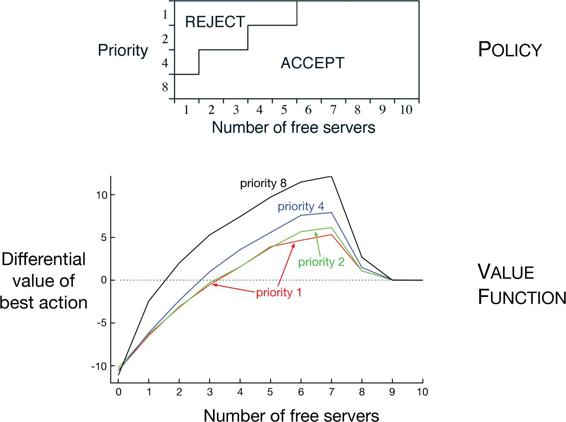

[Figure 10.5](part0019_split_003.html#C_fig10-5): The policy and value function found by differential semi-gradient one-step Sarsa on the access-control queuing task after 2 million steps. The drop on the right of the graph is probably due to insufficient data; many of these states were never experienced. The value learned for *R* was about 2.31.

■

*Exercise 10.7* Suppose there is an MDP that under any policy produces the deterministic sequence of rewards +1, 0, +1, 0, +1, 0*, …* going on forever. Technically, this is not allowed because it violates ergodicity; there is no stationary limiting distribution *μπ* and the limit ([10.7](part0019_split_003.html#x1-117002r7)) does not exist. Nevertheless, the average reward ([10.6](part0019_split_003.html#x1-117001r6)) is well defined; What is it? Now consider two states in this MDP. From `A`, the reward sequence is exactly as described above, starting with a +1, whereas, from `B`, the reward sequence starts with a 0 and then continues with +1, 0, +1, 0*, …*. The differential return ([10.9](part0019_split_003.html#x1-117004r9)) is not well defined for this case as the limit does not exist. To repair this, one could alternately define the value of a state as

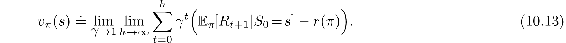

Under this definition, what are the values of states `A` and `B`?

□

*Exercise 10.8* The pseudocode in the box on page 527 updates *R**t*+1 using *δ**t* as an error rather than simply *R**t*+1 − *R**t*+1. Both errors work, but using *δ**t* is better. To see why, consider the ring MRP of three states from [Exercise 10.6](part0019_split_003.html#sec1-87). The estimate of the average reward should tend towards its true value of 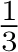. Suppose it was already there and was held stuck there. What would the sequence of *R**t* − *R**t* errors be? What would the sequence of *δ**t* errors be (using ([10.10](part0019_split_003.html#x1-117005r10)))? Which error sequence would produce a more stable estimate of the average reward if the estimate were allowed to change in response to the errors? Why?

□
