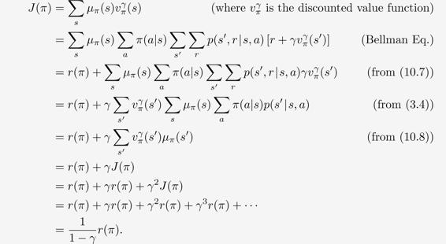

# 10.4  Deprecating the Discounted Setting

The continuing, discounted problem formulation has been very useful in the tabular case, in which the returns from each state can be separately identified and averaged. But in the approximate case it is questionable whether one should ever use this problem formulation.

To see why, consider an infinite sequence of returns with no beginning or end, and no clearly identified states. The states might be represented only by feature vectors, which may do little to distinguish the states from each other. As a special case, all of the feature vectors may be the same. Thus one really has only the reward sequence (and the actions), and performance has to be assessed purely from these. How could it be done? One way is by averaging the rewards over a long interval—this is the idea of the average-reward setting. How could discounting be used? Well, for each time step we could measure the discounted return. Some returns would be small and some big, so again we would have to average them over a sufficiently large time interval. In the continuing setting there are no starts and ends, and no special time steps, so there is nothing else that could be done. However, if you do this, it turns out that the average of the discounted returns is proportional to the average reward. In fact, for policy *π*, the average of the discounted returns is always *r*(*π*)/(1 − *γ*), that is, it is essentially the average reward, *r*(*π*). In particular, the *ordering* of all policies in the average discounted return setting would be exactly the same as in the average-reward setting. The discount rate *γ* thus has no effect on the problem formulation. It could in fact be *zero* and the ranking would be unchanged.

This surprising fact is proven in the box on the next page, but the basic idea can be seen via a symmetry argument. Each time step is exactly the same as every other. With discounting, every reward will appear exactly once in each position in some return. The *t*th reward will appear undiscounted in the *t* − 1st return, discounted once in the *t* − 2nd return, and discounted 999 times in the *t* − 1000th return. The weight on the *t*th reward is thus 1 + *γ* + *γ*2 + *γ*3 + ⋯ = 1/(1 − *γ*). Because all states are the same, they are all weighted by this, and thus the average of the returns will be this times the average reward, or *r*(*π*)/(1 − *γ*).

This example and the more general argument in the box show that if we optimized discounted value over the on-policy distribution, then the effect would be identical to optimizing *undiscounted* average reward; the actual value of *γ* would have no effect. This strongly suggests that discounting has no role to play in the definition of the control problem with function approximation. One can nevertheless go ahead and use discounting in solution methods. The discounting parameter *γ* changes from a problem parameter to a solution method parameter! However, in this case we unfortunately would not be guaranteed to optimize average reward (or the equivalent discounted value over the on-policy distribution).

**The Futility of Discounting in Continuing Problems**

Perhaps discounting can be saved by choosing an objective that sums discounted values over the distribution with which states occur under the policy:

The proposed discounted objective orders policies identically to the undiscounted (average reward) objective. The discount rate *γ* does not inuence the ordering!

The root cause of the difficulties with the discounted control setting is that with function approximation we have lost the policy improvement theorem (Section 4.2). It is no longer true that if we change the policy to improve the discounted value of one state then we are guaranteed to have improved the overall policy in any useful sense. That guarantee was key to the theory of our reinforcement learning control methods. With function approximation we have lost it!

In fact, the lack of a policy improvement theorem is also a theoretical lacuna for the total-episodic and average-reward settings. Once we introduce function approximation we can no longer guarantee improvement for any setting. In Chapter 13 we introduce an alternative class of reinforcement learning algorithms based on parameterized policies, and there we have a theoretical guarantee called the “policy-gradient theorem” which plays a similar role as the policy improvement theorem. But for methods that learn action values we seem to be currently without a local improvement guarantee (possibly the approach taken by Perkins and Precup (2003) may provide a part of the answer). We do know that *ε*-greedification may sometimes result in an inferior policy, as policies may chatter among good policies rather than converge (Gordon, 1996a). This is an area with multiple open theoretical questions.
