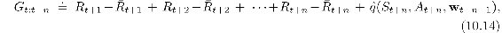
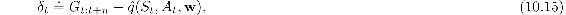
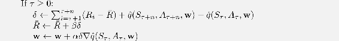

# 10.5  Differential Semi-gradient *n*-step Sarsa

In order to generalize to *n-step* bootstrapping, we need an *n*-step version of the TD error. We begin by generalizing the *n*-step return ([7.4](part0015_split_002.html#x1-72002r4)) to its differential form, with function approximation:

where *R* is an estimate of *r*(*π*), *n* ≥ 1, and *t* + *n < T*. If *t* + *n* ≥ *T*, then we define G*t*:*t*+*n* ≐ G*t* as usual. The *n*-step TD error is then

after which we can apply our usual semi-gradient Sarsa update ([10.12](part0019_split_003.html#x1-117007r12)). Pseudocode for the complete algorithm is given in the box.

**Differential semi-gradient *n*-step Sarsa for estimating ≈ *qπ* or *q*\***

Input: a differentiable function  : 𝒮×𝒜× ℝ*d* *→* ℝ, a policy *π*

Initialize value-function weights **w** ∈ ℝ*d* arbitrarily (e.g., **w** = **0**)

Initialize average-reward estimate *R* ∈ ℝ arbitrarily (e.g., *R* = 0)

Algorithm parameters: step size *α, β >* 0, a positive integer *n*

All store and access operations (*S**t*, *A**t*, and *R**t*) can take their index mod *n* +1

Initialize and store *S*0 and *A*0

Loop for each step, *t* = 0, 1, 2*, …*:

Take action *A**t*

Observe and store the next reward as *R**t*+1 and the next state as *S**t*+1

Select and store an action *A**t*+1 *∼ π*(·|*S**t*+1), or *ε*-greedy wrt  (*S**t*+1, ·, **w**)

*τ* ← *t* − *n* +1 (*τ* is the time whose estimate is being updated)

*Exercise 10.9* In the differential semi-gradient *n*-step Sarsa algorithm, the step-size parameter on the average reward, *β*, needs to be quite small so that *R* becomes a good long-term estimate of the average reward. Unfortunately, *R* will then be biased by its initial value for many steps, which may make learning inefficient. Alternatively, one could use a sample average of the observed rewards for *R*. That would initially adapt rapidly but in the long run would also adapt slowly. As the policy slowly changed, *R* would also change; the potential for such long-term nonstationarity makes sample-average methods ill-suited. In fact, the step-size parameter on the average reward is a perfect place to use the unbiased constant-step-size trick from [Exercise 2.7](part0010_split_006.html#sec1-13). Describe the specific changes needed to the boxed algorithm for differential semi-gradient *n*-step Sarsa to use this trick.

□
