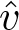
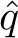

# Chapter 11

# \*Off-policy Methods with Approximation

This book has treated on-policy and off-policy learning methods since Chapter 5 primarily as two alternative ways of handling the conflict between exploitation and exploration inherent in learning forms of generalized policy iteration. The two chapters preceding this have treated the *on*-policy case with function approximation, and in this chapter we treat the *off* -policy case with function approximation. The extension to function approximation turns out to be significantly different and harder for off-policy learning than it is for on-policy learning. The tabular off-policy methods developed in Chapters 6 and 7 readily extend to semi-gradient algorithms, but these algorithms do not converge as robustly as they do under on-policy training. In this chapter we explore the convergence problems, take a closer look at the theory of linear function approx., introduce a notion of learnability, and then discuss new algorithms with stronger convergence guarantees for the off-policy case. In the end we will have improved methods, but the theoretical results will not be as strong, nor the empirical results as satisfying, as they are for on-policy learning. Along the way, we will gain a deeper understanding of approximation in reinforcement learning for on-policy learning as well as off-policy learning.

Recall that in off-policy learning we seek to learn a value function for a *target policy π*, given data due to a different *behavior policy b*. In the prediction case, both policies are static and given, and we seek to learn either state values  ≈ *vπ* or action values ≈ *qπ*. In the control case, action values are learned, and both policies typically change during learning—*π* being the greedy policy with respect to , and *b* being something more exploratory such as the *ε*-greedy policy with respect to .

The challenge of off-policy learning can be divided into two parts, one that arises in the tabular case and one that arises only with function approximation. The first part of the challenge has to do with the target of the update (not to be confused with the target policy), and the second part has to do with the distribution of the updates. The techniques related to importance sampling developed in Chapters 5 and 7 deal with the first part; these may increase variance but are needed in all successful algorithms, tabular and approximate. The extension of these techniques to function approximation are quickly dealt with in the first section of this chapter.

Something more is needed for the second part of the challenge of off-policy learning with function approximation because the distribution of updates in the off-policy case is not according to the on-policy distribution. The on-policy distribution is important to the stability of semi-gradient methods. Two general approaches have been explored to deal with this. One is to use importance sampling methods again, this time to warp the update distribution back to the on-policy distribution, so that semi-gradient methods are guaranteed to converge (in the linear case). The other is to develop true gradient methods that do not rely on any special distribution for stability. We present methods based on both approaches. This is a cutting-edge research area, and it is not clear which of these approaches is most effective in practice.
