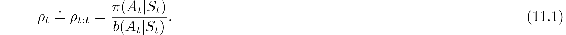
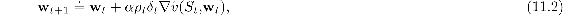
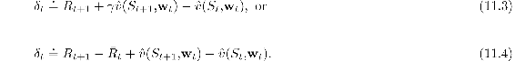
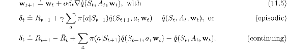
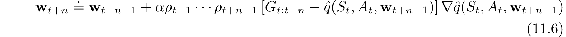
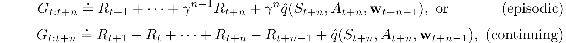
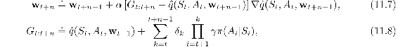

# 11.1  Semi-gradient Methods

We begin by describing how the methods developed in earlier chapters for the off-policy case extend readily to function approximation as semi-gradient methods. These methods address the first part of the challenge of off-policy learning (changing the update targets) but not the second part (changing the update distribution). Accordingly, these methods may diverge in some cases, and in that sense are not sound, but still they are often successfully used. Remember that these methods *are* guaranteed stable and asymptotically unbiased for the tabular case, which corresponds to a special case of function approximation. So it may still be possible to combine them with feature selection methods in such a way that the combined system could be assured stable. In any event, these methods are simple and thus a good place to start.

In Chapter 7 we described a variety of tabular off-policy algorithms. To convert them to semi-gradient form, we simply replace the update to an array (*V* or *Q*) to an update to a weight vector (**w**), using the approximate value function ( or ) and its gradient. Many of these algorithms use the per-step importance sampling ratio:

For example, the one-step, state-value algorithm is semi-gradient off-policy TD(0), which is just like the corresponding on-policy algorithm (page 203) except for the addition of *ρ**t*:

where *δ**t* is defined appropriately depending on whether the problem is episodic and discounted, or continuing and undiscounted using average reward:

For action values, the one-step algorithm is semi-gradient Expected Sarsa:

Note that this algorithm does not use importance sampling. In the tabular case it is clear that this is appropriate because the only sample action is *A**t*, and in learning its value we do not have to consider any other actions. With function approximation it is less clear because we might want to weight different state–action pairs differently once they all contribute to the same overall approximation. Proper resolution of this issue awaits a more thorough understanding of the theory of function approximation in reinforcement learning.

In the multi-step generalizations of these algorithms, both the state-value and action-value algorithms involve importance sampling. For example, the *n*-step version of semi-gradient Expected Sarsa is

with

where here we are being slightly informal in our treatment of the ends of episodes. In the first equation, the *ρ**k*s for *k* ≥ *T* (where *T* is the last time step of the episode) should be taken to be 1, and G*t*:*n* should be taken to be G*t* if *t* + *n* ≥ *T*.

Recall that we also presented in Chapter 7 an off-policy algorithm that does not involve importance sampling at all: the *n*-step tree-backup algorithm. Here is its semi-gradient version:

with *δ**t* as defined at the top of this page for Expected Sarsa. We also defined in Chapter 7 an algorithm that unifies all action-value algorithms: *n*-step *Q*(*σ*). We leave the semi-gradient form of that algorithm, and also of the *n*-step state-value algorithm, as exercises for the reader.

*Exercise 11.1* Convert the equation of *n*-step off-policy TD ([7.9](part0015_split_003.html#x1-73001r9)) to semi-gradient form. Give accompanying definitions of the return for both the episodic and continuing cases.

□

**\*** *Exercise 11.2* Convert the equations of *n*-step *Q*(*σ*) ([7.11](part0015_split_003.html#x1-73003r11) and [7.18](part0015_split_006.html#x1-76003r18)) to semi-gradient form. Give definitions that cover both the episodic and continuing cases.

□
