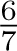
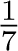
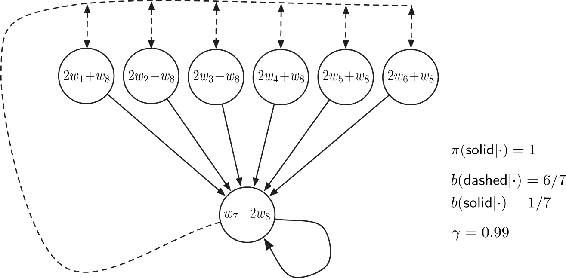
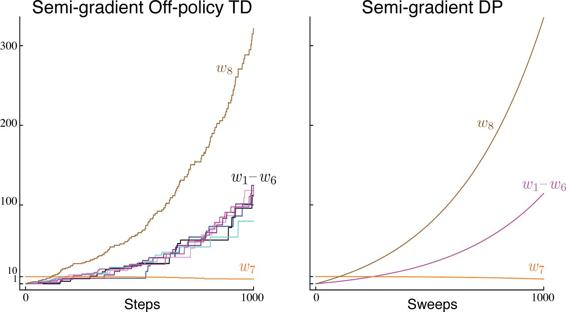
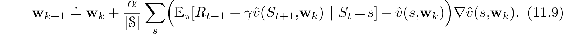
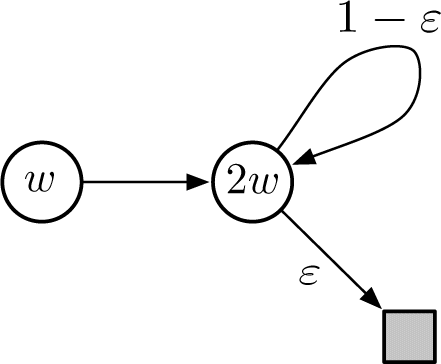
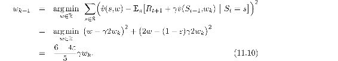
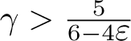

# 11.2  Examples of Off-policy Divergence

In this section we begin to discuss the second part of the challenge of off-policy learning with function approximation—that the distribution of updates does not match the on-policy distribution. We describe some instructive counterexamples to off-policy learning—cases where semi-gradient and other simple algorithms are unstable and diverge.

To establish intuitions, it is best to consider first a very simple example. Suppose, perhaps as part of a larger MDP, there are two states whose estimated values are of the functional form *w* and 2*w*, where the parameter vector **w** consists of only a single component *w*. This occurs under linear function approx. if the feature vectors for the two states are each simple numbers (single-component vectors), in this case 1 and 2. In the first state, only one action is available, and it results deterministically in a transition to the second state with a reward of 0:

where the expressions inside the two circles indicate the two state’s values.

Suppose initially *w* = 10. The transition will then be from a state of estimated value 10 to a state of estimated value 20. It will look like a good transition, and *w* will be increased to raise the first state’s estimated value. If *γ* is nearly 1, then the TD error will be nearly 10, and, if *α* = 0.1, then *w* will be increased to nearly 11 in trying to reduce the TD error. However, the second state’s estimated value will also be increased, to nearly 22. If the transition occurs again, then it will be from a state of estimated value ≈11 to a state of estimated value ≈22, for a TD error of ≈11—larger, not smaller, than before. It will look even more like the first state is undervalued, and its value will be increased again, this time to ≈12.1. This looks bad, and in fact with further updates *w* will diverge to infinity.

To see this definitively we have to look more carefully at the sequence of updates. The TD error on a transition between the two states is

and the off-policy semi-gradient TD(0) update (from ([11.2](part0020_split_001.html#x1-123002r2))) is

Note that the importance sampling ratio, *ρ**t*, is 1 on this transition because there is only one action available from the first state, so its probabilities of being taken under the target and behavior policies must both be 1. In the final update above, the new parameter is the old parameter times a scalar constant, 1 + *α*(2*γ* − 1). If this constant is greater than 1, then the system is unstable and *w* will go to positive or negative infinity depending on its initial value. Here this constant is greater than 1 whenever *γ >* 0.5. Note that stability does not depend on the specific step size, as long as *α >* 0. Smaller or larger step sizes would affect the rate at which *w* goes to infinity, but not whether it goes there or not.

Key to this example is that the one transition occurs repeatedly without *w* being updated on other transitions. This is possible under off-policy training because the behavior policy might select actions on those other transitions which the target policy never would. For these transitions, *ρ**t* would be zero and no update would be made. Under on-policy training, however, *ρ**t* is always one. Each time there is a transition from the *w* state to the 2*w* state, increasing *w*, there would also have to be a transition out of the 2*w* state. That transition would reduce *w*, unless it were to a state whose value was higher (because *γ <* 1) than 2*w*, and then that state would have to be followed by a state of even higher value, or else again *w* would be reduced. Each state can support the one before only by creating a higher expectation. Eventually the piper must be paid. In the on-policy case the promise of future reward must be kept and the system is kept in check. But in the off-policy case, a promise can be made and then, after taking an action that the target policy never would, forgotten and forgiven.

This simple example communicates much of the reason why off-policy training can lead to divergence, but it is not completely convincing because it is not complete—it is just a fragment of a complete MDP. Can there really be a complete system with instability? A simple complete example of divergence is *Baird’s counterexample*. Consider the episodic seven-state, two-action MDP shown in [Figure 11.1](part0020_split_002.html#fig11-1). The `dashed` action takes the system to one of the six upper states with equal probability, whereas the `solid` action takes the system to the seventh state. The behavior policy *b* selects the `dashed` and `solid` actions with probabilities  and , so that the next-state distribution under it is uniform (the same for all nonterminal states), which is also the starting distribution for each episode. The target policy *π* always takes the solid action, and so the on-policy distribution (for *π*) is concentrated in the seventh state. The reward is zero on all transitions. The discount rate is *γ* = 0.99.

[Figure 11.1](part0020_split_002.html#C_fig11-1): Baird’s counterexample. The approximate state-value function for this Markov process is of the form shown by the linear expressions inside each state. The `solid` action usually results in the seventh state, and the `dashed` action usually results in one of the other six states, each with equal probability. The reward is always zero.

Consider estimating the state-value under the linear parameterization indicated by the expression shown in each state circle. For example, the estimated value of the leftmost state is 2*w*1 + *w*8, where the subscript corresponds to the component of the overall weight vector **w** ∈ ℝ8; this corresponds to a feature vector for the first state being **x**(1) = (2, 0, 0, 0, 0, 0, 0, 1)⊤. The reward is zero on all transitions, so the true value function is *vπ*(*s*) = 0, for all *s*, which can be exactly approximated if **w** = **0**. In fact, there are many solutions, as there are more components to the weight vector (8) than there are nonterminal states (7). Moreover, the set of feature vectors, {**x**(*s*) : *s* ∈𝒮}, is a linearly independent set. In all these ways this task seems a favorable case for linear function approx.

If we apply semi-gradient TD(0) to this problem ([11.2](part0020_split_001.html#x1-123002r2)), then the weights diverge to infinity, as shown in [Figure 11.2](part0020_split_002.html#fig11-2) (left). The instability occurs for any positive step size, no matter how small. In fact, it even occurs if an expected update is done as in dynamic programming (DP), as shown in [Figure 11.2](part0020_split_002.html#fig11-2) (right). That is, if the weight vector, **w***k*, is updated for all states at the same time in a semi-gradient way, using the DP (expectation-based) target:

[Figure 11.2](part0020_split_002.html#C_fig11-2): Demonstration of instability on Baird’s counterexample. Shown are the evolution of the components of the parameter vector **w** of the two semi-gradient algorithms. The step size was *α* = 0.01, and the initial weights were **w** = (1, 1, 1, 1, 1, 1, 10, 1)⊤.

In this case, there is no randomness and no asynchrony, just as in a classical DP update. The method is conventional except in its use of semi-gradient function approximation. Yet still the system is unstable.

If we alter just the distribution of DP updates in Baird’s counterexample, from the uniform distribution to the on-policy distribution (which generally requires asynchronous updating), then convergence is guaranteed to a solution with error bounded by ([9.14](part0018_split_004.html#x1-99010r14)). This example is striking because the TD and DP methods used are arguably the simplest and best-understood bootstrapping methods, and the linear, semi-descent method used is arguably the simplest and best-understood kind of function approximation. The example shows that even the simplest combination of bootstrapping and function approximation can be unstable if the updates are not done according to the on-policy distribution.

There are also counterexamples similar to Baird’s showing divergence for Q-learning. This is cause for concern because otherwise Q-learning has the best convergence guarantees of all control methods. Considerable effort has gone into trying to find a remedy to this problem or to obtain some weaker, but still workable, guarantee. For example, it may be possible to guarantee convergence of Q-learning as long as the behavior policy is sufficiently close to the target policy, for example, when it is the *ε*-greedy policy. To the best of our knowledge, Q-learning has never been found to diverge in this case, but there has been no theoretical analysis. In the rest of this section we present several other ideas that have been explored.

Suppose that instead of taking just a step toward the expected one-step return on each iteration, as in Baird’s counterexample, we actually change the value function all the way to the best, least-squares approximation. Would this solve the instability problem? Of course it would if the feature vectors, {**x**(*s*): *s* ∈𝒮}, formed a linearly independent set, as they do in Baird’s counterexample, because then exact approximation is possible on each iteration and the method reduces to standard tabular DP. But of course the point here is to consider the case when an exact solution is *not* possible. In this case stability is not guaranteed even when forming the best approximation at each iteration, as shown in the example.

**Example 11.1: Tsitsiklis and Van Roy’s Counterexample** This example shows that linear function approx. would not work with DP even if the least-squares solution was found at each step. The counterexample is formed by extending the *w*-to-2*w* example (from earlier in this section) with a terminal state, as shown to the right. As before, the estimated value of the first state is *w*, and the estimated value of the second state is 2*w*. The reward is zero on all transitions, so the true values are zero at both states, which is exactly representable with *w* = 0. If we set *w**k*+1 at each step so as to minimize the VE between the estimated value and the expected one-step return, then we have

The sequence {*w**k*} diverges when  and *w*0 ≠ 0.

■

Another way to try to prevent instability is to use special methods for function approximation. In particular, stability is guaranteed for function approximation methods that do not extrapolate from the observed targets. These methods, called *averagers*, include nearest neighbor methods and locally weighted regression, but not popular methods such as tile coding and artificial neural networks (ANNs).

*Exercise 11.3 (programming)* Apply one-step semi-gradient Q-learning to Baird’s counterexample and show empirically that its weights diverge.

□
