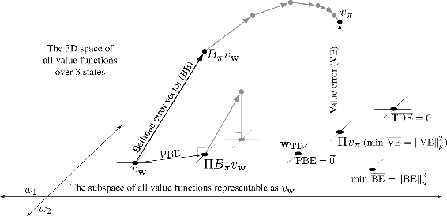
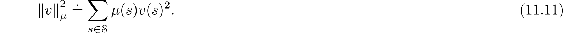
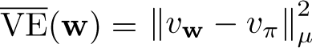
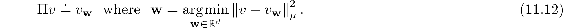
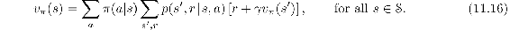
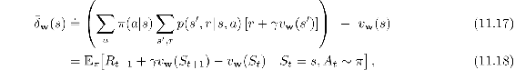
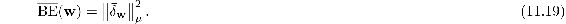
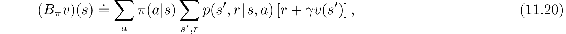
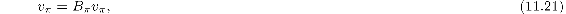
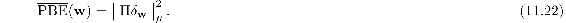

# 11.4  Linear Value-function Geometry

To better understand the stability challenge of off-policy learning, it is helpful to think about value function approximation more abstractly and independently of how learning is done. We can imagine the space of all possible state-value functions—all functions from states to real numbers *v* : 𝒮 *→* ℝ. Most of these value functions do not correspond to any policy. More important for our purposes is that most are not representable by the function approximator, which by design has far fewer parameters than there are states.

Given an enumeration of the state space 𝒮 = {*s*1*, s*2*, …, s*|𝒮|}, any value function *v* corresponds to a vector listing the value of each state in order [*v*(*s*1)*, v*(*s*2)*, …, v*(*s*|𝒮|)]⊤. This vector representation of a value function has as many components as there are states. In most cases where we want to use function approximation, this would be far too many components to represent the vector explicitly. Nevertheless, the idea of this vector is conceptually useful. In the following, we treat a value function and its vector representation interchangeably.

To develop intuitions, consider the case with three states 𝒮 = {*s*1*, s*2*, s*3} and two parameters **w** = (*w*1*, w*2)⊤. We can then view all value functions/vectors as points in a three-dimensional space. The parameters provide an alternative coordinate system over a two-dimensional subspace. Any weight vector **w** = (*w*1*, w*2)⊤ is a point in the two-dimensional subspace and thus also a complete value function *v***w** that assigns values to all three states. With general function approximation the relationship between the full space and the subspace of representable functions could be complex, but in the case of *linear* value-function approximation the subspace is a simple plane, as suggested by [Figure 11.3](part0020_split_004.html#fig11-3).

[Figure 11.3](part0020_split_004.html#C_fig11-3): The geometry of linear value-function approximation. Shown is the three-dimensional space of all value functions over three states, while shown as a plane is the subspace of all value functions representable by a linear function approximator with parameter **w** = (*w*1*, w*2)⊤. The true value function *v**π* is in the larger space and can be projected down (into the subspace, using a projection operator Π) to its best approximation in the value error (VE) sense. The best approximators in the Bellman error (BE), projected Bellman error (PBE), and temporal difference error (TDE) senses are all potentially different and are shown in the lower right. (VE, BE, and PBE are all treated as the corresponding vectors in this figure.) The Bellman operator takes a value function in the plane to one outside, which can then be projected back. If you iteratively applied the Bellman operator outside the space (shown in gray above) you would reach the true value function, as in conventional dynamic programming. If instead you kept projecting back into the subspace at each step, as in the lower step shown in gray, then the fixed point would be the point of vector-zero PBE.

Now consider a single fixed policy *π*. We assume that its true value function, *v**π*, is too complex to be represented exactly as an approximation. Thus *v**π* is not in the subspace; in the figure it is depicted as being above the planar subspace of representable functions.

If *vπ* cannot be represented exactly, what representable value function is closest to it? This turns out to be a subtle question with multiple answers. To begin, we need a measure of the distance between two value functions. Given two value functions *v*1 and *v*2, we can talk about the vector difference between them, *v* = *v*1 − *v*2. If *v* is small, then the two value functions are close to each other. But how are we to measure the size of this difference vector? The conventional Euclidean norm is not appropriate because, as discussed in Section 9.2, some states are more important than others because they occur more frequently or because we are more interested in them (Section 9.11). As in Section 9.2, let us use the distribution *μ* : 𝒮 *→* [0, 1] to specify the degree to which we care about different states being accurately valued (often taken to be the on-policy distribution). We can then define the distance between value functions using the norm

Note that the VE from Section 9.2 can be written simply using this norm as . For any value function *v*, the operation of finding its closest value function in the subspace of representable value functions is a projection operation. We define a projection operator Π that takes an arbitrary value function to the representable function that is closest in our norm:

The representable value function that is closest to the true value function *vπ* is thus its projection, Π*vπ*, as suggested in [Figure 11.3](part0020_split_004.html#fig11-3). This is the solution asymptotically found by Monte Carlo methods, albeit often very slowly. The projection operation is discussed more fully in the box on the next page.

TD methods find different solutions. To understand their rationale, recall that the Bellman equation for value function *vπ* is

The projection matrix

For a linear function approximator, the projection operation is linear, which implies that it can be represented as an |𝒮|×|𝒮| matrix:

where, as in Section 9.4, **D** denotes the |𝒮|×|𝒮| diagonal matrix with the *μ*(*s*) on the diagonal, and *X* denotes the |𝒮|× *d* matrix whose rows are the feature vectors **x**(*s*)⊤, one for each state *s*. If the inverse in does not exist, then the pseudoinverse is substituted. Using these matrices, the norm of a vector can be written

and the approximate linear value function can be written

The true value function *vπ* is the only value function that solves ([11.16](part0020_split_004.html#x1-126007r16)) exactly. If an approximate value function *v***w** were substituted for *vπ*, the difference between the right and left sides of the modified equation could be used as a measure of how far off *v***w** is from *vπ*. We call this the *Bellman error* at state *s*:

which shows clearly the relationship of the Bellman error to the TD error ([11.3](part0020_split_001.html#x1-123003r3)). The Bellman error is the expectation of the TD error.

The vector of all the Bellman errors, at all states, *δ***w** ∈ ℝ|𝒮|, is called the *Bellman error vector* (shown as BE in [Figure 11.3](part0020_split_004.html#fig11-3)). The overall size of this vector, in the norm, is an overall measure of the error in the value function, called the *Mean Squared Bellman Error*:

It is not possible in general to reduce the BE to zero (at which point *v***w** = *vπ*), but for linear function approx. there is a unique value of **w** for which the BE is minimized. This point in the representable-function subspace (labeled min BE in [Figure 11.3](part0020_split_004.html#fig11-3)) is different in general from that which minimizes the VE (shown as Π*vπ*). Methods that seek to minimize the BE are discussed in the next two sections.

The Bellman error vector is shown in [Figure 11.3](part0020_split_004.html#fig11-3) as the result of applying the *Bellman operator Bπ* : ℝ|𝒮| *→* ℝ|𝒮| to the approximate value function. The Bellman operator is defined by

for all *s* ∈𝒮 and *v* : 𝒮 *→* ℝ. The Bellman error vector for *v* can be written *δ***w** = *Bπv***w** − *v***w**.

If the Bellman operator is applied to a value function in the representable subspace, then, in general, it will produce a new value function that is outside the subspace, as suggested in the figure. In dynamic programming (without function approximation), this operator is applied repeatedly to the points outside the representable space, as suggested by the gray arrows in the top of [Figure 11.3](part0020_split_004.html#fig11-3). Eventually that process converges to the true value function *vπ*, the only fixed point for the Bellman operator, the only value function for which

which is just another way of writing the Bellman equation for *π* ([11.16](part0020_split_004.html#x1-126007r16)).

With function approximation, however, the intermediate value functions lying outside the subspace cannot be represented. The gray arrows in the upper part of [Figure 11.3](part0020_split_004.html#fig11-3) cannot be followed because after the first update (dark line) the value function must be projected back into something representable. The next iteration then begins within the subspace; the value function is again taken outside of the subspace by the Bellman operator and then mapped back by the projection operator, as suggested by the lower gray arrow and line. Following these arrows is a DP-like process with approximation.

In this case we are interested in the projection of the Bellman error vector back into the representable space. This is the projected Bellman error vector Π*δ**v***w**, shown in [Figure 11.3](part0020_split_004.html#fig11-3) as PBE. The size of this vector, in the norm, is another measure of error in the approximate value function. For any approximate value function *v*, we define the *Mean Square Projected Bellman Error*, denoted PBE, as

With linear function approx. there always exists an approximate value function (within the subspace) with zero PBE; this is the TD fixed point, **w**TD, introduced in Section 9.4. As we have seen, this point is not always stable under semi-gradient TD methods and off-policy training. As shown in the figure, this value function is generally different from those minimizing VE or BE. Methods that are guaranteed to converge to it are discussed in Sections 11.7 and 11.8.
