# 11.5  Gradient Descent in the Bellman Error

Armed with a better understanding of value function approximation and its various objectives, we return now to the challenge of stability in off-policy learning. We would like to apply the approach of stochastic gradient descent (SGD, Section 9.3), in which updates are made that in expectation are equal to the negative gradient of an objective function. These methods always go downhill (in expectation) in the objective and because of this are typically stable with excellent convergence properties. Among the algorithms investigated so far in this book, only the Monte Carlo methods are true SGD methods. These methods converge robustly under both on-policy and off-policy training as well as for general nonlinear (differentiable) function approximators, though they are often slower than semi-gradient methods with bootstrapping, which are not SGD methods. Semi-gradient methods may diverge under off-policy training, as we have seen earlier in this chapter, and under contrived cases of nonlinear function approximation (Tsitsiklis and Van Roy, 1997). With a true SGD method such divergence would not be possible.

The appeal of SGD is so strong that great effort has gone into finding a practical way of harnessing it for reinforcement learning. The starting place of all such efforts is the choice of an error or objective function to optimize. In this and the next section we explore the origins and limits of the most popular proposed objective function, that based on the *Bellman error* introduced in the previous section. Although this has been a popular and influential approach, the conclusion that we reach here is that it is a misstep and yields no good learning algorithms. On the other hand, this approach fails in an interesting way that offers insight into what might constitute a good approach.

To begin, let us consider not the Bellman error, but something more immediate and naive. Temporal difference learning is driven by the TD error. Why not take the minimization of the expected square of the TD error as the objective? In the general function-approximation case, the one-step TD error with discounting is

A possible objective function then is what one might call the *Mean Squared TD Error*:

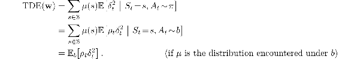

The last equation is of the form needed for SGD; it gives the objective as an expectation that can be sampled from experience (remember the experience is due to the behavior policy *b*). Thus, following the standard SGD approach, one can derive the per-step update based on a sample of this expected value:

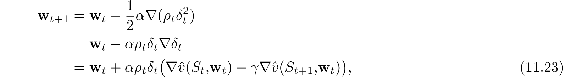

which you will recognize as the same as the semi-gradient TD algorithm ([11.2](part0020_split_001.html#x1-123002r2)) except for the additional final term. This term completes the gradient and makes this a true SGD algorithm with excellent convergence guarantees. Let us call this algorithm the *naive residual-gradient* algorithm (after Baird, 1995). Although the naive residual-gradient algorithm converges robustly, it does not necessarily converge to a desirable place.

**Example 11.2: A-split example, showing the naiveté of the naive residual-gradient algorithm**

Consider the three-state episodic MRP shown to the right. Episodes begin in state `A` and then ‘split’ stochastically, half the time going to `B` (and then invariably going on to terminate with a reward of 1) and half the time going to state `C` (and then invariably terminating with a reward of zero). Reward for the first transition, out of `A`, is always zero whichever way the episode goes. As this is an episodic problem, we can take *γ* to be 1. We also assume on-policy training, so that *ρ**t* is always 1, and tabular function approximation, so that the learning algorithms are free to give arbitrary, independent values to all three states. Thus, this should be an easy problem.

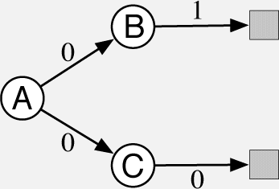

What should the values be? From `A`, half the time the return is 1, and half the time the return is 0; `A` should have value 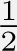. From `B` the return is always 1, so its value should be 1, and similarly from `C` the return is always 0, so its value should be 0. These are the true values and, as this is a tabular problem, all the methods presented previously converge to them exactly.

However, the naive residual-gradient algorithm finds different values for `B` and `C`. It converges with `B` having a value of 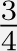 and `C` having a value of 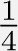 (`A` converges correctly to ). These are in fact the values that minimize the TDE.

Let us compute the TDE for these values. The first transition of each episode is either up from `A`’s  to `B`’s , a change of , or down from `A`’s  to `C`’s , a change of 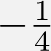. Because the reward is zero on these transitions, and *γ* = 1, these changes *are* the TD errors, and thus the squared TD error is always 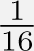 on the first transition. The second transition is similar; it is either up from `B`’s  to a reward of 1 (and a terminal state of value 0), or down from `C`’s  to a reward of 0 (again with a terminal state of value 0). Thus, the TD error is always 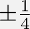, for a squared error of  on the second step. Thus, for this set of values, the TDE on both steps is .

Now let’s compute the TDE for the true values (`B` at 1, `C` at 0, and `A` at ). In this case the first transition is either from  up to 1, at `B`, or from  down to 0, at `C`; in either case the absolute error is  and the squared error is . The second transition has zero error because the starting value, either 1 or 0 depending on whether the transition is from `B` or `C`, always exactly matches the immediate reward and return. Thus the squared TD error is  on the first transition and 0 on the second, for a mean reward over the two transitions of 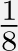. As  is bigger that , this solution is worse according to the TDE. On this simple problem, the true values do not have the smallest TDE.

A tabular representation is used in the A-split example, so the true state values can be exactly represented, yet the naive residual-gradient algorithm finds different values, and these values have lower TDE than do the true values. Minimizing the TDE is naive; by penalizing all TD errors it achieves something more like temporal smoothing than accurate prediction.

A better idea would seem to be minimizing the Bellman error. If the exact values are learned, the Bellman error is zero everywhere. Thus, a Bellman-error-minimizing algorithm should have no trouble with the A-split example. We cannot expect to achieve zero Bellman error in general, as it would involve finding the true value function, which we presume is outside the space of representable value functions. But getting close to this ideal is a natural-seeming goal. As we have seen, the Bellman error is also closely related to the TD error. The Bellman error for a state is the expected TD error in that state. So let’s repeat the derivation above with the expected TD error (all expectations here are implicitly conditional on *S**t*):

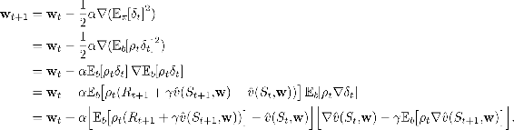

This update and various ways of sampling it are referred to as the *residual-gradient algorithm*. If you simply used the sample values in all the expectations, then the equation above reduces almost exactly to ([11.23](part0020_split_005.html#x1-127003r23)), the naive residual-gradient algorithm.[1](part0020_split_012.html#fn1x14) But this is naive, because the equation above involves the next state, *S**t*+1, appearing in two expectations that are multiplied together. To get an unbiased sample of the product, two independent samples of the next state are required, but during normal interaction with an external environment only one is obtained. One expectation or the other can be sampled, but not both.

There are two ways to make the residual-gradient algorithm work. One is in the case of deterministic environments. If the transition to the next state is deterministic, then the two samples will necessarily be the same, and the naive algorithm is valid. The other way is to obtain *two* independent samples of the next state, *S**t*+1, from *S**t*, one for the first expectation and another for the second expectation. In real interaction with an environment, this would not seem possible, but when interacting with a simulated environment, it is. One simply rolls back to the previous state and obtains an alternate next state before proceeding forward from the first next state. In either of these cases the residual-gradient algorithm is guaranteed to converge to a minimum of the BE under the usual conditions on the step-size parameter. As a true SGD method, this convergence is robust, applying to both linear and nonlinear function approximators. In the linear case, convergence is always to the *unique* **w** that minimizes the BE.

However, there remain at least three ways in which the convergence of the residual-gradient method is unsatisfactory. The first of these is that empirically it is slow, much slower that semi-gradient methods. Indeed, proponents of this method have proposed increasing its speed by combining it with faster semi-gradient methods initially, then gradually switching over to residual gradient for the convergence guarantee (Baird and Moore, 1999). The second way in which the residual-gradient algorithm is unsatisfactory is that it still seems to converge to the wrong values. It does get the right values in all tabular cases, such as the A-split example, as for those an exact solution to the Bellman equation is possible. But if we examine examples with genuine function approximation, then the residual-gradient algorithm, and indeed the BE objective, seem to find the wrong value functions. One of the most telling such examples is the variation on the A-split example known as the A-*pre*split example, shown on the preceding page, in which the residual-gradient algorithm finds the same poor solution as its naive version. This example shows intuitively that minimizing the BE (which the residual-gradient algorithm surely does) may not be a desirable goal.

**Example 11.3: A-presplit example, a counterexample for the BE**

Consider the three-state episodic MRP shown to the right: Episodes start in either `A1` or `A2`, with equal probability. These two states look exactly the same to the function approximator, like a single state `A` whose feature representation is distinct from and unrelated to the feature representation of the other two states, `B` and `C`, which are also distinct from each other. Specifically, the parameter of the function approximator has three components, one giving the value of state `B`, one giving the value of state `C`, and one giving the value of both states `A1` and `A2`. Other than the selection of the initial state, the system is deterministic. If it starts in `A1`, then it transitions to `B` with a reward of 0 and then on to termination with a reward of 1. If it starts in `A2`, then it transitions to `C`, and then to termination, with both rewards zero.

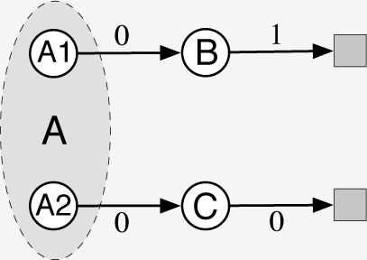

To a learning algorithm, seeing only the features, the system looks identical to the A-split example. The system seems to always start in `A`, followed by either `B` or `C` with equal probability, and then terminating with a 1 or a 0 depending deterministically on the previous state. As in the A-split example, the true values of `B` and `C` are 1 and 0, and the best shared value of `A1` and `A2` is 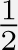, by symmetry.

Because this problem appears externally identical to the A-split example, we already know what values will be found by the algorithms. Semi-gradient TD converges to the ideal values just mentioned, while the naive residual-gradient algorithm converges to values of 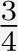 and 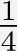 for `B` and `C` respectively. All state transitions are deterministic, so the non-naive residual-gradient algorithm will also converge to these values (it is the same algorithm in this case). It follows then that this ‘naive’ solution must also be the one that minimizes the BE, and so it is. On a deterministic problem, the Bellman errors and TD errors are all the same, so the BE is always the same as the TDE. Optimizing the BE on this example gives rise to the same failure mode as with the naive residual-gradient algorithm on the A-split example.

The third way in which the convergence of the residual-gradient algorithm is not satisfactory is explained in the next section. Like the second way, the third way is also a problem with the BE objective itself rather than with any particular algorithm for achieving it.
