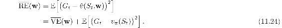
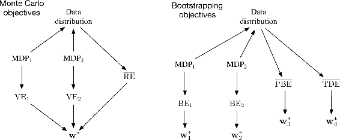
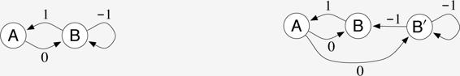
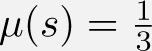
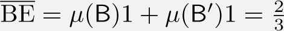
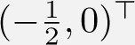
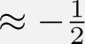

# 11.6  The Bellman Error is Not Learnable

The concept of learnability that we introduce in this section is different from that commonly used in machine learning. There, a hypothesis is said to be “learnable” if it is *efficiently* learnable, meaning that it can be learned within a polynomial rather than an exponential number of examples. Here we use the term in a more basic way, to mean learnable at all, with any amount of experience. It turns out many quantities of apparent interest in reinforcement learning cannot be learned even from an infinite amount of experiential data. These quantities are well defined and can be computed given knowledge of the internal structure of the environment, but cannot be computed or estimated from the observed sequence of feature vectors, actions, and rewards.[2](part0020_split_012.html#fn2x14) We say that they are not *learnable*. It will turn out that the Bellman error objective (BE) introduced in the last two sections is not learnable in this sense. That the Bellman error objective cannot be learned from the observable data is probably the strongest reason not to seek it.

To make the concept of learnability clear, let’s start with some simple examples. Consider the two Markov reward processes[3](part0020_split_012.html#fn3x14) (MRPs) diagrammed below:

Where two edges leave a state, both transitions are assumed to occur with equal probability, and the numbers indicate the reward received. All the states appear the same; they all produce the same single-component feature vector *x* = 1 and have approximated value *w*. Thus, the only varying part of the data trajectory is the reward sequence. The left MRP stays in the same state and emits an endless stream of 0s and 2s at random, each with 0.5 probability. The right MRP, on every step, either stays in its current state or switches to the other, with equal probability. The reward is deterministic in this MRP, always a 0 from one state and always a 2 from the other, but because the each state is equally likely on each step, the observable data is again an endless stream of 0s and 2s at random, identical to that produced by the left MRP. (We can assume the right MRP starts in one of two states at random with equal probability.) Thus, even given even an infinite amount of data, it would not be possible to tell which of these two MRPs was generating it. In particular, we could not tell if the MRP has one state or two, is stochastic or deterministic. These things are not learnable.

This pair of MRPs also illustrates that the VE objective ([9.1](part0018_split_002.html#x1-97001r1)) is not learnable. If *γ* = 0, then the true values of the three states (in both MRPs), left to right, are 1, 0, and 2. Suppose *w* = 1. Then the VE is 0 for the left MRP and 1 for the right MRP. Because the VE is different in the two problems, yet the data generated has the same distribution, the VE cannot be learned. The VE is not a unique function of the data distribution. And if it cannot be learned, then how could the VE possibly be useful as an objective for learning?

If an objective cannot be learned, it does indeed draw its utility into question. In the case of the VE, however, there is a way out. Note that the same solution, *w* = 1, is optimal for both MRPs above (assuming *μ* is the same for the two indistinguishable states in the right MRP). Is this a coincidence, or could it be generally true that all MDPs with the same data distribution also have the same optimal parameter vector? If this is true—and we will show next that it is—then the VE remains a usable objective. The VE is not learnable, but the parameter that optimizes it is!

To understand this, it is useful to bring in another natural objective function, this time one that is clearly learnable. One error that is always observable is that between the value estimate at each time and the return from that time. The *Mean Square Return Error*, denoted RE, is the expectation, under *μ*, of the square of this error. In the on-policy case the RE can be written

Thus, the two objectives are the same except for a variance term that does not depend on the parameter vector. The two objectives must therefore have the same optimal parameter value **w**\*. The overall relationships are summarized in the left side of [Figure 11.4](part0020_split_006.html#fig11-4).

[Figure 11.4](part0020_split_006.html#C_fig11-4): Causal relationships among the data distribution, MDPs, and various objectives. **Left, Monte Carlo objectives:** Two different MDPs can produce the same data distribution yet also produce different VEs, proving that the VE objective cannot be determined from data and is not learnable. However, all such VEs must have the same optimal parameter vector, **w**\*! Moreover, this same **w**\* can be determined from another objective, the RE, which *is* uniquely determined from the data distribution. Thus **w**\* and the RE are learnable even though the VEs are not. **Right, Bootstrapping objectives:** Two different MDPs can produce the same data distribution yet also produce different BEs *and* have different minimizing parameter vectors; these are not learnable from the data distribution. The PBE and TDE objectives and their (different) minima can be directly determined from data and thus are learnable.

**\*** *Exercise 11.4* Prove ([11.24](part0020_split_006.html#x1-128003r24)). Hint: Write the RE as an expectation over possible states *s* of the expectation of the squared error given that *S**t* = *s*. Then add and subtract the true value of state *s* from the error (before squaring), grouping the subtracted true value with the return and the added true value with the estimated value. Then, if you expand the square, the most complex term will end up being zero, leaving you with ([11.24](part0020_split_006.html#x1-128003r24)).

□

Now let us return to the BE. The BE is like the VE in that it can be computed from knowledge of the MDP but is not learnable from data. But it is not like the VE in that its minimum solution is not learnable. The box on the next page presents a counterexample—two MRPs that generate the same data distribution but whose minimizing parameter vector is different, proving that the optimal parameter vector is not a function of the data and thus cannot be learned from it. The other bootstrapping objectives that we have considered, the PBE and TDE, can be determined from data (are learnable) and determine optimal solutions that are in general different from each other and the BE minimums. The general case is summarized in the right side of [Figure 11.4](part0020_split_006.html#fig11-4).

**Example 11.4: Counterexample to the learnability of the Bellman error**

To show the full range of possibilities we need a slightly more complex pair of Markov reward processes (MRPs) than those considered earlier. Consider the following two MRPs:

Where two edges leave a state, both transitions are assumed to occur with equal probability, and the numbers indicate the reward received. The MRP on the left has two states that are represented distinctly. The MRP on the right has three states, two of which, `B` and `B`′, appear the same and must be given the same approximate value. Specifically, **w** has two components and the value of state `A` is given by the first component and the value of `B` and `B`′ is given by the second. The second MRP has been designed so that equal time is spent in all three states, so we can take , for all *s*.

Note that the observable data distribution is identical for the two MRPs. In both cases the agent will see single occurrences of `A` followed by a 0, then some number of apparent `B`s, each followed by a − 1 except the last, which is followed by a 1, then we start all over again with a single `A` and a 0, etc. All the statistical details are the same as well; in both MRPs, the probability of a string of *k* `B`s is 2−*k*.

Now suppose **w** = **0**. In the first MRP, this is an exact solution, and the BE is zero. In the second MRP, this solution produces a squared error in both `B` and `B`′ of 1, such that . These two MRPs, which generate the same data distribution, have different BEs; the BE is not learnable.

Moreover (and unlike the earlier example for the VE) the minimizing value of **w** is different for the two MRPs. For the first MRP, **w** = **0** minimizes the BE for any *γ*. For the second MRP, the minimizing **w** is a complicated function of *γ*, but in the limit, as *γ →* 1, it is . Thus the solution that minimizes BE cannot be estimated from data alone; knowledge of the MRP beyond what is revealed in the data is required. In this sense, it is impossible in principle to pursue the BE as an objective for learning.

It may be surprising that in the second MRP the BE-minimizing value of `A` is so far from zero. Recall that `A` has a dedicated weight and thus its value is unconstrained by function approximation. `A` is followed by a reward of 0 and transition to a state with a value of nearly 0, which suggests *v***w**(`A`) should be 0; why is its optimal value substantially negative rather than 0? The answer is that making *v***w**(`A`) negative reduces the error upon arriving in `A` from `B`. The reward on this deterministic transition is 1, which implies that `B` should have a value 1 more than `A`. Because `B`’s value is approximately zero, `A`’s value is driven toward − 1. The BE-minimizing value of  for `A` is a compromise between reducing the errors on leaving and on entering `A`.

Thus, the BE is not learnable; it cannot be estimated from feature vectors and other observable data. This limits the BE to model-based settings. There can be no algorithm that minimizes the BE without access to the underlying MDP states beyond the feature vectors. The residual-gradient algorithm is only able to minimize BE because it is allowed to double sample from the same state—not a state that has the same feature vector, but one that is guaranteed to be the same underlying state. We can see now that there is no way around this. Minimizing the BE requires some such access to the nominal, underlying MDP. This is an important limitation of the BE beyond that identified in the A-presplit example on page 577. All this directs more attention toward the PBE.
