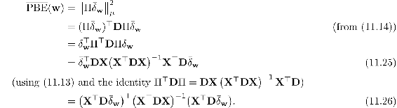
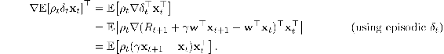
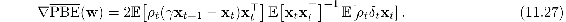
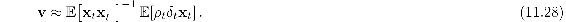
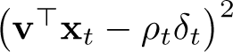
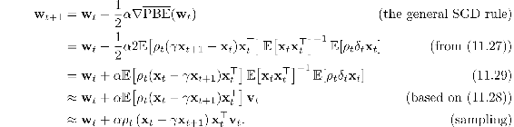
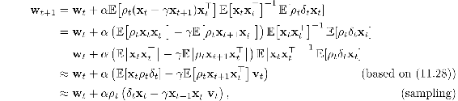
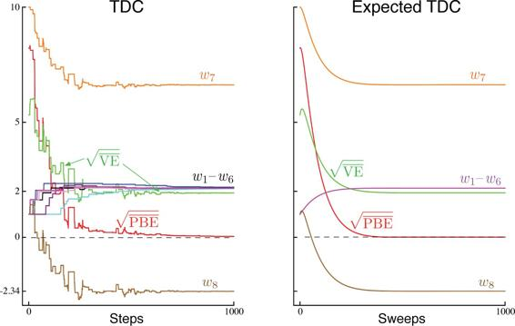
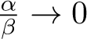

# 11.7  Gradient-TD Methods

We now consider SGD methods for minimizing the PBE. As true SGD methods, these *Gradient-TD methods* have robust convergence properties even under off-policy training and nonlinear function approximation. Remember that in the linear case there is always an exact solution, the TD fixed point **w**TD, at which the PBE is zero. This solution could be found by least-squares methods (Section 9.8), but only by methods of quadratic *O*(*d*2) complexity in the number of parameters. We seek instead an SGD method, which should be *O*(*d*) and have robust convergence properties. Gradient-TD methods come close to achieving these goals, at the cost of a rough doubling of computational complexity.

To derive an SGD method for the PBE (assuming linear function approx.) we begin by expanding and rewriting the objective ([11.22](part0020_split_004.html#x1-126013r22)) in matrix terms:

The gradient with respect to **w** is

To turn this into an SGD method, we have to sample something on every time step that has this quantity as its expected value. Let us take *μ* to be the distribution of states visited under the behavior policy. All three of the factors above can then be written in terms of expectations under this distribution. For example, the last factor can be written

which is just the expectation of the semi-gradient TD(0) update ([11.2](part0020_split_001.html#x1-123002r2)). The first factor is the transpose of the gradient of this update:

Finally, the middle factor is the inverse of the expected outer-product matrix of the feature vectors:

Substituting these expectations for the three factors in our expression for the gradient of the PBE, we get

It might not be obvious that we have made any progress by writing the gradient in this form. It is a product of three expressions and the first and last are not independent. They both depend on the next feature vector **x***t*+1; we cannot simply sample both of these expectations and then multiply the samples. This would give us a biased estimate of the gradient just as in the naive residual-gradient algorithm.

Another idea would be to estimate the three expectations separately and then combine them to produce an unbiased estimate of the gradient. This would work, but would require a lot of computational resources, particularly to store the first two expectations, which are *d* × *d* matrices, and to compute the inverse of the second. This idea can be improved. If two of the three expectations are estimated and stored, then the third could be sampled and used in conjunction with the two stored quantities. For example, you could store estimates of the second two quantities (using the increment inverse-updating techniques in Section 9.8) and then sample the first expression. Unfortunately, the overall algorithm would still be of quadratic complexity (of order *O*(*d*2)).

The idea of storing some estimates separately and then combining them with samples is a good one and is also used in Gradient-TD methods. Gradient-TD methods estimate and store *the product* of the second two factors in ([11.27](part0020_split_007.html#x1-129007r27)). These factors are a *d* × *d* matrix and a *d*-vector, so their product is just a *d*-vector, like **w** itself. We denote this second learned vector as **v**:

This form is familiar to students of linear supervised learning. It is the solution to a linear least-squares problem that tries to approximate *ρ**t**δ**t* from the features. The standard SGD method for incrementally finding the vector **v** that minimizes the expected squared error  is known as the Least Mean Square (LMS) rule (here augmented with an importance sampling ratio):

where *β >* 0 is another step-size parameter. We can use this method to effectively achieve ([11.28](part0020_split_007.html#x1-129008r28)) with *O*(*d*) storage and per-step computation.

Given a stored estimate **v***t* approximating ([11.28](part0020_split_007.html#x1-129008r28)), we can update our main parameter vector **w***t* using SGD methods based on ([11.27](part0020_split_007.html#x1-129007r27)). The simplest such rule is

This algorithm is called *GTD2*. Note that if the final inner product (**x***t*⊤**v***t*) is done first, then the entire algorithm is of *O*(*d*) complexity.

A slightly better algorithm can be derived by doing a few more analytic steps before substituting in **v***t*. Continuing from ([11.29](part0020_split_007.html#x1-129015r29)):

which again is *O*(*d*) if the final product (**x***t*⊤**v***t*) is done first. This algorithm is known as either *TD(0) with gradient correction (TDC)* or, alternatively, as *GTD(0)*.

[Figure 11.5](part0020_split_007.html#fig11-5) shows a sample and the expected behavior of TDC on Baird’s counterexample. As intended, the PBE falls to zero, but note that the individual components of the parameter vector do not approach zero. In fact, these values are still far from an optimal solution,  (*s*) = 0,for all *s*, for which **w** would have to be proportional to (1, 1, 1, 1, 1, 1, 4, − 2)⊤. After 1000 iterations we are still far from an optimal solution, as we can see from the VE, which remains almost 2. The system is actually converging to an optimal solution, but progress is extremely slow because the PBE is already so close to zero.

[Figure 11.5](part0020_split_007.html#C_fig11-5): The behavior of the TDC algorithm on Baird’s counterexample. On the left is shown a typical single run, and on the right is shown the expected behavior of this algorithm if the updates are done synchronously (analogous to ([11.9](part0020_split_002.html#x1-124003r9)), except for the two TDC parameter vectors). The step sizes were *α* = 0.005 and *β* = 0.05.

GTD2 and TDC both involve two learning processes, a primary one for **w** and a secondary one for **v**. The logic of the primary learning process relies on the secondary learning process having finished, at least approximately, whereas the secondary learning process proceeds without being influenced by the first. We call this sort of asymmetrical dependence a *cascade*. In cascades we often assume that the secondary learning process is proceeding faster and thus is always at its asymptotic value, ready and accurate to assist the primary learning process. The convergence proofs for these methods often make this assumption explicitly. These are called *two-time-scale* proofs. The fast time scale is that of the secondary learning process, and the slower time scale is that of the primary learning process. If *α* is the step size of the primary learning process, and *β* is the step size of the secondary learning process, then these convergence proofs will typically require that in the limit *β →* 0 and .

Gradient-TD methods are currently the most well understood and widely used stable off-policy methods. There are extensions to action values and control (GQ, Maei et al., 2010), to eligibility traces (GTD(*λ*) and GQ(*λ*), Maei, 2011; Maei and Sutton, 2010), and to nonlinear function approximation (Maei et al., 2009). There have also been proposed hybrid algorithms midway between semi-gradient TD and gradient TD (Hackman, 2012; White and White, 2016). Hybrid-TD algorithms behave like Gradient-TD algorithms in states where the target and behavior policies are very different, and behave like semi-gradient algorithms in states where the target and behavior policies are the same. Finally, the Gradient-TD idea has been combined with the ideas of proximal methods and control variates to produce more efficient methods (Mahadevan et al., 2014; Du et al., 2017).
