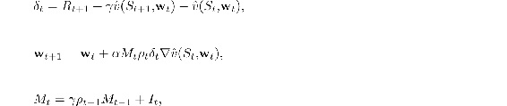
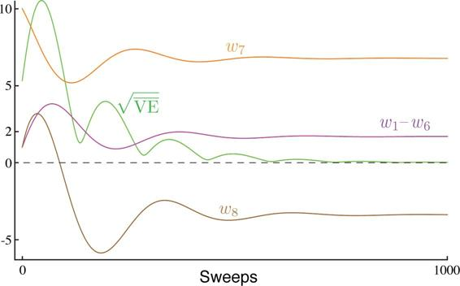

# 11.8  Emphatic-TD Methods

We turn now to the second major strategy that has been extensively explored for obtaining a cheap and efficient off-policy learning method with function approximation. Recall that linear semi-gradient TD methods are efficient and stable when trained under the on-policy distribution, and that we showed in Section 9.4 that this has to do with the positive definiteness of the matrix **A** ([9.11](part0018_split_004.html#x1-99005r11))[4](part0020_split_012.html#fn4x14) and the match between the on-policy state distribution *μπ* and the state-transition probabilities *p*(*s* | *s, a*) under the target policy. In off-policy learning, we reweight the state transitions using importance sampling so that they become appropriate for learning about the target policy, but the state distribution is still that of the behavior policy. There is a mismatch. A natural idea is to somehow reweight the states, emphasizing some and de-emphasizing others, so as to return the distribution of updates to the on-policy distribution. There would then be a match, and stability and convergence would follow from existing results. This is the idea of Emphatic-TD methods, first introduced for on-policy training in Section 9.11.

Actually, the notion of “the on-policy distribution” is not quite right, as there are many on-policy distributions, and any one of these is sufficient to guarantee stability. Consider an undiscounted episodic problem. The way episodes terminate is fully determined by the transition probabilities, but there may be several different ways the episodes might begin. However the episodes start, if all state transitions are due to the target policy, then the state distribution that results is an on-policy distribution. You might start close to the terminal state and visit only a few states with high probability before ending the episode. Or you might start far away and pass through many states before terminating. Both are on-policy distributions, and training on both with a linear semi-gradient method would be guaranteed to be stable. However the process starts, an on-policy distribution results as long as all states encountered are updated up until termination.

If there is discounting, it can be treated as partial or probabilistic termination for these purposes. If *γ* = 0.9, then we can consider that with probability 0.1 the process terminates on every time step and then immediately restarts in the state that is transitioned to. A discounted problem is one that is continually terminating and restarting with probability 1 − *γ* on every step. This way of thinking about discounting is an example of a more general notion of *pseudo termination*—termination that does not affect the sequence of state transitions, but does affect the learning process and the quantities being learned. This kind of pseudo termination is important to off-policy learning because the restarting is optional—remember we can start any way we want to—and the termination relieves the need to keep including encountered states within the on-policy distribution. That is, if we don’t consider the new states as restarts, then discounting quickly gives us a limited on-policy distribution.

The one-step Emphatic-TD algorithm for learning episodic state values is defined by:

with *I**t*, the *interest*, being arbitrary and *M**t*, the *emphasis*, being initialized to *M**t*−1 = 0. How does this algorithm perform on Baird’s counterexample? [Figure 11.6](part0020_split_008.html#fig11-6) shows the trajectory in expectation of the components of the parameter vector (for the case in which *I**t* = 1, for all *t*). There are some oscillations but eventually everything converges and the VE goes to zero. These trajectories are obtained by iteratively computing the expectation of the parameter vector trajectory without any of the variance due to sampling of transitions and rewards. We do not show the results of applying the Emphatic-TD algorithm directly because its variance on Baird’s counterexample is so high that it is nigh impossible to get consistent results in computational experiments. The algorithm converges to the optimal solution in theory on this problem, but in practice it does not. We turn to the topic of reducing the variance of all these algorithms in the next section.

[Figure 11.6](part0020_split_008.html#C_fig11-6): The behavior of the one-step Emphatic-TD algorithm in expectation on Baird’s counterexample. The step size was *α* = 0.03.
