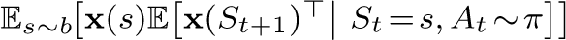

# Notes

[1](part0020_split_005.html#fn1x14-bk)For state values there remains a small difference in the treatment of the importance sampling ratio *ρ**t*. In the analagous action-value case (which is the most important case for control algorithms), the residual-gradient algorithm would reduce exactly to the naive version.

[2](part0020_split_006.html#fn2x14-bk)They would of course be estimated if the *state* sequence were observed rather than only the corresponding feature vectors.

[3](part0020_split_006.html#fn3x14-bk)All MRPs can be considered MDPs with a single action in all states; what we conclude about MRPs here applies as well to MDPs.

[4](part0020_split_008.html#fn4x14-bk)In the off-policy case, the matrix *A* is generally defined as .
