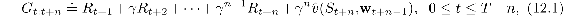
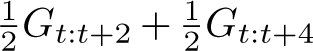
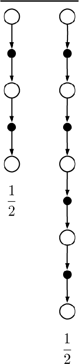
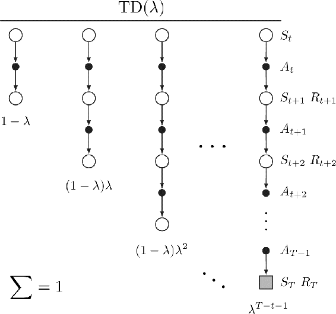
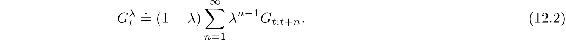
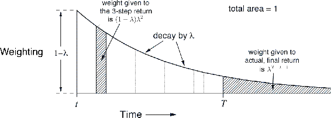
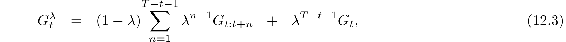
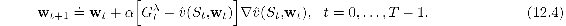
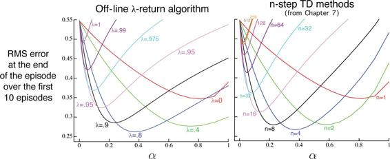
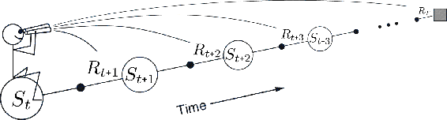

# 12.1  The *λ*-return

In Chapter 7 we defined an *n*-step return as the sum of the first *n* rewards plus the estimated value of the state reached in *n* steps, each appropriately discounted ([7.1](part0015_split_001.html#x1-71002r1)). The general form of that equation, for any parameterized function approximator, is

where *T* is the time of episode termination, if any. We noted in Chapter 7 that each *n*-step return, for *n* ≥ 1, is a valid update target for a tabular learning update, just as it is for an approximate SGD learning update such as ([9.7](part0018_split_003.html#x1-98005r7)).

Now we note that a valid update can be done not just toward any *n*-step return, but toward any average of *n*-step returns for different *n*s. For example, an update can be done toward a target that is half of a two-step return and half of a four-step return: . Any set of *n*-step returns can be averaged in this way, even an infinite set, as long as the weights on the component returns are positive and sum to 1. The composite return possesses an error reduction property similar to that of individual *n*-step returns ([7.3](part0015_split_001.html#x1-71004r3)) and thus can be used to construct updates with guaranteed convergence properties. Averaging produces a substantial new range of algorithms. For example, one could average one-step and infinite-step returns to obtain another way of interrelating TD and Monte Carlo methods. In principle, one could even average experience-based updates with DP updates to get a simple combination of experience-based and model-based methods (cf. Chapter 8).

An update that averages simpler component updates is called a *compound update*. The backup diagram for a compound update consists of the backup diagrams for each of the component updates with a horizontal line above them and the weighting fractions below. For example, the compound update for the case mentioned at the start of this section, mixing half of a two-step return and half of a four-step return, has the diagram shown to the right. A compound update can only be done when the longest of its component updates is complete. The update at the right, for example, could only be done at time *t* + 4 for the estimate formed at time *t*. In general one would like to limit the length of the longest component update because of the corresponding delay in the updates.

The TD(*λ*) algorithm can be understood as one particular way of averaging *n*-step updates. This average contains all the *n*-step updates, each weighted proportionally to *λ**n*−1 (where *λ* ∈ [0, 1]), and is normalized by a factor of 1 − *λ* to ensure that the weights sum to 1 ([Figure 12.1](part0021_split_001.html#fig12-1)). The resulting update is toward a return, called the *λ-return*, defined in its state-based form by

[Figure 12.1](part0021_split_001.html#C_fig12-1): The backup digram for TD(*λ*). If *λ* = 0, then the overall update reduces to its first component, the one-step TD update, whereas if *λ* = 1, then the overall update reduces to its last component, the Monte Carlo update.

[Figure 12.2](part0021_split_001.html#fig12-2) further illustrates the weighting on the sequence of *n*-step returns in the *λ*-return. The one-step return is given the largest weight, 1 − *λ*; the two-step return is given the next largest weight, (1 − *λ*)*λ*; the three-step return is given the weight (1 − *λ*)*λ*2; and so on. The weight fades by *λ* with each additional step. After a terminal state has been reached, all subsequent *n*-step returns are equal to the conventional return, *G**t*. If we want, we can separate these post-termination terms from the main sum, yielding

[Figure 12.2](part0021_split_001.html#C_fig12-2): Weighting given in the *λ*-return to each of the *n*-step returns.

as indicated in the figures. This equation makes it clearer what happens when *λ* = 1. In this case the main sum goes to zero, and the remaining term reduces to the conventional return. Thus, for *λ* = 1, updating according to the *λ*-return is a Monte Carlo algorithm. On the other hand, if *λ* = 0, then the *λ*-return reduces to *G**t*:*t*+1, the one-step return. Thus, for *λ* = 0, updating according to the *λ*-return is a one-step TD method.

*Exercise 12.1* Just as the return can be written recursively in terms of the first reward and itself one-step later ([3.9](part0011_split_003.html#x1-30004r9)), so can the *λ*-return. Derive the analogous recursive relationship from ([12.2](part0021_split_001.html#x1-135003r2)) and ([12.1](part0021_split_001.html#x1-135001r1)).

□

*Exercise 12.2* The parameter *λ* characterizes how fast the exponential weighting in [Figure 12.2](part0021_split_001.html#fig12-2) falls off, and thus how far into the future the *λ*-return algorithm looks in determining its update. But a rate factor such as *λ* is sometimes an awkward way of characterizing the speed of the decay. For some purposes it is better to specify a time constant, or half-life. What is the equation relating *λ* and the half-life, *τ**λ*, the time by which the weighting sequence will have fallen to half of its initial value?

□

We are now ready to define our first learning algorithm based on the *λ*-return: the *off-line λ-return algorithm*. As an off-line algorithm, it makes no changes to the weight vector during the episode. Then, at the end of the episode, a whole sequence of off-line updates are made according to our usual semi-gradient rule, using the *λ*-return as the target:

The *λ*-return gives us an alternative way of moving smoothly between Monte Carlo and one-step TD methods that can be compared with the *n*-step bootstrapping way developed in Chapter 7. There we assessed effectiveness on a 19-state random walk task ([Example 7.1](part0015_split_001.html#sec1-53), page 144). [Figure 12.3](part0021_split_001.html#fig12-3) shows the performance of the off-line *λ*-return algorithm on this task alongside that of the *n*-step methods (repeated from [Figure 7.2](part0015_split_001.html#fig7-2)). The experiment was just as described earlier except that for the *λ*-return algorithm we varied *λ* instead of *n*. The performance measure used is the estimated root-mean-squared error between the correct and estimated values of each state measured at the end of the episode, averaged over the first 10 episodes and the 19 states. Note that overall performance of the off-line *λ*-return algorithms is comparable to that of the *n*-step algorithms. In both cases we get best performance with an intermediate value of the bootstrapping parameter, *n* for *n*-step methods and *λ* for the off-line *λ*-return algorithm.

[Figure 12.3](part0021_split_001.html#C_fig12-3): 19-state Random walk results ([Example 7.1](part0015_split_001.html#sec1-53)): Performance of the off-line *λ*-return algorithm alongside that of the *n*-step TD methods. In both case, intermediate values of the bootstrapping parameter (*λ* or *n*) performed best. The results with the off-line *λ*-return algorithm are slightly better at the best values of *α* and *λ*, and at high *α*.

The approach that we have been taking so far is what we call the theoretical, or *forward*, view of a learning algorithm. For each state visited, we look forward in time to all the future rewards and decide how best to combine them. We might imagine ourselves riding the stream of states, looking forward from each state to determine its update, as suggested by [Figure 12.4](part0021_split_001.html#fig12-4). After looking forward from and updating one state, we move on to the next and never have to work with the preceding state again. Future states, on the other hand, are viewed and processed repeatedly, once from each vantage point preceding them.

[Figure 12.4](part0021_split_001.html#C_fig12-4): The forward view. We decide how to update each state by looking forward to future rewards and states.
