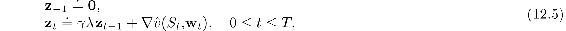
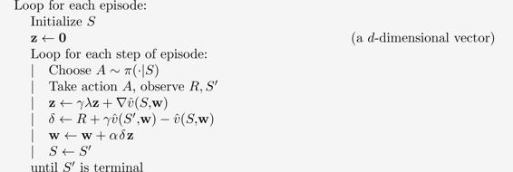
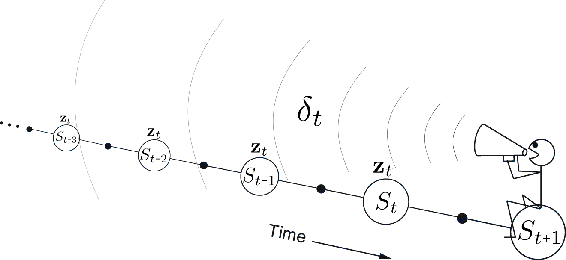
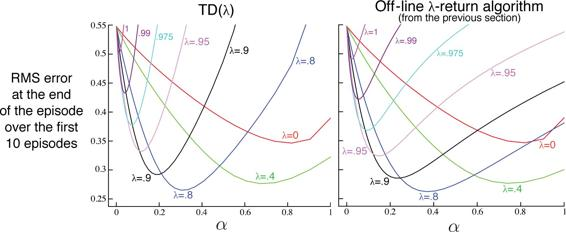
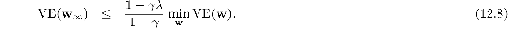
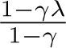

# 12.2  TD(*λ*)

TD(*λ*) is one of the oldest and most widely used algorithms in reinforcement learning. It was the first algorithm for which a formal relationship was shown between a more theoretical forward view and a more computationally congenial backward view using eligibility traces. Here we will show empirically that it approximates the off-line *λ*-return algorithm presented in the previous section.

TD(*λ*) improves over the off-line *λ*-return algorithm in three ways. First it updates the weight vector on every step of an episode rather than only at the end, and thus its estimates may be better sooner. Second, its computations are equally distributed in time rather than all at the end of the episode. And third, it can be applied to continuing problems rather than just to episodic problems. In this section we present the semi-gradient version of TD(*λ*) with function approximation.

With function approximation, the eligibility trace is a vector **z***t* ∈ ℝ*d* with the same number of components as the weight vector **w***t*. Whereas the weight vector is a long-term memory, accumulating over the lifetime of the system, the eligibility trace is a short-term memory, typically lasting less time than the length of an episode. Eligibility traces assist in the learning process; their only consequence is that they affect the weight vector, and then the weight vector determines the estimated value.

In TD(*λ*), the eligibility trace vector is initialized to zero at the beginning of the episode, is incremented on each time step by the value gradient, and then fades away by *γλ*:

where *γ* is the discount rate and *λ* is the parameter introduced in the previous section, which we henceforth call the trace-decay parameter. The eligibility trace keeps track of which components of the weight vector have contributed, positively or negatively, to recent state valuations, where “recent” is defined in terms of *γλ*. (Recall that in linear function approx., ∇ (*S**t*, **w***t*) is just the feature vector, **x***t*, in which case the eligibility trace vector is just a sum of past, fading, input vectors.) The trace is said to indicate the eligibility of each component of the weight vector for undergoing learning changes should a reinforcing event occur. The reinforcing events we are concerned with are the moment-by-moment one-step TD errors. The TD error for state-value prediction is

In TD(*λ*), the weight vector is updated on each step proportional to the scalar TD error and the vector eligibility trace:

**Semi-gradient TD(*λ*) for estimating  ≈ *vπ***

Input: the policy *π* to be evaluated

Input: a differentiable function  : 𝒮+ × ℝ*d* *→* ℝ such that  (terminal, ·) = 0

Algorithm parameters: step size *α >* 0, trace decay rate *λ* ∈ [0, 1]

Initialize value-function weights **w** arbitrarily (e.g., **w** = **0**)

TD(*λ*) is oriented backward in time. At each moment we look at the current TD error and assign it backward to each prior state according to how much that state contributed to the current eligibility trace at that time. We might imagine ourselves riding along the stream of states, computing TD errors, and shouting them back to the previously visited states, as suggested by [Figure 12.5](part0021_split_002.html#fig12-5). Where the TD error and traces come together, we get the update given by ([12.7](part0021_split_002.html#x1-136003r7)), changing the values of those past states for when they occur again in the future.

[Figure 12.5](part0021_split_002.html#C_fig12-5): The backward or mechanistic view of TD(*λ*). Each update depends on the current TD error combined with the current eligibility traces of past events.

To better understand the backward view of TD(*λ*), consider what happens at various values of *λ*. If *λ* = 0, then by ([12.5](part0021_split_002.html#x1-136001r5)) the trace at *t* is exactly the value gradient corresponding to *S**t*. Thus the TD(*λ*) update ([12.7](part0021_split_002.html#x1-136003r7)) reduces to the one-step semi-gradient TD update treated in Chapter 9 (and, in the tabular case, to the simple TD rule ([6.2](part0014_split_001.html#x1-60002r2))). This is why that algorithm was called TD(0). In terms of [Figure 12.5](part0021_split_002.html#fig12-5), TD(0) is the case in which only the one state preceding the current one is changed by the TD error. For larger values of *λ*, but still *λ <* 1, more of the preceding states are changed, but each more temporally distant state is changed less because the corresponding eligibility trace is smaller, as suggested by the figure. We say that the earlier states are given less *credit* for the TD error.

If *λ* = 1, then the credit given to earlier states falls only by *γ* per step. This turns out to be just the right thing to do to achieve Monte Carlo behavior. For example, remember that the TD error, *δ**t*, includes an undiscounted term of *R**t*+1. In passing this back *k* steps it needs to be discounted, like any reward in a return, by *γ**k*, which is just what the falling eligibility trace achieves. If *λ* = 1 and *γ* = 1, then the eligibility traces do not decay at all with time. In this case the method behaves like a Monte Carlo method for an undiscounted, episodic task. If *λ* = 1, the algorithm is also known as TD(1).

TD(1) is a way of implementing Monte Carlo algorithms that is more general than those presented earlier and that significantly increases their range of applicability. Whereas the earlier Monte Carlo methods were limited to episodic tasks, TD(1) can be applied to discounted continuing tasks as well. Moreover, TD(1) can be performed incrementally and online. One disadvantage of Monte Carlo methods is that they learn nothing from an episode until it is over. For example, if a Monte Carlo control method takes an action that produces a very poor reward but does not end the episode, then the agent’s tendency to repeat the action will be undiminished during the episode. Online TD(1), by contrast, learns in an *n*-step TD way from the incomplete ongoing episode, where the *n* steps are all the way up to the current step. If something unusually good or bad happens during an episode, control methods based on TD(1) can learn immediately and alter their behavior on that same episode.

It is revealing to revisit the 19-state random walk example ([Example 7.1](part0015_split_001.html#sec1-53)) to see how well TD(*λ*) does in approximating the off-line *λ*-return algorithm. The results for both algorithms are shown in [Figure 12.6](part0021_split_002.html#fig12-6). For each *λ* value, if *α* is selected optimally for it (or smaller), then the two algorithms perform virtually identically. If *α* is chosen larger than is optimal, however, then the *λ*-return algorithm is only a little worse whereas TD(*λ*) is much worse and may even be unstable. This is not catastrophic for TD(*λ*) on this problem, as these higher parameter values are not what one would want to use anyway, but for other problems it can be a significant weakness.

[Figure 12.6](part0021_split_002.html#C_fig12-6): 19-state Random walk results ([Example 7.1](part0015_split_001.html#sec1-53)): Performance of TD(*λ*) alongside that of the off-line *λ*-return algorithm. The two algorithms performed virtually identically at low (less than optimal) *α* values, but TD(*λ*) was worse at high *α* values.

Linear TD(*λ*) has been proved to converge in the on-policy case if the step-size parameter is reduced over time according to the usual conditions ([2.7](part0010_split_005.html#x1-20003r7)). Just as discussed in Section 9.4, convergence is not to the minimum-error weight vector, but to a nearby weight vector that depends on *λ*. The bound on solution quality presented in that section (9.14) can now be generalized to apply for any *λ*. For the continuing discounted case,

That is, the asymptotic error is no more than  times the smallest possible error. As *λ* approaches 1, the bound approaches the minimum error (and it is loosest at *λ* = 0). In practice, however, *λ* = 1 is often the poorest choice, as will be illustrated later in [Figure 12.14](part0021_split_013.html#fig12-14).

*Exercise 12.3* Some insight into how TD(*λ*) can closely approximate the off-line *λ*-return algorithm can be gained by seeing that the latter’s error term (in brackets in ([12.4](part0021_split_001.html#x1-135006r4))) can be written as the sum of TD errors ([12.6](part0021_split_002.html#x1-136002r6)) for a single fixed **w**. Show this, following the pattern of (6.7), and using the recursive relationship for the *λ*-return you obtained in [Exercise 12.1](part0021_split_001.html#sec1-101) .

□

*Exercise 12.4* Use your result from the preceding exercise to show that, if the weight updates over an episode were computed on each step but not actually used to change the weights (**w** remained fixed), then the sum of TD(*λ*)’s weight updates would be the same as the sum of the off-line *λ*-return algorithm’s updates.

□
