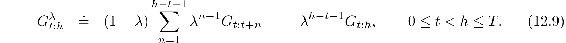
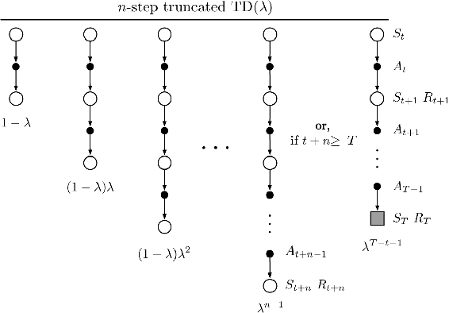
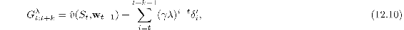

# 12.3  *n*-step Truncated *λ*-return Methods

The off-line *λ*-return algorithm is an important ideal, but it is of limited utility because it uses the *λ*-return ([12.2](part0021_split_001.html#x1-135003r2)), which is not known until the end of the episode. In the continuing case, the *λ*-return is technically never known, as it depends on *n*-step returns for arbitrarily large *n*, and thus on rewards arbitrarily far in the future. However, the dependence becomes weaker for longer-delayed rewards, falling by *γ λ* for each step of delay. A natural approximation, then, would be to truncate the sequence after some number of steps. Our existing notion of *n*-step returns provides a natural way to do this in which the missing rewards are replaced with estimated values.

In general, we define the *truncated λ-return* for time *t*, given data only up to some later horizon, *h*, as

If you compare this equation with the *λ*-return ([12.3](part0021_split_001.html#x1-135004r3)), it is clear that the horizon *h* is playing the same role as was previously played by *T*, the time of termination. Whereas in the *λ*-return there is a residual weight given to the conventional return, *G**t*, here it is given to the longest available *n*-step return, *G**t*:*h* ([Figure 12.2](part0021_split_001.html#fig12-2)).

The truncated *λ*-return immediately gives rise to a family of *n*-step *λ*-return algorithms similar to the *n*-step methods of Chapter 7. In all of these algorithms, updates are delayed by *n* steps and only take into account the first *n* rewards, but now all the *k*-step returns are included for 1 ≤ *k* ≤ *n* (whereas the earlier *n*-step algorithms used only the *n*-step return), weighted geometrically as in [Figure 12.2](part0021_split_001.html#fig12-2). In the state-value case, this family of algorithms is known as Truncated TD(*λ*), or TTD(*λ*). The compound backup diagram, shown in [Figure 12.7](part0021_split_003.html#fig12-7), is similar to that for TD(*λ*) ([Figure 12.1](part0021_split_001.html#fig12-1)) except that the longest component update is at most *n* steps rather than always going all the way to the end of the episode. TTD(*λ*) is defined by (cf. ([9.15](part0018_split_004.html#x1-99012r15))):

[Figure 12.7](part0021_split_003.html#C_fig12-7): The backup diagram for Truncated TD(*λ*).

This algorithm can be implemented efficiently so that per-step computation does not scale with *n* (though of course memory must). Much as in *n*-step TD methods, no updates are made on the first *n* − 1 time steps, and *n* − 1 additional updates are made upon termination. Efficient implementation relies on the fact that the *k*-step *λ*-return can be written exactly as

where

*Exercise 12.5* Several times in this book (often in exercises) we have established that returns can be written as sums of TD errors if the value function is held constant. Why is ([12.10](part0021_split_003.html#x1-137004r10)) another instance of this? Prove ([12.10](part0021_split_003.html#x1-137004r10)).

□
