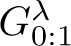
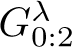
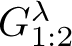
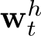
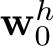
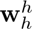
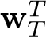
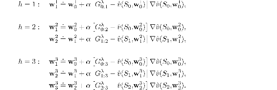
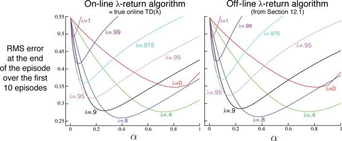

# 12.4  Redoing Updates: Online *λ*-return Algorithm

Choosing the truncation parameter *n* in Truncated TD(*λ*) involves a tradeoff. *n* should be large so that the method closely approximates the off-line *λ*-return algorithm, but it should also be small so that the updates can be made sooner and can influence behavior sooner. Can we get the best of both? Well, yes, in principle we can, albeit at the cost of computational complexity.

The idea is that, on each time step as you gather a new increment of data, you go back and redo all the updates since the beginning of the current episode. The new updates will be better than the ones you previously made because now they can take into account the time step’s new data. That is, the updates are always toward a truncated *λ*-return target, but they always use the latest horizon. In each pass over that episode you can use a slightly longer horizon and obtain slightly better results. Recall that the truncated *λ*-return is defined by

Let us step through how this target could ideally be used if computational complexity was not an issue. The episode begins with an estimate at time 0 using the weights **w**0 from the end of the previous episode. Learning begins when the data horizon is extended to time step 1. The target for the estimate at step 0, given the data up to horizon 1, could only be the one-step return *G*0:1, which includes *R*1 and bootstraps from the estimate  (*S*1, **w**0). Note that this is exactly what  is, with the sum in the first term of the equation degenerating to zero. Using this update target, we construct **w**1. Then, after advancing the data horizon to step 2, what do we do? We have new data in the form of *R*2 and *S*2, as well as the new **w**1, so now we can construct a better update target  for the first update from *S*0 as well as a better update target  for the second update from *S*1. Using these improved targets, we redo the updates at *S*1 and *S*2, starting again from **w**0, to produce **w**2. Now we advance the horizon to step 3 and repeat, going all the way back to produce three new targets, redoing all updates starting from the original **w**0 to produce **w**3, and so on. Each time the horizon is advanced, all the updates are redone starting from **w**0 using the weight vector from the preceding horizon.

This conceptual algorithm involves multiple passes over the episode, one at each horizon, each generating a different sequence of weight vectors. To describe it clearly we have to distinguish between the weight vectors computed at the different horizons. Let us use  to denote the weights used to generate the value at time *t* in the sequence up to horizon *h*. The first weight vector  in each sequence is that inherited from the previous episode (so they are the same for all *h*), and the last weight vector  in each sequence defines the ultimate weight-vector sequence of the algorithm. At the final horizon *h* = *T* we obtain the final weights  which will be passed on to form the initial weights of the next episode. With these conventions, the three first sequences described in the previous paragraph can be given explicitly:

The general form for the update is

This update, together with  defines the *online λ-return algorithm*.

The online *λ*-return algorithm is fully online, determining a new weight vector **w***t* at each step *t* during an episode, using only information available at time *t*. Its main drawback is that it is computationally complex, passing over the portion of the episode experienced so far on every step. Note that it is strictly more complex than the off-line *λ*-return algorithm, which passes through all the steps at the time of termination but does not make any updates during the episode. In return, the online algorithm can be expected to perform better than the off-line one, not only during the episode when it makes an update while the off-line algorithm makes none, but also at the end of the episode because the weight vector used in bootstrapping (in ) has had a larger number of informative updates. This effect can be seen if one looks carefully at [Figure 12.8](part0021_split_004.html#fig12-8), which compares the two algorithms on the 19-state random walk task.

[Figure 12.8](part0021_split_004.html#C_fig12-8): 19-state Random walk results ([Example 7.1](part0015_split_001.html#sec1-53)): Performance of online and off-line *λ*-return algorithms. The performance measure here is the VE at the end of the episode, which should be the best case for the off-line algorithm. Nevertheless, the online algorithm performs subtly better. For comparison, the *λ* = 0 line is the same for both methods.
