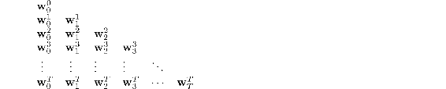
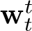
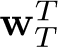
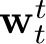
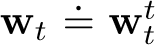
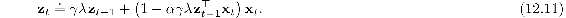
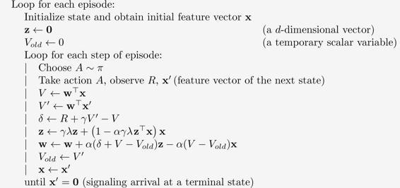
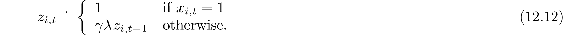

# 12.5  True Online TD(*λ*)

The online *λ*-return algorithm just presented is currently the best performing temporal-difference algorithm. It is an ideal which online TD(*λ*) only approximates. As presented, however, the online *λ*-return algorithm is very complex. Is there a way to invert this forward-view algorithm to produce an efficient backward-view algorithm using eligibility traces? It turns out that there is indeed an exact computationally congenial implementation of the online *λ*-return algorithm for the case of linear function approx. This implementation is known as the true online TD(*λ*) algorithm because it is “truer” to the ideal of the online *λ*-return algorithm than the TD(*λ*) algorithm is.

The derivation of true online TD(*λ*) is a little too complex to present here (see the next section and the appendix to the paper by van Seijen et al., 2016) but its strategy is simple. The sequence of weight vectors produced by the online *λ*-return algorithm can be arranged in a triangle:

One row of this triangle is produced on each time step. It turns out that the weight vectors on the diagonal, the , are only ones really needed. The first, , is the initial weight vector of the episode; the last, , is the final weight vector; and each weight vector along the way, , plays a role in bootstrapping in the *n*-step returns of the updates. In the final algorithm the diagonal weight vectors are renamed without a superscript, . The strategy then is to find a compact, efficient way of computing each  from the one before. If this is done, for the linear case in which  (*s,* **w**) = **w**⊤**x**(*s*), then we arrive at the true online TD(*λ*) algorithm:

where we have used the shorthand **x***t* ≐ **x**(*S**t*), *δ**t* is defined as in TD(*λ*) ([12.6](part0021_split_002.html#x1-136002r6)), and **z***t* is defined by

This algorithm has been proven to produce exactly the same sequence of weight vectors, **w***t*, 0 ≤ *t* ≤ *T*, as the online *λ*-return algorithm (van Seijen et al. 2016). Thus the results on the random walk task on the left of [Figure 12.8](part0021_split_004.html#fig12-8) are also its results on that task. Now, however, the algorithm is much less expensive. The memory requirements of true online TD(*λ*) are identical to those of conventional TD(*λ*), while the per-step computation is increased by about 50% (there is one more inner product in the eligibility-trace update). Overall, the per-step computational complexity remains of *O*(*d*), the same as TD(*λ*). Pseudocode for the complete algorithm is given in the box.

**True online TD(*λ*) for estimating **w**⊤**x** ≈ *vπ***

Input: the policy *π* to be evaluated

Input: a feature function **x** : 𝒮+ *→* ℝ*d* such that **x**(*terminal,* ·) = **0**

Algorithm parameters: step size *α >* 0, trace decay rate *λ* ∈ [0, 1]

Initialize value-function weights **w** ∈ ℝ*d* (e.g., **w** = **0**)

The eligibility trace ([12.11](part0021_split_005.html#x1-139002r11)) used in true online TD(*λ*) is called a *dutch trace* to distinguish it from the trace ([12.5](part0021_split_002.html#x1-136001r5)) used in TD(*λ*), which is called an *accumulating trace*. Earlier work often used a third kind of trace called the *replacing trace*, defined only for the tabular case or for binary feature vectors such as those produced by tile coding. The replacing trace is defined on a component-by-component basis depending on whether the component of the feature vector was 1 or 0:

Nowadays, we see replacing traces as crude approximations to dutch traces, which largely supersede them. Dutch traces usually perform better than replacing traces and have a clearer theoretical basis. Accumulating traces remain of interest for nonlinear function approximations where dutch traces are not available.
