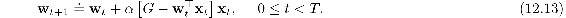
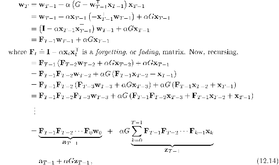
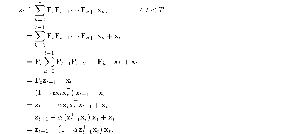

# 12.6  \*Dutch Traces in Monte Carlo Learning

Although eligibility traces are closely associated historically with TD learning, in fact they have nothing to do with it. In fact, eligibility traces arise even in Monte Carlo learning, as we show in this section. We show that the linear MC algorithm (Chapter 9), taken as a forward view, can be used to derive an equivalent yet computationally cheaper backward-view algorithm using dutch traces. This is the only equivalence of forward- and backward-views that we explicitly demonstrate in this book. It gives some of the flavor of the proof of equivalence of true online TD(*λ*) and the online *λ*-return algorithm, but is much simpler.

The linear version of the gradient Monte Carlo prediction algorithm (page 202) makes the following sequence of updates, one for each time step of the episode:

To simplify the example, we assume here that the return G is a single reward received at the end of the episode (this is why G is not subscripted by time) and that there is no discounting. In this case the update is also known as the Least Mean Square (LMS) rule. As a Monte Carlo algorithm, all the updates depend on the final reward/return, so none can be made until the end of the episode. The MC algorithm is an off-line algorithm and we do not seek to improve this aspect of it. Rather we seek merely an implementation of this algorithm with computational advantages. We will still update the weight vector only at the end of the episode, but we will do some computation during each step of the episode and less at its end. This will give a more equal distribution of computation—*O*(*d*) per step—and also remove the need to store the feature vectors at each step for use later at the end of each episode. Instead, we will introduce an additional vector memory, the eligibility trace, keeping in it a summary of all the feature vectors seen so far. This will be sufficient to efficiently recreate exactly the same overall update as the sequence of MC updates ([12.13](part0021_split_006.html#x1-140001r13)), by the end of the episode:

where *a**T*−1 and **z***T*−1 are the values at time *T* − 1 of two auxilary memory vectors that can be updated incrementally without knowledge of G and with *O*(*d*) complexity per time step. The **z***t* vector is in fact a dutch-style eligibility trace. It is initialized to **z**0 = **x**0 and then updated according to

which is the dutch trace for the case of *γ λ* = 1 (cf. [Eq. 12.11](part0021_split_005.html#x1-139002r11)). The *a**t* auxilary vector is initialized to *a*0 = **w**0 and then updated according to

The auxiliary vectors, *a**t* and **z***t*, are updated on each time step *t < T* and then, at time *T* when G is observed, they are used in ([12.14](part0021_split_006.html#x1-140002r14)) to compute **w***T*. In this way we achieve exactly the same final result as the MC/LMS algorithm that has poor computational properties ([12.13](part0021_split_006.html#x1-140001r13)), but now with an incremental algorithm whose time and memory complexity per step is *O*(*d*). This is surprising and intriguing because the notion of an eligibility trace (and the dutch trace in particular) has arisen in a setting without temporal-difference (TD) learning (in contrast to van Seijen and Sutton, 2014). It seems eligibility traces are not specific to TD learning at all; they are more fundamental than that. The need for eligibility traces seems to arise whenever one tries to learn long-term predictions in an efficient manner.
