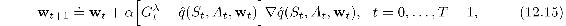
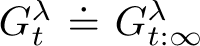
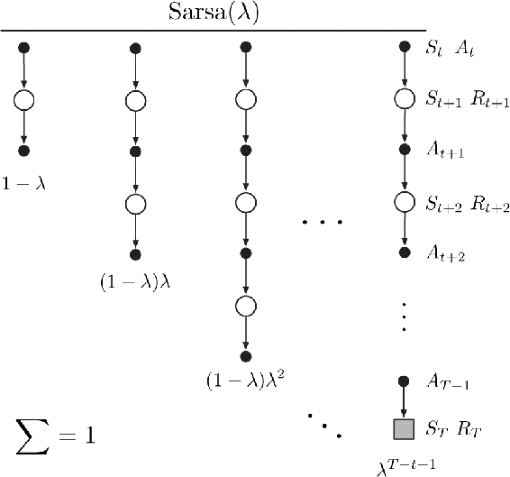
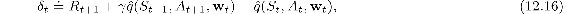
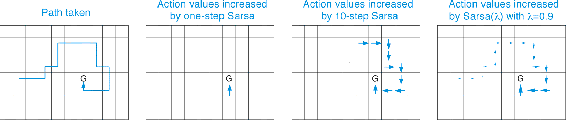
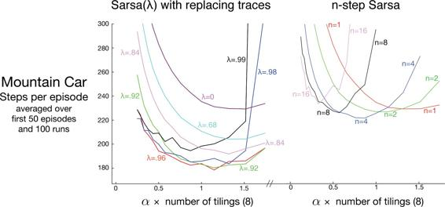
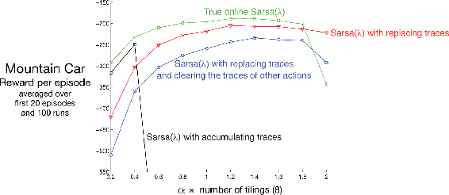
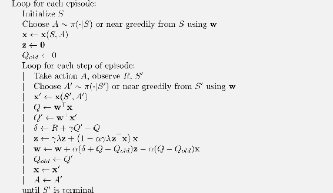

# 12.7  Sarsa(*λ*)

Very few changes in the ideas already presented in this chapter are required in order to extend eligibility-traces to action-value methods. To learn approximate action values,  (*s, a,* **w**), rather than approximate state values,  (*s,* **w**), we need to use the action-value form of the *n*-step return, from Chapter 10:

with G*t*:*t*+*n* ≐ G*t* if *t* + *n* ≥ *T*. Using this, we can form the action-value form of the truncated *λ*-return, which is otherwise identical to the state-value form ([12.9](part0021_split_003.html#x1-137001r9)). The action-value form of the off-line *λ*-return algorithm ([12.4](part0021_split_001.html#x1-135006r4)) simply uses  rather than :

where . The compound backup diagram for this forward view is shown in [Figure 12.9](part0021_split_007.html#fig12-9). Notice the similarity to the diagram of the TD(*λ*) algorithm ([Figure 12.1](part0021_split_001.html#fig12-1)). The first update looks ahead one full step, to the next state–action pair, the second looks ahead two steps, to the second state–action pair, and so on. A final update is based on the complete return. The weighting of each *n*-step update in the *λ*-return is just as in TD(*λ*) and the *λ*-return algorithm ([12.3](part0021_split_001.html#x1-135004r3)).

[Figure 12.9](part0021_split_007.html#C_fig12-9): Sarsa(*λ*)’s backup diagram. Compare with [Figure 12.1](part0021_split_001.html#fig12-1).

The temporal-difference method for action values, known as *Sarsa(λ)*, approximates this forward view. It has the same update rule as given earlier for TD(*λ*):

except, naturally, using the action-value form of the TD error:

and the action-value form of the eligibility trace:

Complete pseudocode for Sarsa(*λ*) with linear function approx., binary features, and either accumulating or replacing traces is given in the box on the next page. This pseudocode highlights a few optimizations possible in the special case of binary features (features are either active (=1) or inactive (=0).

**Example 12.1: Traces in Gridworld** The use of eligibility traces can substantially increase the efficiency of control algorithms over one-step methods and even over *n*-step methods. The reason for this is illustrated by the gridworld example below.

The first panel shows the path taken by an agent in a single episode. The initial estimated values were zero, and all rewards were zero except for a positive reward at the goal location marked by `G`. The arrows in the other panels show, for various algorithms, which action-values would be increased, and by how much, upon reaching the goal. A one-step method would increment only the last action value, whereas an *n*-step method would equally increment the last *n* actions’ values, and an eligibility trace method would update all the action values up to the beginning of the episode, to different degrees, fading with recency. The fading strategy is often the best.

■

**Sarsa(*λ*) with binary features and linear function approx.   
for estimating **w**⊤**x** ≈ *qπ* or *q*\***

Input: a function ℱ(*s, a*) returning the set of (indices of) active features for *s, a*

Input: a policy *π* (if estimating *qπ*)

Algorithm parameters: step size *α >* 0, trace decay rate *λ* ∈ [0, 1]

Initialize: **w** = (*w*1*, …, w**d*)⊤ ∈ ℝ*d* (e.g., **w** = **0**), **z** = (*z*1*, …, z**d*)⊤ ∈ ℝ*d*

Loop for each episode:

Initialize *S*

Choose *A ∼ π*(·|*S*) or *ε*-greedy according to  (*S,* ·, **w**)

**z** ← **0**

Loop for each step of episode:

Take action *A*, observe *R, S*′

*δ* ← *R*

Loop for *i* in ℱ(*S, A*):

*δ* ← *δ* − *w**i*

*z**i* ← *z**i* + 1            (accumulating traces)

or *z**i* ← 1              (replacing traces)

If *S*′ is terminal then:

**w** ← **w** + *α δ* **z**

Go to next episode

Choose *A*′ *∼ π*(·|*S*′) or near greedily *∼*  (*S*′, ·, **w**)

Loop for *i* in ℱ(*S*′*, A*′): *δ* ← *δ* + *γ w**i*

**w** ← **w** + *α δ* **z**

**z** ← *γλ***z**

*S* ← *S*′; *A* ← *A*′

*Exercise 12.6* Modify the pseudocode for Sarsa(*λ*) to use dutch traces ([12.11](part0021_split_005.html#x1-139002r11)) without the other features of a true online algorithm. Assume linear function approx. and binary features.

□

**Example 12.2: Sarsa(***λ***) on Mountain Car** [Figure 12.10](part0021_split_007.html#fig12-10) (left) on the next page shows results with Sarsa(*λ*) on the Mountain Car task introduced in [Example 10.1](part0019_split_001.html#sec1-85) . The function approximation, action selection, and environmental details were exactly as in Chapter 10, and thus it is appropriate to numerically compare these results with the Chapter 10 results for *n*-step Sarsa (right side of the figure). The earlier results varied the update length *n* whereas here for Sarsa(*λ*) we vary the trace parameter *λ*, which plays a similar role. The fading-trace bootstrapping strategy of Sarsa(*λ*) appears to result in more efficient learning on this problem.

■

There is also an action-value version of our ideal TD method, the online *λ*-return algorithm (Section 12.4) and its efficient implementation as true online TD(*λ*) (Section 12.5). Everything in Section 12.4 goes through without change other than to use the action-value form of the *n*-step return given at the beginning of the current section. The analyses in Sections 12.5 and 12.6 also carry through for action values, the only change being the use of state–action feature vectors **x***t* = **x**(*S**t**, A**t*) instead of state feature vectors **x***t* = **x**(*S**t*). Pseudocode for the resulting efficient algorithm, called *true online Sarsa(λ)* is given in the box on the next page. The figure below compares the performance of various versions of Sarsa(*λ*) on the Mountain Car example. Finally, there is also a truncated version of Sarsa(*λ*), called *forward Sarsa(λ)* (van Seijen, 2016), which appears to be a particularly effective model-free control method for use in conjunction with multi-layer artificial neural networks.

[Figure 12.10](part0021_split_007.html#C_fig12-10): Early performance on the Mountain Car task of Sarsa(*λ*) with replacing traces and *n*-step Sarsa (copied from [Figure 10.4](part0019_split_002.html#fig10-4)) as a function of the step size, *α*.

[Figure 12.11](part0021_split_014.html#C_fig12-11): Summary comparison of Sarsa(*λ*) algorithms on the Mountain Car task. True online Sarsa(*λ*) performed better than regular Sarsa(*λ*) with both accumulating and replacing traces. Also included is a version of Sarsa(*λ*) with replacing traces in which, on each time step, the traces for the state and the actions not selected were set to zero.

**True online Sarsa(*λ*) for estimating **w**⊤**x** ≈ *qπ* or *q*\***

Input: a feature function **x** : 𝒮*+* × 𝒜 *→* ℝ*d* such that **x**(*terminal,* ·) = **0**

Input: a policy *π* (if estimating *qπ*)

Algorithm parameters: step size *α >* 0, trace decay rate *λ* ∈ [0, 1]

Initialize: **w** ∈ ℝ*d* (e.g., **w** = **0**)

