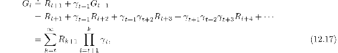
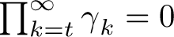
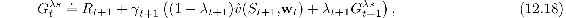
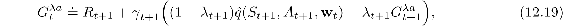
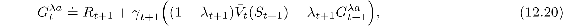
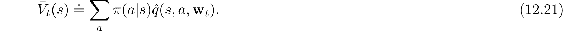

# 12.8  Variable *λ* and *γ*

We are starting now to reach the end of our development of fundamental TD learning algorithms. To present the final algorithms in their most general forms, it is useful to generalize the degree of bootstrapping and discounting beyond constant parameters to functions potentially dependent on the state and action. That is, each time step will have a different *λ* and *γ*, denoted *λ**t* and *γ**t*. We change notation now so that *λ* : 𝒮 × 𝒜 *→* [0, 1] is now a function from states and actions to the unit interval such that *λ**t* ≐ *λ*(*S**t**, A**t*), and similarly, *γ* : 𝒮 *→* [0, 1] is a function from states to the unit interval such that *γ**t* ≐ *γ* (*S**t*).

Introducing the function *γ*, the *termination function*, is particularly significant because it changes the return, the fundamental random variable whose expectation we seek to estimate. Now the return is defined more generally as

where, to assure the sums are finite, we require that  with probability one for all *t*. One convenient aspect of this definition is that it enables the episodic setting and its algorithms to be presented in terms of a single stream of experience, without special terminal states, start distributions, or termination times. An erstwhile terminal state becomes a state at which *γ*(*s*) = 0 and which transitions to the start distribution. In that way (and by choosing *γ*(·) as a constant in all other states) we can recover the classical episodic setting as a special case. State dependent termination includes other prediction cases such as *pseudo termination*, in which we seek to predict a quantity without altering the flow of the Markov process. Discounted returns can be thought of as such a quantity, in which case state-dependent termination unifies the episodic and discounted-continuing cases. (The undiscounted-continuing case still needs some special treatment.)

The generalization to variable bootstrapping is not a change in the problem, like discounting, but a change in the solution strategy. The generalization affects the *λ*-returns for states and actions. The new state-based *λ*-return can be written recursively as

where now we have added the “*s*” to the superscript *λ* to remind us that this is a return that bootstraps from state values, distinguishing it from returns that bootstrap from action values, which we present below with “*a*” in the superscript. This equation says that the *λ*-return is the first reward, undiscounted and unaffected by bootstrapping, plus possibly a second term to the extent that we are not discounting at the next state (that is, according to *γ**t*+1; recall that this is zero if the next state is terminal). To the extent that we aren’t terminating at the next state, we have a second term which is itself divided into two cases depending on the degree of bootstrapping in the state. To the extent we are bootstrapping, this term is the estimated value at the state, whereas, to the extent that we not bootstrapping, the term is the *λ*-return for the next time step. The action-based *λ*-return is either the Sarsa form

or the Expected Sarsa form,

where ([7.8](part0015_split_002.html#x1-72007r8)) is generalized to function approximation as

*Exercise 12.7* Generalize the three recursive equations above to their truncated versions, defining  and .

□
