# 12.9  Off-policy Traces with Control Variates

The final step is to incorporate importance sampling. Unlike in the case of *n*-step methods, for full non-truncated *λ*-returns one does not have a practical option in which the importance sampling is done outside the target return. Instead, we move directly to the bootstrapping generalization of per-decision importance sampling with control variates (Section 7.4). In the state case, our final definition of the *λ*-return generalizes ([12.18](part0021_split_008.html#x1-142002r18)), after the model of ([7.13](part0015_split_004.html#x1-74002r13)), to

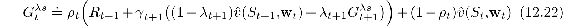

where 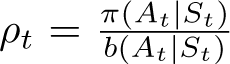 is the usual single-step importance sampling ratio. Much like the other returns we have seen in this book, the truncated version of this return can be approximated simply in terms of sums of the state-based TD error,

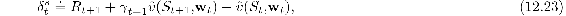

as

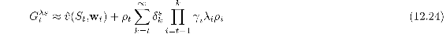

with the approximation becoming exact if the approximate value function does not change.

*Exercise 12.8* Prove that ([12.24](part0021_split_009.html#x1-143003r24)) becomes exact if the value function does not change. To save writing, consider the case of *t* = 0, and use the notation *V**k* ≐  (*S**k*, **w**).

□

*Exercise 12.9* The truncated version of the general off-policy return is denoted 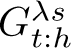. Guess the correct equation, based on ([12.24](part0021_split_009.html#x1-143003r24)).

□

The above form of the *λ*-return ([12.24](part0021_split_009.html#x1-143003r24)) is convenient to use in a forward-view update,

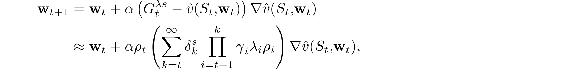

which to the experienced eye looks like an eligibility-based TD update—the product is like an eligibility trace and it is multiplied by TD errors. But this is just one time step of a forward view. The relationship that we are looking for is that the forward-view update, summed over time, is approximately equal to a backward-view update, summed over time (this relationship is only approximate because again we ignore changes in the value function). The sum of the forward-view update over time is

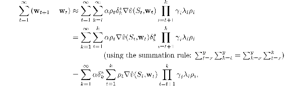

which would be in the form of the sum of a backward-view TD update if the entire expression from the second sum left could be written and updated incrementally as an eligibility trace, which we now show can be done. That is, we show that if this expression was the trace at time *k*, then we could update it from its value at time *k* − 1 by:

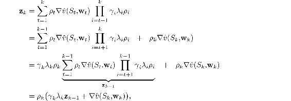

which, changing the index from *k* to *t*, is the general accumulating trace update for state values:

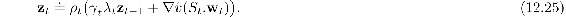

This eligibility trace, together with the usual semi-gradient parameter-update rule for TD(*λ*) ([12.7](part0021_split_002.html#x1-136003r7)), forms a general TD(*λ*) algorithm that can be applied to either on-policy or off-policy data. In the on-policy case, the algorithm is exactly TD(*λ*) because *ρ**t* is alway 1 and ([12.25](part0021_split_009.html#x1-143006r25)) becomes the usual accumulating trace ([12.5](part0021_split_002.html#x1-136001r5)) (extended to variable *λ* and *γ*). In the off-policy case, the algorithm often works well but, as a semi-gradient method, is not guaranteed to be stable. In the next few sections we will consider extensions of it that do guarantee stability.

A very similar series of steps can be followed to derive the off-policy eligibility traces for *action*-value methods and corresponding general Sarsa(*λ*) algorithms. One could start with either recursive form for the general action-based *λ*-return, ([12.19](part0021_split_008.html#x1-142003r19)) or ([12.20](part0021_split_008.html#x1-142004r20)), but the latter (the Expected Sarsa form) works out to be simpler. We extend ([12.20](part0021_split_008.html#x1-142004r20)) to the off-policy case after the model of ([7.14](part0015_split_004.html#x1-74003r14)) to produce

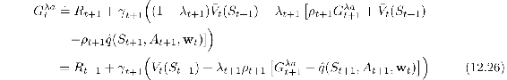

where *V**t*(*S**t*+1) is as given by ([12.21](part0021_split_008.html#x1-142005r21)). Again the *λ*-return can be written approximately as the sum of TD errors,

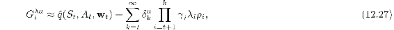

using the expectation form of the action-based TD error:

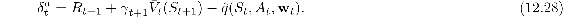

As before, the approximation becomes exact if the approximate value function does not change.

*Exercise 12.10* Prove that ([12.27](part0021_split_009.html#x1-143008r27)) becomes exact if the value function does not change. To save writing, consider the case of *t* = 0, and use the notation *Q**k* =  (*S**k**, A**k*, **w**). Hint: Start by writing out 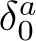 and 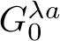, then 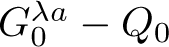.

□

*Exercise 12.11* The truncated version of the general off-policy return is denoted 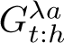. Guess the correct equation for it, based on ([12.27](part0021_split_009.html#x1-143008r27)).

□

Using steps entirely analogous to those for the state case, one can write a forward-view update based on ([12.27](part0021_split_009.html#x1-143008r27)), transform the sum of the updates using the summation rule, and finally derive the following form for the eligibility trace for action values:

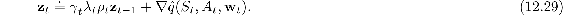

This eligibility trace, together with the expectation-based TD error ([12.28](part0021_split_009.html#x1-143009r28)) and the usual semi-gradient parameter-update rule ([12.7](part0021_split_002.html#x1-136003r7)), forms an elegant, efficient Expected Sarsa(*λ*) algorithm that can be applied to either on-policy or off-policy data. It is probably the best algorithm of this type at the current time (though of course it is not guaranteed to be stable until combined in some way with one of the methods presented in the following sections). In the on-policy case with constant *λ* and *γ*, and the usual state-action TD error ([12.16](part0021_split_007.html#x1-141003r16)), the algorithm would be identical to the Sarsa(*λ*) algorithm presented in Section 12.7.

*Exercise 12.12* Show in detail the steps outlined above for deriving ([12.29](part0021_split_009.html#x1-143010r29)) from ([12.27](part0021_split_009.html#x1-143008r27)). Start with the update ([12.15](part0021_split_007.html#x1-141001r15)), substitute 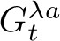 from ([12.26](part0021_split_009.html#x1-143007r26)) for 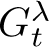, then follow similar steps as led to ([12.25](part0021_split_009.html#x1-143006r25)).

□

At *λ* = 1, these algorithms become closely related to corresponding Monte Carlo algorithms. One might expect that an exact equivalence would hold for episodic problems and off-line updating, but in fact the relationship is subtler and slightly weaker than that. Under these most favorable conditions still there is not an episode by episode equivalence of updates, only of their expectations. This should not be surprising as these method make irrevocable updates as a trajectory unfolds, whereas true Monte Carlo methods would make no update for a trajectory if any action within it has zero probability under the target policy. In particular, all of these methods, even at *λ* = 1, still bootstrap in the sense that their targets depend on the current value estimates—it’s just that the dependence cancels out in expected value. Whether this is a good or bad property in practice is another question. Recently, methods have been proposed that do achieve an exact equivalence (Sutton, Mahmood, Precup and van Hasselt, 2014). These methods require an additional vector of “provisional weights” that keep track of updates which have been made but may need to be retracted (or emphasized) depending on the actions taken later. The state and state–action versions of these methods are called PTD(*λ*) and PQ(*λ*) respectively, where the ‘P’ stands for Provisional.

The practical consequences of all these new off-policy methods have not yet been established. Undoubtedly, issues of high variance will arise as they do in all off-policy methods using importance sampling (Section 11.9).

If *λ <* 1, then all these off-policy algorithms involve bootstrapping and the deadly triad applies (Section 11.3), meaning that they can be guaranteed stable only for the tabular case, for state aggregation, and for other limited forms of function approximation. For linear and more-general forms of function approximation the parameter vector may diverge to infinity as in the examples in Chapter 11. As we discussed there, the challenge of off-policy learning has two parts. Off-policy eligibility traces deal effectively with the first part of the challenge, correcting for the expected value of the targets, but not at all with the second part of the challenge, having to do with the distribution of updates. Algorithmic strategies for meeting the second part of the challenge of off-policy learning with eligibility traces are summarized in Section 12.11.

*Exercise 12.13* What are the dutch-trace and replacing-trace versions of off-policy eligibility traces for state-value and action-value methods?

□
