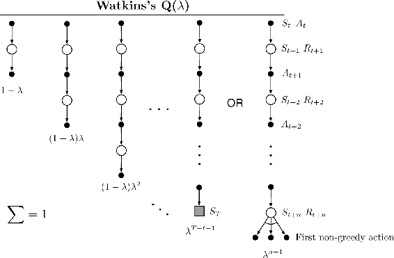
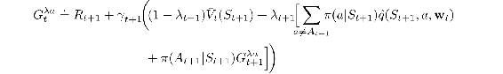
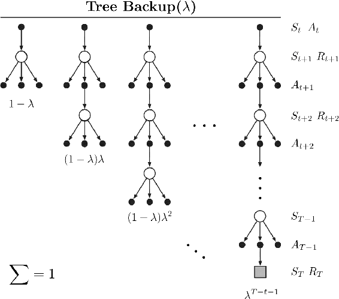

# 12.10  Watkins’s Q(*λ*) to Tree-Backup(*λ*)

Several methods have been proposed over the years to extend Q-learning to eligibility traces. The original is *Watkins’s Q(λ)*, which decays its eligibility traces in the usual way as long as a greedy action was taken, then cuts the traces to zero after the first non-greedy action. The backup diagram for Watkins’s Q(*λ*) is shown in [Figure 12.12](part0021_split_010.html#fig12-12). In Chapter 6, we unified Q-learning and Expected Sarsa in the off-policy version of the latter, which includes Q-learning as a special case, and generalizes it to arbitrary target policies, and in the previous section of this chapter we completed our treatment of Expected Sarsa by generalizing it to off-policy eligibility traces. In Chapter 7, however, we distinguished *n*-step Expected Sarsa from *n*-step Tree Backup, where the latter retained the property of not using importance sampling. It remains then to present the eligibility trace version of Tree Backup, which we will call *Tree-Backup(λ)*, or *TB(λ)* for short. This is arguably the true successor to Q-learning because it retains its appealing absence of importance sampling even though it can be applied to off-policy data.

[Figure 12.12](part0021_split_010.html#C_fig12-12): The backup diagram for Watkins’s Q(*λ*). The series of component updates ends either with the end of the episode or with the first nongreedy action, whichever comes first.

The concept of TB(*λ*) is straightforward. As shown in its backup diagram in [Figure 12.13](part0021_split_010.html#fig12-13), the tree-backup updates of each length (from Section 7.5) are weighted in the usual way dependent on the bootstrapping parameter *λ*. To get the detailed equations, with the right indices on the general bootstrapping and discounting parameters, it is best to start with a recursive form ([12.20](part0021_split_008.html#x1-142004r20)) for the *λ*-return using action values, and then expand the bootstrapping case of the target after the model of ([7.16](part0015_split_005.html#x1-75002r16)):

[Figure 12.13](part0021_split_010.html#C_fig12-13): The backup diagram for the *λ* version of the Tree Backup algorithm.

As per the usual pattern, it can also be written approximately (ignoring changes in the approximate value function) as a sum of TD errors,

using the expectation form of the action-based TD error ([12.28](part0021_split_009.html#x1-143009r28)).

Following the same steps as in the previous section, we arrive at a special eligibility trace update involving the target-policy probabilities of the selected actions,

This, together with the usual parameter-update rule ([12.7](part0021_split_002.html#x1-136003r7)), defines the TB(*λ*) algorithm. Like all semi-gradient algorithms, TB(*λ*) is not guaranteed to be stable when used with off-policy data and with a powerful function approximator. To obtain those assurances, TB(*λ*) would have to be combined with one of the methods presented in the next section.

**\*** *Exercise 12.14* How might Double Expected Sarsa be extended to eligibility traces?

□
