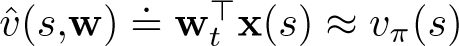
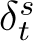
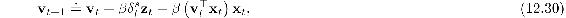
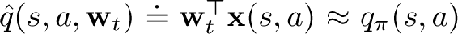
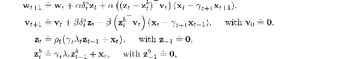
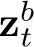
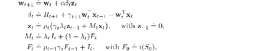

# 12.11  Stable Off-policy Methods with Traces

Several methods using eligibility traces have been proposed that achieve guarantees of stability under off-policy training, and here we present four of the most important using this book’s standard notation, including general bootstrapping and discounting functions. All are based on either the Gradient-TD or the Emphatic-TD ideas presented in Sections 11.7 and 11.8. All the algorithms assume linear function approx., though extensions to nonlinear function approximation can also be found in the literature.

*GTD(λ)* is the eligibility-trace algorithm analogous to TDC, the better of the two state-value Gradient-TD prediction algorithms discussed in Section 11.7. Its goal is to learn a parameter w*t* such that , even from data that is due to following another policy *b*. Its update is

with , **z***t*, and *ρ**t* defined in the usual ways for state values ([12.23](part0021_split_009.html#x1-143002r23)) ([12.25](part0021_split_009.html#x1-143006r25)) ([11.1](part0020_split_001.html#x1-123001r1)), and

where, as in Section 11.7, **v** ∈ ℝ*d* is a vector of the same dimension as **w**, initialized to **v**0 = **0**, and *β >* 0 is a second step-size parameter.

*GQ(λ)* is the Gradient-TD algorithm for action values with eligibility traces. Its goal is to learn a parameter **w***t* such that  from off-policy data. If the target policy is *ε*-greedy, or otherwise biased toward the greedy policy for , then GQ(*λ*) can be used as a control algorithm. Its update is

where **x***t* is the average feature vector for *S**t* under the target policy,

 is the expectation form of the TD error, which can be written

**z***t* is defined in the usual way for action values ([12.29](part0021_split_009.html#x1-143010r29)), and the rest is as in GTD(*λ*), including the update for **v***t* ([12.30](part0021_split_011.html#x1-145002r30)).

*HTD(λ)* is a hybrid state-value algorithm combining aspects of GTD(*λ*) and TD(*λ*). Its most appealing feature is that it is a strict generalization of TD(*λ*) to off-policy learning, meaning that if the behavior policy happens to be the same as the target policy, then HTD(*λ*) becomes the same as TD(*λ*), which is not true for GTD(*λ*). This is appealing because TD(*λ*) is often faster than GTD(*λ*) when both algorithms converge, and TD(*λ*) requires setting only a single step size. HTD(*λ*) is defined by

where *β >* 0 again is a second step-size parameter. In addition to the second set of weights, **v***t*, HTD(*λ*) also has a second set of eligibility traces, . These are conventional accumulating eligibility traces for the behavior policy and become equal to **z***t* if all the *ρ**t* are 1, which causes the last term in the **w***t* update to be zero and the overall update to reduce to TD(*λ*).

*Emphatic TD(λ)* is the extension of the one-step Emphatic-TD algorithm (Sections 9.11 and 11.8) to eligibility traces. The resultant algorithm retains strong off-policy convergence guarantees while enabling any degree of bootstrapping, albeit at the cost of high variance and potentially slow convergence. Emphatic TD(*λ*) is defined by

where *M**t* ≥ 0 is the general form of *emphasis*, *F**t* ≥ 0 is termed the *followon trace*, and *I**t* ≥ 0 is the *interest*, as described in Section 11.8. Note that *M**t*, like *δ**t*, is not really an additional memory variable. It can be removed from the algorithm by substituting its definition into the eligibility-trace equation. Pseudocode and software for the true online version of Emphatic-TD(*λ*) are available on the web (Sutton, 2015b).

In the on-policy case (*ρ**t* = 1, for all *t*), Emphatic-TD(*λ*) is similar to conventional TD(*λ*), but still significantly different. In fact, whereas Emphatic-TD(*λ*) is guaranteed to converge for all state-dependent *λ* functions, TD(*λ*) is not. TD(*λ*) is guaranteed convergent only for all constant *λ*. See Yu’s counterexample (Ghiassian, Rafiee, and Sutton, 2016).
