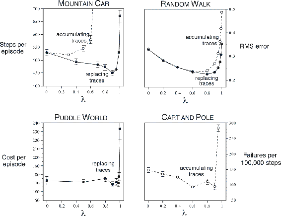

# 12.13  Conclusions

Eligibility traces in conjunction with TD errors provide an efficient, incremental way of shifting and choosing between Monte Carlo and TD methods. The *n*-step methods of Chapter 7 also enabled this, but eligibility trace methods are more general, often faster to learn, and offer different computational complexity tradeoffs. This chapter has offered an introduction to the elegant, emerging theoretical understanding of eligibility traces for on- and off-policy learning and for variable bootstrapping and discounting. One aspect of this elegant theory is true online methods, which exactly reproduce the behavior of expensive ideal methods while retaining the computational congeniality of conventional TD methods. Another aspect is the possibility of derivations that automatically convert from intuitive forward-view methods to more efficient incremental backward-view algorithms. We illustrated this general idea in a derivation that started with a classical, expensive Monte Carlo algorithm and ended with a cheap incremental non-TD implementation using the same novel eligibility trace used in true online TD methods.

As we mentioned in Chapter 5, Monte Carlo methods may have advantages in non-Markov tasks because they do not bootstrap. Because eligibility traces make TD methods more like Monte Carlo methods, they also can have advantages in these cases. If one wants to use TD methods because of their other advantages, but the task is at least partially non-Markov, then the use of an eligibility trace method is indicated. Eligibility traces are the first line of defense against both long-delayed rewards and non-Markov tasks.

By adjusting *λ*, we can place eligibility trace methods anywhere along a continuum from Monte Carlo to one-step TD methods. Where shall we place them? We do not yet have a good theoretical answer to this question, but a clear empirical answer appears to be emerging. On tasks with many steps per episode, or many steps within the half-life of discounting, it appears significantly better to use eligibility traces than not to (e.g., see [Figure 12.14](part0021_split_013.html#fig12-14)). On the other hand, if the traces are so long as to produce a pure Monte Carlo method, or nearly so, then performance degrades sharply. An intermediate mixture appears to be the best choice. Eligibility traces should be used to bring us toward Monte Carlo methods, but not all the way there. In the future it may be possible to more finely vary the trade-off between TD and Monte Carlo methods by using variable *λ*, but at present it is not clear how this can be done reliably and usefully.

[Figure 12.14](part0021_split_013.html#C_fig12-14): The effect of *λ* on reinforcement learning performance in four different test problems. In all cases, performance is generally best (a *lower* number in the graph) at an intermediate value of *λ*. The two left panels are applications to simple continuous-state control tasks using the Sarsa(*λ*) algorithm and tile coding, with either replacing or accumulating traces (Sutton, 1996). The upper-right panel is for policy evaluation on a random walk task using TD(*λ*) (Singh and Sutton, 1996). The lower right panel is unpublished data for the pole-balancing task ([Example 3.4](part0011_split_003.html#sec1-20)) from an earlier study (Sutton, 1984).

Methods using eligibility traces require more computation than one-step methods, but in return they offer significantly faster learning, particularly when rewards are delayed by many steps. Thus it often makes sense to use eligibility traces when data are scarce and cannot be repeatedly processed, as is often the case in online applications. On the other hand, in off-line applications in which data can be generated cheaply, perhaps from an inexpensive simulation, then it often does not pay to use eligibility traces. In these cases the objective is not to get more out of a limited amount of data, but simply to process as much data as possible as quickly as possible. In these cases the speedup per datum due to traces is typically not worth their computational cost, and one-step methods are favored.
