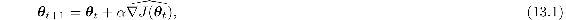
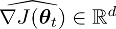

# Chapter 13

# Policy Gradient Methods

In this chapter we consider something new. So far in this book almost all the methods have been *action-value methods*; they learned the values of actions and then selected actions based on their estimated action values[1](part0022_split_010.html#fn1x16); their policies would not even exist without the action-value estimates. In this chapter we consider methods that instead learn a *parameterized policy* that can select actions without consulting a value function. A value function may still be used to *learn* the policy parameter, but is not required for action selection. We use the notation ***θ*** ∈ ℝ*d*′ for the policy’s parameter vector. Thus we write *π*(*a*|*s,* ***θ*** = Pr {A*t* = *a* | *S**t* = s, ***θ****t* = ***θ***} for the probability that action *a* is taken at time *t* given that the environment is in state *s* at time *t* with parameter ***θ***. If a method uses a learned value function as well, then the value function’s weight vector is denoted **w** ∈ ℝ*d* as usual, as in (*s,* **w**).

In this chapter we consider methods for learning the policy parameter based on the gradient of some scalar performance measure *J*(***θ***) with respect to the policy parameter. These methods seek to *maximize* performance, so their updates approximate gradient *ascent* in *J*:

where  is a stochastic estimate whose expectation approximates the gradient of the performance measure with respect to its argument ***θ****t*. All methods that follow this general schema we call *policy gradient methods*, whether or not they also learn an approximate value function. Methods that learn approximations to both policy and value functions are often called *actor–critic methods*, where ‘actor’ is a reference to the learned policy, and ‘critic’ refers to the learned value function, usually a state-value function. First we treat the episodic case, in which performance is defined as the value of the start state under the parameterized policy, before going on to consider the continuing case, in which performance is defined as the average reward rate, as in Section 10.3. In the end, we are able to express the algorithms for both cases in very similar terms.
