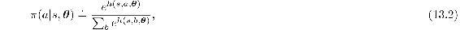
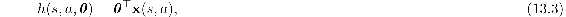
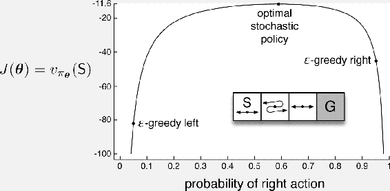

# 13.1  Policy Approximation and its Advantages

In policy gradient methods, the policy can be parameterized in any way, as long as *π*(*a*|*s,* ***θ***) is differentiable with respect to its parameters, that is, as long as ∇*π*(*a*|*s,* ***θ***) (the column vector of partial derivatives of *π*(*a*|*s,* ***θ***) with respect to the components of ***θ***) exists and is finite for all *s* ∈ 𝒮, *a* ∈ 𝒜 (*s*), and ***θ*** ∈ ℝ*d*′. In practice, to ensure exploration we generally require that the policy never becomes deterministic (i.e., that *π*(*a*|*s,* ***θ***) ∈ (0, 1), for all *s, a,* ***θ***). In this section we introduce the most common parameterization for discrete action spaces and point out the advantages it offers over action-value methods. Policy-based methods also offer useful ways of dealing with continuous action spaces, as we describe later in Section 13.7.

If the action space is discrete and not too large, then a natural and common kind of parameterization is to form parameterized numerical preferences *h*(*s, a,* ***θ***) ∈ ℝ for each state–action pair. The actions with the highest preferences in each state are given the highest probabilities of being selected, for example, according to an exponential soft-max distribution:

where *e* ≈ 2.71828 is the base of the natural logarithm. Note that the denominator here is just what is required so that the action probabilities in each state sum to one. We call this kind of policy parameterization *soft-max in action preferences*.

The action preferences themselves can be parameterized arbitrarily. For example, they might be computed by a deep artificial neural network (ANN), where ***θ*** is the vector of all the connection weights of the network (as in the AlphaGo system described in Section 16.6). Or the preferences could simply be linear in features,

using feature vectors **x**(*s, a*) ∈ ℝ*d*′ constructed by any of the methods described in Chapter 9.

One advantage of parameterizing policies according to the soft-max in action preferences is that the approximate policy can approach a deterministic policy, whereas with *ε*-greedy action selection over action values there is always an *ε* probability of selecting a random action. Of course, one could select according to a soft-max distribution based on action values, but this alone would not allow the policy to approach a deterministic policy. Instead, the action-value estimates would converge to their corresponding true values, which would differ by a finite amount, translating to specific probabilities other than 0 and 1. If the soft-max distribution included a temperature parameter, then the temperature could be reduced over time to approach determinism, but in practice it would be difficult to choose the reduction schedule, or even the initial temperature, without more prior knowledge of the true action values than we would like to assume. Action preferences are different because they do not approach specific values; instead they are driven to produce the optimal stochastic policy. If the optimal policy is deterministic, then the preferences of the optimal actions will be driven infinitely higher than all suboptimal actions (if permitted by the parameterization).

A second advantage of parameterizing policies according to the soft-max in action preferences is that it enables the selection of actions with arbitrary probabilities. In problems with significant function approximation, the best approximate policy may be stochastic. For example, in card games with imperfect information the optimal play is often to do two different things with specific probabilities, such as when bluffing in Poker. Action-value methods have no natural way of finding stochastic optimal policies, whereas policy approximating methods can, as shown in [Example 13.1](part0022_split_001.html#sec1-114) .

**Example 13.1 Short corridor with switched actions**

Consider the small corridor gridworld shown inset in the graph below. The reward is − 1 per step, as usual. In each of the three nonterminal states there are only two actions, `right` and `left`. These actions have their usual consequences in the first and third states (`left` causes no movement in the first state), but in the second state they are reversed, so that `right` moves to the left and `left` moves to the right. The problem is difficult because all the states appear identical under the function approximation. In particular, we define **x**(*s,* `right`) = [1, 0]⊤ and **x**(*s,* `left`) = [0, 1]⊤, for all *s*. An action-value method with *ε*-greedy action selection is forced to choose between just two policies: choosing `right` with high probability 1 − *ε*/2 on all steps or choosing `left` with the same high probability on all time steps. If *ε* = 0.1, then these two policies achieve a value (at the start state) of less than − 44 and − 82, respectively, as shown in the graph. A method can do significantly better if it can learn a specific probability with which to select `right`. The best probability is about 0.59, which achieves a value of about − 11.6.

Perhaps the simplest advantage that policy parameterization may have over action-value parameterization is that the policy may be a simpler function to approximate. Problems vary in the complexity of their policies and action-value functions. For some, the action-value function is simpler and thus easier to approximate. For others, the policy is simpler. In the latter case a policy-based method will typically learn faster and yield a superior asymptotic policy (as in Tetris; see Şimşek, Algórta, and Kothiyal, 2016).

Finally, we note that the choice of policy parameterization is sometimes a good way of injecting prior knowledge about the desired form of the policy into the reinforcement learning system. This is often the most important reason for using a policy-based learning method.

*Exercise 13.1* Use your knowledge of the gridworld and its dynamics to determine an *exact* symbolic expression for the optimal probability of selecting the `right` action in [Example 13.1](part0022_split_001.html#sec1-114) .

□
