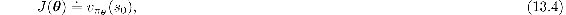
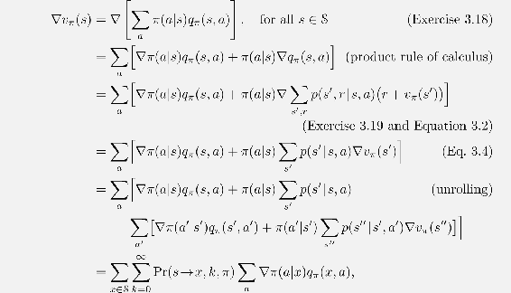
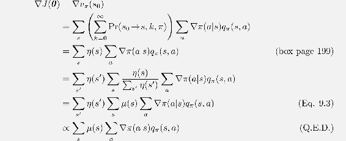
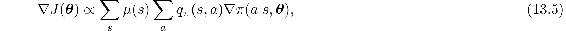

# 13.2  The Policy Gradient Theorem

In addition to the practical advantages of policy parameterization over *ε*-greedy action selection, there is also an important theoretical advantage. With continuous policy parameterization the action probabilities change smoothly as a function of the learned parameter, whereas in *ε*-greedy selection the action probabilities may change dramatically for an arbitrarily small change in the estimated action values, if that change results in a different action having the maximal value. Largely because of this stronger convergence guarantees are available for policy-gradient methods than for action-value methods. In particular, it is the continuity of the policy dependence on the parameters that enables policy-gradient methods to approximate gradient ascent ([13.1](part0022_split_000.html#x1-149002r1)).

The episodic and continuing cases define the performance measure, *J*(***θ***), differently and thus have to be treated separately to some extent. Nevertheless, we will try to present both cases uniformly, and we develop a notation so that the major theoretical results can be described with a single set of equations.

In this section we treat the episodic case, for which we define the performance measure as the value of the start state of the episode. We can simplify the notation without losing any meaningful generality by assuming that every episode starts in some particular (non-random) state *s*0. Then, in the episodic case we define performance as

where *v**π****θ*** is the true value function for *π****θ***, the policy determined by ***θ***. From here on in our discussion we will assume no discounting (*γ* = 1) for the episodic case, although for completeness we do include the possibility of discounting in the boxed algorithms.

With function approximation, it may seem challenging to change the policy parameter in a way that ensures improvement. The problem is that performance depends on both the action selections and the distribution of states in which those selections are made, and that both of these are affected by the policy parameter. Given a state, the effect of the policy parameter on the actions, and thus on reward, can be computed in a relatively straightforward way from knowledge of the parameterization. But the effect of the policy on the state distribution is a function of the environment and is typically unknown. How can we estimate the performance gradient with respect to the policy parameter when the gradient depends on the unknown effect of policy changes on the state distribution?

**Proof of the Policy Gradient Theorem (episodic case)**

With just elementary calculus and re-arranging of terms, we can prove the policy gradient theorem from first principles. To keep the notation simple, we leave it implicit in all cases that *π* is a function of ***θ***, and all gradients are also implicitly with respect to ***θ***. First note that the gradient of the state-value function can be written in terms of the action-value function as

after repeated unrolling, where Pr(*s → x, k, π*) is the probability of transitioning from state *s* to state *x* in *k* steps under policy *π*. It is then immediate that

Fortunately, there is an excellent theoretical answer to this challenge in the form of the *policy gradient theorem*, which provides an analytic expression for the gradient of performance with respect to the policy parameter (which is what we need to approximate for gradient ascent ([13.1](part0022_split_000.html#x1-149002r1))) that does *not* involve the derivative of the state distribution. The policy gradient theorem for the episodic case establishes that

where the gradients are column vectors of partial derivatives with respect to the components of ***θ***, and *π* denotes the policy corresponding to parameter vector ***θ***. The symbol ∝ here means “proportional to”. In the episodic case, the constant of proportionality is the average length of an episode, and in the continuing case it is 1, so that the relationship is actually an equality. The distribution *μ* here (as in Chapters 9 and 10) is the on-policy distribution under *π* (see page 199). The policy gradient theorem is proved for the episodic case in the box on the previous page.
