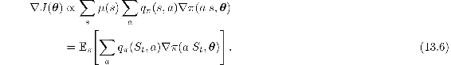
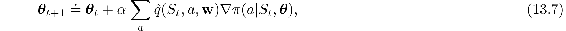
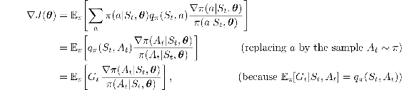
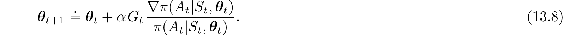
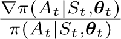
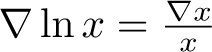
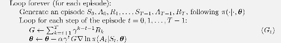
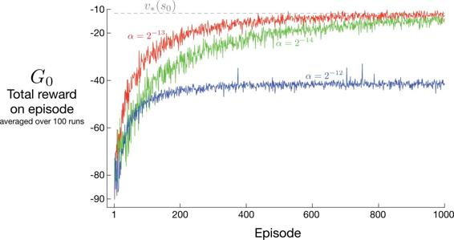
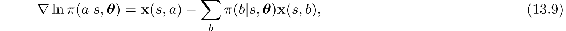

# 13.3  REINFORCE: Monte Carlo Policy Gradient

We are now ready to derive our first policy-gradient learning algorithm. Recall our overall strategy of stochastic gradient ascent ([13.1](part0022_split_000.html#x1-149002r1)), which requires a way to obtain samples such that the expectation of the sample gradient is proportional to the actual gradient of the performance measure as a function of the parameter. The sample gradients need only be proportional to the gradient because any constant of proportionality can be absorbed into the step size *α*, which is otherwise arbitrary. The policy gradient theorem gives an exact expression proportional to the gradient; all that is needed is some way of sampling whose expectation equals or approximates this expression. Notice that the right-hand side of the policy gradient theorem is a sum over states weighted by how often the states occur under the target policy *π*; if *π* is followed, then states will be encountered in these proportions. Thus

We could stop here and instantiate our stochastic gradient-ascent algorithm ([13.1](part0022_split_000.html#x1-149002r1)) as

where  is some learned approximation to *qπ*. This algorithm, which has been called an *all-actions* method because its update involves all of the actions, is promising and deserving of further study, but our current interest is the classical REINFORCE algorithm (Willams, 1992) whose update at time *t* involves just *A**t*, the one action actually taken at time *t*. We continue our derivation of REINFORCE by introducing *A**t* in the same way as we introduced *S**t* in ([13.6](part0022_split_003.html#x1-152001r6))—by replacing a sum over the random variable’s possible values by an expectation under *π*, and then sampling the expectation. Equation ([13.6](part0022_split_003.html#x1-152001r6)) involves an appropriate sum over actions, but each term is not weighted by *π*(*a*|*S**t*, ***θ***) as is needed for an expectation under *π*. So we introduce such a weighting, without changing the equality, by multiplying and then dividing the summed terms by *π*(*a*|*S**t*, ***θ***). Continuing from ([13.6](part0022_split_003.html#x1-152001r6)), we have

where *G**t* is the return as usual. The final expression in brackets is exactly what is needed, a quantity that can be sampled on each time step whose expectation is equal to the gradient. Using this sample to instantiate our generic stochastic gradient ascent algorithm ([13.1](part0022_split_000.html#x1-149002r1)) yields the REINFORCE update:

This update has an intuitive appeal. Each increment is proportional to the product of a return G*t* and a vector, the gradient of the probability of taking the action actually taken divided by the probability of taking that action. The vector is the direction in parameter space that most increases the probability of repeating the action *A**t* on future visits to state *S**t*. The update increases the parameter vector in this direction proportional to the return, and inversely proportional to the action probability. The former makes sense because it causes the parameter to move most in the directions that favor actions that yield the highest return. The latter makes sense because otherwise actions that are selected frequently are at an advantage (the updates will be more often in their direction) and might win out even if they do not yield the highest return.

Note that REINFORCE uses the complete return from time *t*, which includes all future rewards up until the end of the episode. In this sense REINFORCE is a Monte Carlo algorithm and is well defined only for the episodic case with all updates made in retrospect after the episode is completed (like the Monte Carlo algorithms in Chapter 5). This is shown explicitly in the boxed on the next page.

Notice that the update in the last line of pseudocode appears rather different from the REINFORCE update rule ([13.8](part0022_split_003.html#x1-152007r8)). One difference is that the pseudocode uses the compact expression ∇ln*π*(*A**t*|*S**t*, ***θ****t*) for the fractional vector  in ([13.8](part0022_split_003.html#x1-152007r8)). That these two expressions for the vector are equivalent follows from the identity . This vector has been given several names and notations in the literature; we will refer to it simply as the *eligibility vector*. Note that it is the only place that the policy parameterization appears in the algorithm.

**REINFORCE: Monte-Carlo Policy-Gradient Control (episodic) for *π*\***

Input: a differentiable policy parameterization *π*(*a*|*s,* ***θ***)

Algorithm parameter: step size *α >* 0

Initialize policy parameter ***θ*** ∈ ℝ*d*′ (e.g., to **0**)

The second difference between the pseudocode update and the REINFORCE update equation ([13.8](part0022_split_003.html#x1-152007r8)) is that the former includes a factor of *γ**t*. This is because, as mentioned earlier, in the text we are treating the non-discounted case (*γ* = 1) while in the boxed algorithms we are giving the algorithms for the general discounted case. All of the ideas go through in the discounted case with appropriate adjustments (including to the box on page 199) but involve additional complexity that distracts from the main ideas.

**\****Exercise 13.2* Generalize the box on page 199, the policy gradient theorem ([13.5](part0022_split_002.html#x1-151018r5)), the proof of the policy gradient theorem (page 325), and the steps leading to the REINFORCE update equation ([13.8](part0022_split_003.html#x1-152007r8)), so that ([13.8](part0022_split_003.html#x1-152007r8)) ends up with a factor of *γ**t* and thus aligns with the general algorithm given in the pseudocode.

□

[Figure 13.1](part0022_split_003.html#fig13-1) shows the performance of REINFORCE on the short-corridor gridworld from [Example 13.1](part0022_split_001.html#sec1-114) .

[Figure 13.1](part0022_split_003.html#C_fig13-1): REINFORCE on the short-corridor gridworld ([Example 13.1](part0022_split_001.html#sec1-114)). With a good step size, the total reward per episode approaches the optimal value of the start state.

As a stochastic gradient method, REINFORCE has good theoretical convergence properties. By construction, the expected update over an episode is in the same direction as the performance gradient. This assures an improvement in expected performance for sufficiently small *α*, and convergence to a local optimum under standard stochastic approximation conditions for decreasing *α*. However, as a Monte Carlo method REINFORCE may be of high variance and thus produce slow learning.

*Exercise 13.3* In Section 13.1 we considered policy parameterizations using the soft-max in action preferences ([13.2](part0022_split_001.html#x1-150001r2)) with linear action preferences ([13.3](part0022_split_001.html#x1-150002r3)). For this parameterization, prove that the eligibility vector is

using the definitions and elementary calculus.

□
