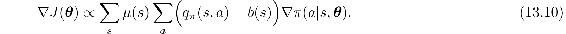
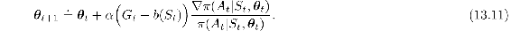
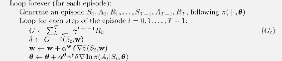
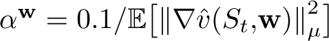
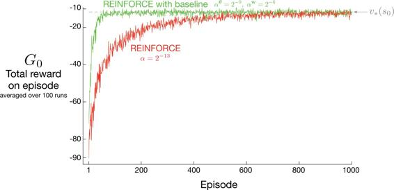

# 13.4  REINFORCE with Baseline

The policy gradient theorem ([13.5](part0022_split_002.html#x1-151018r5)) can be generalized to include a comparison of the action value to an arbitrary *baseline b*(*s*):

The baseline can be any function, even a random variable, as long as it does not vary with *a*; the equation remains valid because the subtracted quantity is zero:

The policy gradient theorem with baseline ([13.10](part0022_split_004.html#x1-153001r10)) can be used to derive an update rule using similar steps as in the previous section. The update rule that we end up with is a new version of REINFORCE that includes a general baseline:

Because the baseline could be uniformly zero, this update is a strict generalization of REINFORCE. In general, the baseline leaves the expected value of the update unchanged, but it can have a large effect on its variance. For example, we saw in Section 2.8 that an analogous baseline can significantly reduce the variance (and thus speed the learning) of gradient bandit algorithms. In the bandit algorithms the baseline was just a number (the average of the rewards seen so far), but for MDPs the baseline should vary with state. In some states all actions have high values and we need a high baseline to differentiate the higher valued actions from the less highly valued ones; in other states all actions will have low values and a low baseline is appropriate.

One natural choice for the baseline is an estimate of the state value,  (*S**t*, **w**), where **w** ∈ ℝ*m* is a weight vector learned by one of the methods presented in previous chapters. Because REINFORCE is a Monte Carlo method for learning the policy parameter, ***θ***, it seems natural to also use a Monte Carlo method to learn the state-value weights, **w**. A complete pseudocode algorithm for REINFORCE with baseline using such a learned state-value function as the baseline is given in the box below.

**REINFORCE with Baseline (episodic), for estimating *π****θ*** ≈ *π*\***

Input: a differentiable policy parameterization *π*(*a*|*s,* ***θ***)

Input: a differentiable state-value function parameterization  (*s,* **w**)

Algorithm parameters: step sizes *α****θ*** > 0, *α***w** > 0

Initialize policy parameter ***θ*** ∈ ℝ*d*′ and state-value weights **w** ∈ ℝ*d* (e.g., to **0**)

This algorithm has two step sizes, denoted *α****θ*** and *α***w** (where *α****θ*** is the *α* in ([13.11](part0022_split_004.html#x1-153002r11))). Choosing the step size for values (here *α***w**) is relatively easy; in the linear case we have rules of thumb for setting it, such as  (see Section 9.6). It is much less clear how to set the step size for the policy parameters, *α****θ***, whose best value depends on the range of variation of the rewards and on the policy parameterization.

[Figure 13.2](part0022_split_004.html#fig13-2) compares the behavior of REINFORCE with and without a baseline on the short-corridor gridword ([Example 13.1](part0022_split_001.html#sec1-114)). Here the approximate state-value function used in the baseline is  (*s,* **w**) = *w*. That is, **w** is a single component, *w*.

[Figure 13.2](part0022_split_004.html#C_fig13-2): Adding a baseline to REINFORCE can make it learn much faster, as illustrated here on the short-corridor gridworld ([Example 13.1](part0022_split_001.html#sec1-114)). The step size used here for plain REINFORCE is that at which it performs best (to the nearest power of two; see [Figure 13.1](part0022_split_003.html#fig13-1)).
